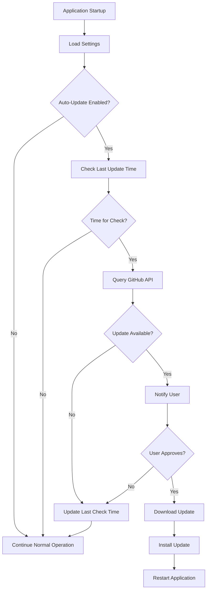

# BulkEditor Auto-Update System

This document describes the comprehensive auto-update system implemented for BulkEditor, including installation, settings management, and automatic updates from GitHub releases.

## Overview

The BulkEditor auto-update system provides:

- **Standalone Installer**: WiX-based installer that deploys to user's AppData
- **Settings Management**: Centralized configuration with automatic migration and backup
- **Auto-Update Engine**: Automatic checking and installation of updates from GitHub
- **Settings Preservation**: User settings are preserved across updates
- **Rollback Capability**: Ability to rollback failed updates

## Architecture

### Core Components

1. **ConfigurationService** (`BulkEditor.Infrastructure.Services.ConfigurationService`)

   - Manages application settings in `%APPDATA%\BulkEditor`
   - Handles settings migration from old locations
   - Creates automatic backups before changes
   - Provides settings validation and error recovery

2. **GitHubUpdateService** (`BulkEditor.Infrastructure.Services.GitHubUpdateService`)

   - Checks GitHub releases for new versions
   - Downloads and verifies update packages
   - Manages update installation process
   - Handles rollback scenarios

3. **UpdateManager** (`BulkEditor.Application.Services.UpdateManager`)

   - Orchestrates the update process
   - Provides user notifications and progress tracking
   - Manages update scheduling and intervals
   - Handles user interaction for update approval

4. **WiX Installer** (`BulkEditor.Installer`)
   - Creates MSI installer packages
   - Installs to user AppData directory
   - Sets up auto-update configuration
   - Creates desktop and start menu shortcuts

## Installation Process

### Directory Structure

The installer creates the following structure in `%APPDATA%\BulkEditor`:

```
BulkEditor/
├── bin/                    # Application executables
├── settings.json           # User configuration
├── Logs/                   # Application logs
├── Backups/                # Document backups
├── Cache/                  # Application cache
├── Temp/                   # Temporary files
├── SettingsBackups/        # Settings backups
├── UpdateBackups/          # Update backups
└── Downloads/              # Update downloads
```

### Registry Configuration

Auto-update settings are stored in the registry:

```
HKCU\Software\DiaTech\BulkEditor\
├── InstallPath             # Installation directory
├── Version                 # Current version
└── InstallDate            # Installation timestamp

HKCU\Software\DiaTech\BulkEditor\AutoUpdate\
├── Enabled                # Auto-update enabled (default: 1)
├── CheckInterval          # Check interval in hours (default: 24)
├── GitHubOwner           # Repository owner (default: "DiaTech")
└── GitHubRepo            # Repository name (default: "Bulk_Editor")
```

## Settings Management

### Configuration File Location

- **New installations**: `%APPDATA%\BulkEditor\settings.json`
- **Migrated from**: `{CurrentDirectory}\appsettings.json`

### Settings Schema

```json
{
  "processing": {
    /* Document processing settings */
  },
  "validation": {
    /* Hyperlink validation settings */
  },
  "backup": {
    /* Backup configuration */
  },
  "logging": {
    /* Logging configuration */
  },
  "ui": {
    /* User interface preferences */
  },
  "api": {
    /* API configuration */
  },
  "replacement": {
    /* Text/hyperlink replacement rules */
  },
  "update": {
    "autoUpdateEnabled": true,
    "checkIntervalHours": 24,
    "installSecurityUpdatesAutomatically": true,
    "notifyOnUpdatesAvailable": true,
    "createBackupBeforeUpdate": true,
    "gitHubOwner": "DiaTech",
    "gitHubRepository": "Bulk_Editor",
    "includePrerelease": false
  }
}
```

### Settings Backup Strategy

1. **Automatic Backups**: Created before each save operation
2. **Update Backups**: Created before installing updates
3. **Migration Backups**: Created when migrating from old locations
4. **Cleanup**: Old backups are automatically cleaned up (keeps last 10)

### Backup File Naming

```
settings_backup_YYYY-MM-DD_HH-mm-ss_[suffix].json
```

Examples:

- `settings_backup_2024-01-15_14-30-00_pre-save.json`
- `settings_backup_2024-01-15_14-35-00_pre-update.json`
- `settings_backup_2024-01-15_14-40-00_migration.json`

## Auto-Update Process

### Update Check Flow



### GitHub API Integration

The system uses GitHub's REST API to check for releases:

- **Endpoint**: `https://api.github.com/repos/{owner}/{repo}/releases/latest`
- **Authentication**: No authentication required for public repositories
- **Rate Limiting**: Respects GitHub's rate limits
- **User Agent**: `BulkEditor-UpdateService/1.0`

### Version Comparison

- Uses semantic versioning (e.g., `1.2.3`)
- Supports tag formats: `v1.2.3` or `1.2.3`
- Compares using .NET's `Version` class
- Only updates to newer versions

### Download and Installation

1. **Download**: Update downloaded to `%APPDATA%\BulkEditor\Downloads`
2. **Verification**: File size verification against GitHub metadata
3. **Backup**: Current settings and installation backed up
4. **Installation**: Silent MSI installation with `/S` flag
5. **Restart**: Application gracefully shuts down for installer
6. **Cleanup**: Temporary files and old downloads cleaned up

## Update Installation Process

### Preparation Phase

1. **Settings Backup**: Current settings backed up with `pre-update` suffix
2. **Installation Backup**: Current installation state recorded
3. **Download Verification**: Downloaded file integrity checked
4. **User Notification**: Progress updates provided to user

### Installation Phase

1. **Batch Script Creation**: Creates temporary batch script for installation
2. **Silent Installation**: Runs installer with silent flags
3. **Application Shutdown**: Current application instance terminates
4. **Installer Execution**: New version installed over existing installation
5. **Cleanup**: Temporary files and old installer removed

### Post-Installation

1. **Settings Migration**: Existing settings automatically preserved
2. **Configuration Update**: New default settings merged with user preferences
3. **Backup Cleanup**: Old backups cleaned up according to retention policy
4. **First Run**: Application starts with updated version

## Error Handling and Rollback

### Error Scenarios

1. **Download Failure**: Network issues, file corruption, insufficient space
2. **Installation Failure**: Installer errors, permission issues, file locks
3. **Startup Failure**: New version fails to start properly

### Rollback Process

1. **Automatic Detection**: Failed updates detected on next startup
2. **Settings Restoration**: Previous settings restored from backup
3. **User Notification**: User informed of rollback and reason
4. **Retry Logic**: Option to retry update or disable auto-updates

### Recovery Mechanisms

- **Settings Recovery**: Multiple backup levels with automatic restoration
- **Manual Recovery**: User can manually restore from backup files
- **Safe Mode**: Application can start with default settings if needed
- **Update Disable**: Auto-updates can be disabled if repeatedly failing

## Configuration Options

### User Interface

The Settings window includes an "Updates" tab with options for:

- **Enable/Disable Auto-Updates**: Master switch for automatic updates
- **Check Interval**: How often to check for updates (hours)
- **Security Updates**: Install security updates automatically
- **Notifications**: Show notifications when updates are available
- **Backup Before Update**: Create backup before installing updates
- **Include Prereleases**: Include beta/preview versions
- **Repository Settings**: GitHub owner and repository name

### Registry Override

Advanced users can override settings via registry:

```registry
[HKEY_CURRENT_USER\Software\DiaTech\BulkEditor\AutoUpdate]
"Enabled"=dword:00000001
"CheckInterval"=dword:00000018
"GitHubOwner"="DiaTech"
"GitHubRepo"="Bulk_Editor"
```

### Command Line Parameters

Development and testing options:

```bash
# Force update check
BulkEditor.UI.exe --check-updates

# Disable auto-updates for this session
BulkEditor.UI.exe --no-auto-update

# Use different GitHub repository
BulkEditor.UI.exe --update-repo="owner/repository"
```

## Security Considerations

### Download Security

- **HTTPS Only**: All downloads over encrypted connections
- **Integrity Verification**: File size and basic integrity checks
- **Source Validation**: Only downloads from configured GitHub repository
- **Sandboxed Downloads**: Downloads isolated to specific directory

### Installation Security

- **User Scope**: Installation doesn't require administrator privileges
- **Signed Installers**: Support for code-signed installers (optional)
- **Silent Installation**: Minimal user interaction reduces attack surface
- **Rollback Capability**: Failed installations can be rolled back

### Settings Security

- **User Profile**: Settings stored in user profile directory
- **Backup Encryption**: Settings backups use secure file permissions
- **Audit Trail**: All setting changes logged with timestamps
- **Validation**: Settings validated before saving to prevent corruption

## Monitoring and Logging

### Update Logs

All update activities are logged to `%APPDATA%\BulkEditor\Logs\bulkeditor-{Date}.log`:

```
[2024-01-15 14:30:00 INF] Checking for updates from GitHub...
[2024-01-15 14:30:01 INF] Update available: 1.2.0
[2024-01-15 14:30:05 INF] Starting update download for version 1.2.0
[2024-01-15 14:30:15 INF] Update downloaded to: Downloads\BulkEditor-Setup-1.2.0.msi
[2024-01-15 14:30:16 INF] Settings backed up to: SettingsBackups\settings_backup_2024-01-15_14-30-16_pre-update.json
[2024-01-15 14:30:17 INF] Update installer started, application will now exit
```

### Metrics Tracked

- Update check frequency and results
- Download success/failure rates
- Installation success/failure rates
- Settings migration success
- Rollback occurrences
- User interaction patterns

## Deployment Workflow

### Building Releases

1. **Local Build**: `.\Deployment\build-installer.ps1 -Version "1.0.0"`
2. **Testing**: Manual testing of installer and update process
3. **GitHub Deploy**: `.\Deployment\deploy-release.ps1 -Version "1.0.0"`

### Release Assets

Each GitHub release includes:

- **Installer**: `BulkEditor-Setup-{version}.msi`
- **Version Info**: `version.json` with build metadata
- **Release Notes**: Markdown description of changes
- **Checksums**: File integrity verification data

### Continuous Integration

The system supports CI/CD workflows with:

- **Automated Building**: PowerShell scripts for automation
- **Testing Integration**: Automated installer testing
- **GitHub Actions**: YAML workflows for releases
- **Quality Gates**: Tests must pass before deployment

## Testing the Update System

### Local Testing

1. **Install Current Version**: Install from existing MSI
2. **Modify Version**: Temporarily modify version number in code
3. **Build New Version**: Create "newer" version installer
4. **Test Update**: Verify update detection and installation
5. **Verify Settings**: Ensure settings are preserved

### GitHub Testing

1. **Create Test Repository**: Fork repository for testing
2. **Upload Test Release**: Create releases with test installers
3. **Configure Settings**: Point application to test repository
4. **Test End-to-End**: Full update cycle from GitHub
5. **Verify Rollback**: Test failure scenarios and rollback

### Edge Case Testing

- **Network Failures**: Disconnect during download/installation
- **Permission Issues**: Test with restricted user accounts
- **Disk Space**: Test with insufficient disk space
- **Concurrent Updates**: Multiple instances trying to update
- **Corrupted Downloads**: Simulate file corruption scenarios

## Best Practices

### For Users

- **Regular Backups**: Keep additional backups of important settings
- **Update Reviews**: Review release notes before accepting updates
- **Stable Internet**: Ensure stable connection during updates
- **Close Documents**: Close all documents before updating
- **Monitor Logs**: Check logs if experiencing update issues

### For Developers

- **Version Management**: Use semantic versioning consistently
- **Release Notes**: Provide clear, detailed release notes
- **Testing**: Thoroughly test installers before deployment
- **Rollback Testing**: Verify rollback scenarios work properly
- **Documentation**: Keep update documentation current

### For Administrators

- **Group Policy**: Use registry settings for organization-wide configuration
- **Network Access**: Ensure GitHub access for update checking
- **Deployment**: Use MSI for automated deployment scenarios
- **Monitoring**: Monitor update success rates across organization
- **Support**: Provide user training on update system

This auto-update system provides a robust, secure, and user-friendly way to keep BulkEditor installations current while preserving user data and preferences.
