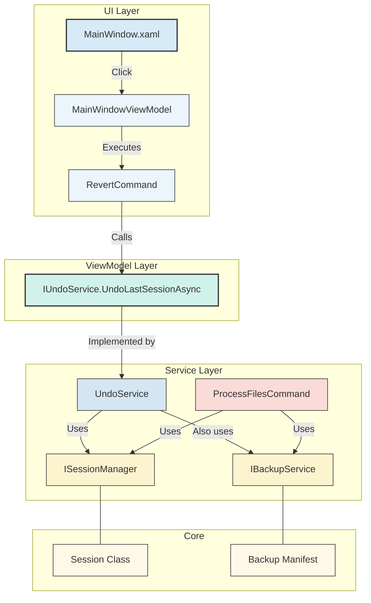

# Revert/Undo Functionality Design

## 1. Overview

This document outlines the design for a revert/undo feature in the Bulk Editor application. This feature will allow users to undo the changes made to documents during a processing session, providing a safety net and improving user confidence.

The proposed solution is a session-based revert mechanism. When the user starts a processing job, the application will create a temporary backup of each document _before_ any modifications are made. If the user chooses to revert, the application will restore these backups, effectively undoing the changes from that specific session.

## 2. Core Concepts

### Session-Based Revert

- A "session" begins when the user clicks the "Process Files" button and ends when the application is closed or when a new set of files is processed.
- The revert functionality will only apply to the most recent processing session. It will not be a multi-level undo system.
- Upon starting a new processing job, any previous session's backups will be cleared.

### Backup Mechanism

- Before a file is processed, a copy of it will be saved to a temporary, session-specific directory.
- This directory will be located within the user's local application data folder (`%LOCALAPPDATA%\BulkEditor\backups\<session_id>\`) to avoid cluttering the original file locations.
- The backup files will retain their original names.

## 3. Proposed Architecture

We will introduce several new services to manage the lifecycle of the revert process, all while adhering to the existing DI and MVVM patterns.

### 3.1. New Services and Interfaces

#### a. `ISessionManager` & `SessionManager`

- **Responsibilities**:
  - Manages the current processing session.
  - Generates a unique session ID.
  - Holds a list of files processed in the current session and the location of their backups.
  - Methods: `StartSession()`, `EndSession()`, `GetCurrentSession()`, `AddFileToSession(originalPath, backupPath)`.
- **DI Scope**: Singleton.

#### b. `IBackupService` & `BackupService`

- **Responsibilities**:
  - Handles the physical file operations for creating and restoring backups.
  - Methods: `CreateBackupAsync(filePath, session)`, `RestoreBackupAsync(originalPath, backupPath)`, `ClearBackups(session)`.
- **DI Scope**: Singleton.

#### c. `IUndoService` & `UndoService`

- **Responsibilities**:
  - Orchestrates the entire undo process.
  - It will use the `ISessionManager` to get the list of files to revert and the `IBackupService` to restore them.
  - Methods: `UndoLastSessionAsync()`.
- **DI Scope**: Singleton.

### 3.2. Data Models

#### a. `Session`

- A simple class to hold session data.
- **Properties**: `SessionId` (Guid), `StartTime` (DateTime), `ProcessedFiles` (a `Dictionary<string, string>` mapping original path to backup path).

## 4. Implementation Plan

### Step 1: Create Services and Interfaces

- Define the three new interfaces (`ISessionManager`, `IBackupService`, `IUndoService`) in the `BulkEditor.Core/Interfaces` project.
- Implement the concrete classes (`SessionManager`, `BackupService`, `UndoService`) in the `BulkEditor.Infrastructure/Services` project.
- Register the services in `App.xaml.cs` or the relevant DI container setup.

### Step 2: Integrate into `MainWindowViewModel`

- Inject `IUndoService` and `ISessionManager` into `MainWindowViewModel`.
- Modify the `ProcessFilesCommand`:
  1.  At the start, call `_sessionManager.StartSession()`.
  2.  For each file about to be processed, call `await _backupService.CreateBackupAsync(file, _sessionManager.GetCurrentSession())`.
  3.  Store the returned backup path.
- Create a new `RevertCommand`:
  - This `RelayCommand` will call `await _undoService.UndoLastSessionAsync()`.
  - Bind the `IsEnabled` property of the "Revert" button to a new ViewModel property, e.g., `IsRevertEnabled`. This property should be set to `true` after a processing session is complete and there is a session to revert.

### Step 3: UI Changes

- Add a "Revert Processed" button to `MainWindow.xaml`.
- Position it logically, perhaps next to the "Process Files" button.
- Bind its `Command` to `RevertCommand` and `IsEnabled` to `IsRevertEnabled`.
- Provide user feedback upon completion of the revert, possibly via the notification service.

## 5. Security and Scalability Considerations

- **File Permissions**: The backup and restore operations must handle potential `UnauthorizedAccessException`. The services should log these errors and report them to the user.
- **Large Files**: The current design involves a direct file copy. For very large files, this could be time and memory-consuming. Future optimizations could include differential backups, but for the typical size of Word documents, a direct copy is acceptable.
- **Concurrency**: The services will be registered as Singletons. File operations within them should be thread-safe, though the UI's single-threaded nature mitigates most risks. The use of `async`/`await` is crucial.
- **Cleanup**: Implement a mechanism to clear out old backup folders to prevent disk space from being consumed indefinitely. This could be done on application startup, clearing any folders older than a few days, or by explicitly clearing the previous session's backups when a new session starts. The `SessionManager.EndSession()` or `StartSession()` method is a good place for this logic.
