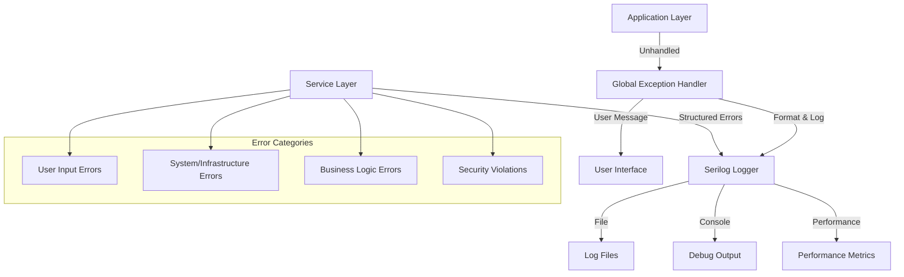

# WPF Bulk Editor - Error Handling & Logging Strategy with Serilog

## 🎯 **Error Handling Philosophy**

### **Core Principles**

- **User-First Experience**: Present clear, actionable error messages to users
- **Developer-Rich Context**: Capture detailed technical information for debugging
- **Fail-Safe Operations**: Graceful degradation when non-critical features fail
- **Security-Conscious**: Never expose sensitive information in error messages
- **Performance-Aware**: Minimal overhead in logging and error handling
- **Audit-Ready**: Comprehensive logging for compliance and analysis

### **Error Handling Architecture**



## 🔧 **Serilog Configuration & Setup**

### **Core Serilog Infrastructure**

```csharp
/// <summary>
/// Centralized logging configuration using Serilog
/// </summary>
public static class LoggingConfiguration
{
    /// <summary>
    /// Creates and configures the main application logger
    /// </summary>
    public static ILogger CreateLogger(LoggingSettings settings)
    {
        var loggerConfig = new LoggerConfiguration()
            .MinimumLevel.Is(ConvertLogLevel(settings.MinimumLevel))
            .MinimumLevel.Override("Microsoft", LogEventLevel.Warning)
            .MinimumLevel.Override("System", LogEventLevel.Warning)
            .Enrich.FromLogContext()
            .Enrich.WithProperty("Application", "BulkEditor")
            .Enrich.WithProperty("Version", GetApplicationVersion())
            .Enrich.WithMachineName()
            .Enrich.WithUserName()
            .Enrich.WithThreadId()
            .Enrich.WithProcessId()
            .Enrich.WithEnvironmentName();

        // Console logging for development
        if (settings.EnableConsoleLogging)
        {
            loggerConfig.WriteTo.Console(
                outputTemplate: "[{Timestamp:HH:mm:ss} {Level:u3}] {SourceContext} {Message:lj}{NewLine}{Exception}",
                theme: AnsiConsoleTheme.Code);
        }

        // File logging with rotation
        if (settings.EnableFileLogging)
        {
            var logPath = ExpandEnvironmentPath(settings.LogDirectory);
            Directory.CreateDirectory(logPath);

            loggerConfig.WriteTo.File(
                path: Path.Combine(logPath, settings.LogFilePattern),
                outputTemplate: settings.OutputTemplate,
                rollingInterval: RollingInterval.Day,
                retainedFileCountLimit: settings.RetainedFileCountLimit,
                fileSizeLimitBytes: settings.FileSizeLimitMB * 1024 * 1024,
                shared: true,
                flushToDiskInterval: TimeSpan.FromSeconds(1));
        }

        // Structured JSON logging for analysis
        if (settings.EnableStructuredLogging)
        {
            var structuredLogPath = Path.Combine(ExpandEnvironmentPath(settings.LogDirectory), "structured");
            Directory.CreateDirectory(structuredLogPath);

            loggerConfig.WriteTo.File(
                new JsonFormatter(renderMessage: true),
                path: Path.Combine(structuredLogPath, "log-.json"),
                rollingInterval: RollingInterval.Day,
                retainedFileCountLimit: settings.RetainedFileCountLimit);
        }

        // Performance metrics logging
        if (settings.EnableMetricsLogging)
        {
            loggerConfig.WriteTo.File(
                path: Path.Combine(ExpandEnvironmentPath(settings.LogDirectory), "metrics-.txt"),
                outputTemplate: "{Timestamp:yyyy-MM-dd HH:mm:ss.fff} [{Level:u3}] {Message:lj}{NewLine}",
                restrictedToMinimumLevel: LogEventLevel.Information,
                rollingInterval: RollingInterval.Day);
        }

        return loggerConfig.CreateLogger();
    }

    /// <summary>
    /// Creates a logger with specific context for a service or class
    /// </summary>
    public static ILogger CreateContextualLogger<T>(ILogger baseLogger)
    {
        return baseLogger.ForContext<T>();
    }

    /// <summary>
    /// Creates a logger with correlation ID for tracking operations
    /// </summary>
    public static ILogger CreateCorrelatedLogger(ILogger baseLogger, string correlationId)
    {
        return baseLogger.ForContext("CorrelationId", correlationId);
    }

    private static LogEventLevel ConvertLogLevel(LogLevel logLevel)
    {
        return logLevel switch
        {
            LogLevel.Trace => LogEventLevel.Verbose,
            LogLevel.Debug => LogEventLevel.Debug,
            LogLevel.Information => LogEventLevel.Information,
            LogLevel.Warning => LogEventLevel.Warning,
            LogLevel.Error => LogEventLevel.Error,
            LogLevel.Critical => LogEventLevel.Fatal,
            _ => LogEventLevel.Information
        };
    }

    private static string GetApplicationVersion()
    {
        return Assembly.GetExecutingAssembly().GetName().Version?.ToString() ?? "Unknown";
    }

    private static string ExpandEnvironmentPath(string path)
    {
        return Environment.ExpandEnvironmentVariables(path);
    }
}
```

### **Enhanced Logging Settings**

```csharp
/// <summary>
/// Comprehensive logging configuration model
/// </summary>
public class LoggingSettings
{
    [Required]
    public LogLevel MinimumLevel { get; set; } = LogLevel.Information;

    [Required]
    public string LogDirectory { get; set; } = "%APPDATA%\\BulkEditor\\Logs";

    [Range(1, 1000)]
    public int FileSizeLimitMB { get; set; } = 50;

    [Range(1, 100)]
    public int RetainedFileCountLimit { get; set; } = 10;

    public bool EnableConsoleLogging { get; set; } = true;
    public bool EnableFileLogging { get; set; } = true;
    public bool EnableStructuredLogging { get; set; } = true;
    public bool EnableMetricsLogging { get; set; } = true;
    public bool EnablePerformanceLogging { get; set; } = true;
    public bool EnableSecurityLogging { get; set; } = true;

    public string LogFilePattern { get; set; } = "log-{Date}.txt";

    public string OutputTemplate { get; set; } =
        "{Timestamp:yyyy-MM-dd HH:mm:ss.fff zzz} [{Level:u3}] [{SourceContext}] {Message:lj}{NewLine}{Exception}";

    public Dictionary<string, LogLevel> LogLevelOverrides { get; set; } = new();

    public TimeSpan FlushInterval { get; set; } = TimeSpan.FromSeconds(1);

    public bool BufferLogWrites { get; set; } = true;

    [Range(1, 10000)]
    public int BufferSize { get; set; } = 1000;

    public bool CompressOldLogs { get; set; } = true;

    public bool EnableLogSampling { get; set; } = false;

    [Range(1, 1000)]
    public int SamplingRate { get; set; } = 100;
}
```

## 🏗️ **Structured Error Types & Categories**

### **Domain-Specific Exception Types**

```csharp
/// <summary>
/// Base exception type for all application-specific exceptions
/// </summary>
public abstract class BulkEditorException : Exception
{
    public string ErrorCode { get; }
    public ErrorCategory Category { get; }
    public ErrorSeverity Severity { get; }
    public Dictionary<string, object> Context { get; }
    public string CorrelationId { get; }
    public DateTime Timestamp { get; }

    protected BulkEditorException(
        string message,
        string errorCode,
        ErrorCategory category,
        ErrorSeverity severity,
        Exception? innerException = null)
        : base(message, innerException)
    {
        ErrorCode = errorCode;
        Category = category;
        Severity = severity;
        Context = new Dictionary<string, object>();
        CorrelationId = Activity.Current?.Id ?? Guid.NewGuid().ToString();
        Timestamp = DateTime.UtcNow;
    }

    public BulkEditorException WithContext(string key, object value)
    {
        Context[key] = value;
        return this;
    }

    public virtual string GetUserFriendlyMessage()
    {
        return Category switch
        {
            ErrorCategory.UserInput => "Please check your input and try again.",
            ErrorCategory.FileSystem => "There was a problem accessing the file. Please check permissions and try again.",
            ErrorCategory.Network => "Unable to connect to the service. Please check your internet connection.",
            ErrorCategory.BusinessLogic => "The operation could not be completed due to business rules.",
            ErrorCategory.System => "A system error occurred. Please try again or contact support.",
            _ => "An unexpected error occurred. Please try again."
        };
    }
}

/// <summary>
/// Document processing specific exceptions
/// </summary>
public class DocumentProcessingException : BulkEditorException
{
    public string DocumentPath { get; }
    public ProcessingStage Stage { get; }

    public DocumentProcessingException(
        string message,
        string documentPath,
        ProcessingStage stage,
        Exception? innerException = null)
        : base(message, "DOC_PROCESSING_ERROR", ErrorCategory.BusinessLogic, ErrorSeverity.High, innerException)
    {
        DocumentPath = documentPath;
        Stage = stage;

        WithContext("DocumentPath", documentPath)
            .WithContext("ProcessingStage", stage.ToString());
    }

    public override string GetUserFriendlyMessage()
    {
        return Stage switch
        {
            ProcessingStage.Loading => $"Could not load document '{Path.GetFileName(DocumentPath)}'. The file may be corrupted or in use.",
            ProcessingStage.Validation => $"Document '{Path.GetFileName(DocumentPath)}' failed validation. Please check the file format.",
            ProcessingStage.HyperlinkExtraction => $"Could not extract hyperlinks from '{Path.GetFileName(DocumentPath)}'.",
            ProcessingStage.ApiCall => $"Could not retrieve information for links in '{Path.GetFileName(DocumentPath)}'.",
            ProcessingStage.HyperlinkUpdate => $"Could not update hyperlinks in '{Path.GetFileName(DocumentPath)}'.",
            ProcessingStage.Saving => $"Could not save changes to '{Path.GetFileName(DocumentPath)}'. Please check file permissions.",
            _ => $"An error occurred while processing '{Path.GetFileName(DocumentPath)}'."
        };
    }
}

/// <summary>
/// API communication exceptions
/// </summary>
public class ApiCommunicationException : BulkEditorException
{
    public string ApiEndpoint { get; }
    public int? HttpStatusCode { get; }
    public string? ResponseContent { get; }

    public ApiCommunicationException(
        string message,
        string apiEndpoint,
        int? httpStatusCode = null,
        string? responseContent = null,
        Exception? innerException = null)
        : base(message, "API_COMMUNICATION_ERROR", ErrorCategory.Network, ErrorSeverity.Medium, innerException)
    {
        ApiEndpoint = apiEndpoint;
        HttpStatusCode = httpStatusCode;
        ResponseContent = responseContent;

        WithContext("ApiEndpoint", apiEndpoint);
        if (httpStatusCode.HasValue)
            WithContext("HttpStatusCode", httpStatusCode.Value);
    }

    public override string GetUserFriendlyMessage()
    {
        return HttpStatusCode switch
        {
            401 => "Authentication failed. Please check your API credentials.",
            403 => "Access denied. You don't have permission to access this resource.",
            404 => "The requested resource was not found.",
            429 => "Too many requests. Please wait a moment and try again.",
            >= 500 => "The service is temporarily unavailable. Please try again later.",
            _ => "Unable to connect to the service. Please check your internet connection and try again."
        };
    }
}

/// <summary>
/// File system operation exceptions
/// </summary>
public class FileSystemException : BulkEditorException
{
    public string FilePath { get; }
    public FileOperation Operation { get; }

    public FileSystemException(
        string message,
        string filePath,
        FileOperation operation,
        Exception? innerException = null)
        : base(message, "FILE_SYSTEM_ERROR", ErrorCategory.FileSystem, ErrorSeverity.High, innerException)
    {
        FilePath = filePath;
        Operation = operation;

        WithContext("FilePath", filePath)
            .WithContext("FileOperation", operation.ToString());
    }

    public override string GetUserFriendlyMessage()
    {
        return Operation switch
        {
            FileOperation.Read => $"Could not read file '{Path.GetFileName(FilePath)}'. Please check if the file exists and you have permission to access it.",
            FileOperation.Write => $"Could not write to file '{Path.GetFileName(FilePath)}'. Please check file permissions and available disk space.",
            FileOperation.Delete => $"Could not delete file '{Path.GetFileName(FilePath)}'. The file may be in use by another program.",
            FileOperation.Backup => $"Could not create backup of '{Path.GetFileName(FilePath)}'. Please check available disk space.",
            FileOperation.Restore => $"Could not restore file from backup. The backup file may be corrupted.",
            _ => $"A file system error occurred with '{Path.GetFileName(FilePath)}'."
        };
    }
}

/// <summary>
/// Configuration and validation exceptions
/// </summary>
public class ConfigurationException : BulkEditorException
{
    public string ConfigurationSection { get; }
    public List<string> ValidationErrors { get; }

    public ConfigurationException(
        string message,
        string configurationSection,
        List<string>? validationErrors = null,
        Exception? innerException = null)
        : base(message, "CONFIGURATION_ERROR", ErrorCategory.System, ErrorSeverity.Critical, innerException)
    {
        ConfigurationSection = configurationSection;
        ValidationErrors = validationErrors ?? new List<string>();

        WithContext("ConfigurationSection", configurationSection)
            .WithContext("ValidationErrors", ValidationErrors);
    }

    public override string GetUserFriendlyMessage()
    {
        return "The application configuration is invalid. Please check your settings or reset to defaults.";
    }
}
```

### **Error Categories and Enums**

```csharp
public enum ErrorCategory
{
    UserInput,
    BusinessLogic,
    FileSystem,
    Network,
    Security,
    System,
    Performance
}

public enum ErrorSeverity
{
    Low,        // Informational, operation can continue
    Medium,     // Warning, operation may be affected
    High,       // Error, operation failed but application stable
    Critical    // Fatal, application may be unstable
}

public enum ProcessingStage
{
    Loading,
    Validation,
    BackupCreation,
    HyperlinkExtraction,
    ApiCall,
    HyperlinkUpdate,
    Saving,
    ChangelogGeneration,
    Cleanup
}

public enum FileOperation
{
    Read,
    Write,
    Delete,
    Copy,
    Move,
    Backup,
    Restore
}
```

## 🛡️ **Global Exception Handling**

### **Application-Level Exception Handler**

```csharp
/// <summary>
/// Global exception handler for the WPF application
/// </summary>
public class GlobalExceptionHandler
{
    private readonly ILogger _logger;
    private readonly IDialogService _dialogService;
    private readonly IConfigurationService _configurationService;
    private readonly ConcurrentDictionary<string, int> _errorCounts = new();
    private readonly Timer _errorResetTimer;

    public GlobalExceptionHandler(
        ILogger logger,
        IDialogService dialogService,
        IConfigurationService configurationService)
    {
        _logger = logger;
        _dialogService = dialogService;
        _configurationService = configurationService;

        // Reset error counts every hour
        _errorResetTimer = new Timer(ResetErrorCounts, null, TimeSpan.FromHours(1), TimeSpan.FromHours(1));

        // Subscribe to global exception events
        AppDomain.CurrentDomain.UnhandledException += OnUnhandledException;
        Application.Current.DispatcherUnhandledException += OnDispatcherUnhandledException;
        TaskScheduler.UnobservedTaskException += OnUnobservedTaskException;
    }

    private void OnUnhandledException(object sender, UnhandledExceptionEventArgs e)
    {
        var exception = e.ExceptionObject as Exception ?? new Exception("Unknown unhandled exception");

        _logger.Fatal(exception, "Unhandled application domain exception. IsTerminating: {IsTerminating}", e.IsTerminating);

        if (e.IsTerminating)
        {
            // Application is terminating - save critical state
            HandleCriticalError(exception, "Application Domain");
        }
        else
        {
            HandleNonCriticalError(exception, "Application Domain");
        }
    }

    private void OnDispatcherUnhandledException(object sender, DispatcherUnhandledExceptionEventArgs e)
    {
        _logger.Error(e.Exception, "Unhandled UI thread exception");

        // Determine if we can recover from this exception
        if (CanRecover(e.Exception))
        {
            e.Handled = true;
            HandleRecoverableError(e.Exception, "UI Thread");
        }
        else
        {
            HandleCriticalError(e.Exception, "UI Thread");
        }
    }

    private void OnUnobservedTaskException(object? sender, UnobservedTaskExceptionEventArgs e)
    {
        _logger.Error(e.Exception, "Unobserved task exception");

        // Mark as observed to prevent application termination
        e.SetObserved();

        HandleNonCriticalError(e.Exception, "Background Task");
    }

    public async Task<ErrorHandlingResult> HandleExceptionAsync(Exception exception, string context = "Unknown")
    {
        var correlationId = Guid.NewGuid().ToString();

        using var logContext = _logger.ForContext("CorrelationId", correlationId)
                                     .ForContext("ErrorContext", context);

        try
        {
            // Extract or create BulkEditorException
            var appException = ExtractApplicationException(exception);

            // Log the exception with full context
            LogException(logContext, appException, context);

            // Determine error handling strategy
            var strategy = DetermineHandlingStrategy(appException);

            // Execute handling strategy
            var result = await ExecuteHandlingStrategy(appException, strategy, correlationId);

            // Track error metrics
            TrackErrorMetrics(appException);

            return result;
        }
        catch (Exception handlingException)
        {
            // Exception occurred while handling exception - log and return generic result
            _logger.Fatal(handlingException, "Exception occurred while handling exception {OriginalException}", exception.Message);

            return new ErrorHandlingResult
            {
                IsRecovered = false,
                UserMessage = "A critical error occurred. Please restart the application.",
                ShouldTerminate = true,
                CorrelationId = correlationId
            };
        }
    }

    private BulkEditorException ExtractApplicationException(Exception exception)
    {
        // If it's already our exception type, return it
        if (exception is BulkEditorException appException)
            return appException;

        // Wrap in generic application exception
        return new GenericApplicationException(
            "An unexpected error occurred",
            exception.GetType().Name,
            DetermineCategory(exception),
            DetermineSeverity(exception),
            exception);
    }

    private void LogException(ILogger logger, BulkEditorException exception, string context)
    {
        var logLevel = exception.Severity switch
        {
            ErrorSeverity.Low => LogEventLevel.Information,
            ErrorSeverity.Medium => LogEventLevel.Warning,
            ErrorSeverity.High => LogEventLevel.Error,
            ErrorSeverity.Critical => LogEventLevel.Fatal,
            _ => LogEventLevel.Error
        };

        logger.Write(logLevel, exception,
            "Exception in {Context}: {ErrorCode} - {Message}. Category: {Category}, Severity: {Severity}",
            context, exception.ErrorCode, exception.Message, exception.Category, exception.Severity);

        // Log additional context
        foreach (var kvp in exception.Context)
        {
            logger.Information("Context {Key}: {Value}", kvp.Key, kvp.Value);
        }
    }

    private ErrorHandlingStrategy DetermineHandlingStrategy(BulkEditorException exception)
    {
        return exception.Severity switch
        {
            ErrorSeverity.Low => ErrorHandlingStrategy.LogOnly,
            ErrorSeverity.Medium => ErrorHandlingStrategy.LogAndNotify,
            ErrorSeverity.High => ErrorHandlingStrategy.LogNotifyAndRecover,
            ErrorSeverity.Critical => ErrorHandlingStrategy.LogNotifyAndTerminate,
            _ => ErrorHandlingStrategy.LogNotifyAndRecover
        };
    }

    private async Task<ErrorHandlingResult> ExecuteHandlingStrategy(
        BulkEditorException exception,
        ErrorHandlingStrategy strategy,
        string correlationId)
    {
        var result = new ErrorHandlingResult
        {
            CorrelationId = correlationId,
            UserMessage = exception.GetUserFriendlyMessage()
        };

        switch (strategy)
        {
            case ErrorHandlingStrategy.LogOnly:
                result.IsRecovered = true;
                break;

            case ErrorHandlingStrategy.LogAndNotify:
                await ShowUserNotification(exception, correlationId);
                result.IsRecovered = true;
                break;

            case ErrorHandlingStrategy.LogNotifyAndRecover:
                await ShowErrorDialog(exception, correlationId);
                result.IsRecovered = AttemptRecovery(exception);
                break;

            case ErrorHandlingStrategy.LogNotifyAndTerminate:
                await ShowCriticalErrorDialog(exception, correlationId);
                result.IsRecovered = false;
                result.ShouldTerminate = true;
                break;
        }

        return result;
    }

    private bool CanRecover(Exception exception)
    {
        // Determine if we can recover from specific exception types
        return exception switch
        {
            OutOfMemoryException => false,
            StackOverflowException => false,
            AccessViolationException => false,
            FileNotFoundException => true,
            UnauthorizedAccessException => true,
            HttpRequestException => true,
            _ => true
        };
    }

    private bool AttemptRecovery(BulkEditorException exception)
    {
        try
        {
            return exception.Category switch
            {
                ErrorCategory.FileSystem => AttemptFileSystemRecovery(exception),
                ErrorCategory.Network => AttemptNetworkRecovery(exception),
                ErrorCategory.BusinessLogic => AttemptBusinessLogicRecovery(exception),
                _ => false
            };
        }
        catch (Exception recoveryException)
        {
            _logger.Error(recoveryException, "Recovery attempt failed for {ErrorCode}", exception.ErrorCode);
            return false;
        }
    }

    private void TrackErrorMetrics(BulkEditorException exception)
    {
        var key = $"{exception.Category}_{exception.ErrorCode}";
        _errorCounts.AddOrUpdate(key, 1, (k, v) => v + 1);

        _logger.Information("Error metrics: {ErrorKey} occurred {Count} times",
            key, _errorCounts[key]);
    }

    private void ResetErrorCounts(object? state)
    {
        _errorCounts.Clear();
        _logger.Information("Error counts reset");
    }
}

public enum ErrorHandlingStrategy
{
    LogOnly,
    LogAndNotify,
    LogNotifyAndRecover,
    LogNotifyAndTerminate
}

public class ErrorHandlingResult
{
    public bool IsRecovered { get; set; }
    public string UserMessage { get; set; } = string.Empty;
    public bool ShouldTerminate { get; set; }
    public string CorrelationId { get; set; } = string.Empty;
    public Dictionary<string, object> Context { get; set; } = new();
}
```

## 📊 **Performance and Metrics Logging**

### **Performance Tracking Service**

```csharp
/// <summary>
/// Service for tracking performance metrics and operations
/// </summary>
public class PerformanceTrackingService : IPerformanceTrackingService
{
    private readonly ILogger _logger;
    private readonly ConcurrentDictionary<string, PerformanceMetrics> _metrics = new();
    private readonly Timer _metricsReportTimer;

    public PerformanceTrackingService(ILogger logger)
    {
        _logger = logger;

        // Report metrics every 5 minutes
        _metricsReportTimer = new Timer(ReportMetrics, null,
            TimeSpan.FromMinutes(5), TimeSpan.FromMinutes(5));
    }

    public IOperationTracker StartOperation(string operationName, string? correlationId = null)
    {
        return new OperationTracker(_logger, operationName, correlationId ?? Guid.NewGuid().ToString());
    }

    public void TrackMetric(string metricName, double value, Dictionary<string, object>? properties = null)
    {
        var metric = _metrics.GetOrAdd(metricName, new PerformanceMetrics(metricName));
        metric.AddValue(value);

        _logger.Information("Performance metric {MetricName}: {Value} {Unit}",
            metricName, value, properties?.GetValueOrDefault("Unit", ""));

        if (properties != null)
        {
            foreach (var prop in properties)
            {
                _logger.Information("Metric property {Key}: {Value}", prop.Key, prop.Value);
            }
        }
    }

    public void TrackResourceUsage()
    {
        using var process = Process.GetCurrentProcess();

        var memoryUsage = process.WorkingSet64 / (1024.0 * 1024.0); // MB
        var cpuTime = process.TotalProcessorTime.TotalMilliseconds;
        var threadCount = process.Threads.Count;
        var handleCount = process.HandleCount;

        _logger.Information("Resource usage - Memory: {MemoryMB:F2} MB, CPU Time: {CpuTimeMs:F2} ms, Threads: {ThreadCount}, Handles: {HandleCount}",
            memoryUsage, cpuTime, threadCount, handleCount);

        // Track GC metrics
        var gen0Collections = GC.CollectionCount(0);
        var gen1Collections = GC.CollectionCount(1);
        var gen2Collections = GC.CollectionCount(2);
        var totalMemory = GC.GetTotalMemory(false) / (1024.0 * 1024.0); // MB

        _logger.Information("GC metrics - Gen0: {Gen0}, Gen1: {Gen1}, Gen2: {Gen2}, Total Memory: {TotalMemoryMB:F2} MB",
            gen0Collections, gen1Collections, gen2Collections, totalMemory);
    }

    private void ReportMetrics(object? state)
    {
        try
        {
            foreach (var metric in _metrics.Values)
            {
                _logger.Information("Metric summary {MetricName}: Count={Count}, Avg={Average:F2}, Min={Min:F2}, Max={Max:F2}",
                    metric.Name, metric.Count, metric.Average, metric.Minimum, metric.Maximum);
            }

            TrackResourceUsage();
        }
        catch (Exception ex)
        {
            _logger.Error(ex, "Error reporting metrics");
        }
    }
}

/// <summary>
/// Tracks individual operation performance
/// </summary>
public class OperationTracker : IOperationTracker, IDisposable
{
    private readonly ILogger _logger;
    private readonly string _operationName;
    private readonly string _correlationId;
    private readonly Stopwatch _stopwatch;
    private readonly long _startMemory;
    private bool _disposed;

    public OperationTracker(ILogger logger, string operationName, string correlationId)
    {
        _logger = logger.ForContext("CorrelationId", correlationId);
        _operationName = operationName;
        _correlationId = correlationId;
        _stopwatch = Stopwatch.StartNew();
        _startMemory = GC.GetTotalMemory(false);

        _logger.Information("Operation started: {OperationName}", operationName);
    }

    public void AddContext(string key, object value)
    {
        _logger.ForContext(key, value);
    }

    public void LogProgress(string message, double? progressPercentage = null)
    {
        var elapsed = _stopwatch.Elapsed;

        if (progressPercentage.HasValue)
        {
            _logger.Information("Operation progress {OperationName}: {Message} ({Progress:F1}%) - Elapsed: {Elapsed}",
                _operationName, message, progressPercentage.Value, elapsed);
        }
        else
        {
            _logger.Information("Operation progress {OperationName}: {Message} - Elapsed: {Elapsed}",
                _operationName, message, elapsed);
        }
    }

    public void Dispose()
    {
        if (_disposed) return;

        _stopwatch.Stop();
        var endMemory = GC.GetTotalMemory(false);
        var memoryDelta = (endMemory - _startMemory) / (1024.0 * 1024.0); // MB

        _logger.Information("Operation completed: {OperationName} - Duration: {Duration}, Memory Delta: {MemoryDeltaMB:F2} MB",
            _operationName, _stopwatch.Elapsed, memoryDelta);

        _disposed = true;
    }
}

public class PerformanceMetrics
{
    public string Name { get; }
    public int Count { get; private set; }
    public double Sum { get; private set; }
    public double Minimum { get; private set; } = double.MaxValue;
    public double Maximum { get; private set; } = double.MinValue;
    public double Average => Count > 0 ? Sum / Count : 0;

    public PerformanceMetrics(string name)
    {
        Name = name;
    }

    public void AddValue(double value)
    {
        Count++;
        Sum += value;
        Minimum = Math.Min(Minimum, value);
        Maximum = Math.Max(Maximum, value);
    }
}

public interface IOperationTracker : IDisposable
{
    void AddContext(string key, object value);
    void LogProgress(string message, double? progressPercentage = null);
}

public interface IPerformanceTrackingService
{
    IOperationTracker StartOperation(string operationName, string? correlationId = null);
    void TrackMetric(string metricName, double value, Dictionary<string, object>? properties = null);
    void TrackResourceUsage();
}
```

## 🔐 **Security-Conscious Logging**

### **Sensitive Data Protection**

```csharp
/// <summary>
/// Service for sanitizing sensitive data from logs
/// </summary>
public class LogSanitizationService
{
    private static readonly Regex[] SensitivePatterns =
    {
        new(@"(?i)(password|pwd|secret|key|token)[\s]*[=:]\s*[^\s]+", RegexOptions.Compiled),
        new(@"(?i)(authorization|auth)[\s]*:\s*[^\s]+", RegexOptions.Compiled),
        new(@"\b[A-Za-z0-9._%+-]+@[A-Za-z0-9.-]+\.[A-Z|a-z]{2,}\b", RegexOptions.Compiled), // Email
        new(@"\b\d{4}[\s-]?\d{4}[\s-]?\d{4}[\s-]?\d{4}\b", RegexOptions.Compiled), // Credit card
        new(@"\b\d{3}-?\d{2}-?\d{4}\b", RegexOptions.Compiled) // SSN
    };

    public static string SanitizeMessage(string message)
    {
        if (string.IsNullOrEmpty(message))
            return message;

        var sanitized = message;

        foreach (var pattern in SensitivePatterns)
        {
            sanitized = pattern.Replace(sanitized, match =>
            {
                var groups = match.Groups;
                if (groups.Count > 1)
                {
                    return $"{groups[1].Value}=[REDACTED]";
                }
                return "[REDACTED]";
            });
        }

        return sanitized;
    }

    public static object SanitizeObject(object obj)
    {
        if (obj == null) return obj;

        var json = JsonSerializer.Serialize(obj);
        var sanitized = SanitizeMessage(json);

        try
        {
            return JsonSerializer.Deserialize<object>(sanitized);
        }
        catch
        {
            return "[SANITIZATION_ERROR]";
        }
    }
}

/// <summary>
/// Custom Serilog enricher for security context
/// </summary>
public class SecurityContextEnricher : ILogEventEnricher
{
    public void Enrich(LogEvent logEvent, ILogEventPropertyFactory propertyFactory)
    {
        // Add security-relevant context
        var userPrincipal = Thread.CurrentPrincipal;
        if (userPrincipal?.Identity?.IsAuthenticated == true)
        {
            logEvent.AddPropertyIfAbsent(propertyFactory.CreateProperty("UserId",
                userPrincipal.Identity.Name ?? "Unknown"));
        }

        // Add machine and process security context
        logEvent.AddPropertyIfAbsent(propertyFactory.CreateProperty("ProcessId",
            Environment.ProcessId));
        logEvent.AddPropertyIfAbsent(propertyFactory.CreateProperty("IsElevated",
            IsProcessElevated()));
    }

    private static bool IsProcessElevated()
    {
        try
        {
            using var identity = WindowsIdentity.GetCurrent();
            var principal = new WindowsPrincipal(identity);
            return principal.IsInRole(WindowsBuiltInRole.Administrator);
        }
        catch
        {
            return false;
        }
    }
}
```

This comprehensive error handling and logging strategy provides robust error management, detailed diagnostics, performance monitoring, and security-conscious logging throughout the application using Serilog's powerful structured logging capabilities.
