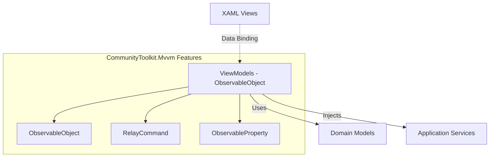

# WPF Bulk Editor - MVVM Architecture with CommunityToolkit.Mvvm

## 🎯 **MVVM Architecture Overview**

### **Architecture Principles**

- **View**: Pure XAML with minimal code-behind, focused on presentation
- **ViewModel**: Business logic and UI state management using CommunityToolkit.Mvvm
- **Model**: Domain entities and data structures (from Core layer)
- **Data Binding**: Two-way binding between View and ViewModel
- **Command Pattern**: User interactions handled through ICommand implementations
- **Dependency Injection**: ViewModels receive services through constructor injection

### **CommunityToolkit.Mvvm Integration**



## 🏗️ **Base ViewModel Infrastructure**

### **BaseViewModel Implementation**

```csharp
/// <summary>
/// Base class for all ViewModels providing common functionality
/// </summary>
public abstract partial class BaseViewModel : ObservableObject, IDisposable
{
    protected readonly ILogger logger;
    private readonly CancellationTokenSource _cancellationTokenSource = new();

    /// <summary>
    /// Indicates if the ViewModel is currently performing an operation
    /// </summary>
    [ObservableProperty]
    private bool isBusy;

    /// <summary>
    /// Current status message for user feedback
    /// </summary>
    [ObservableProperty]
    private string statusMessage = string.Empty;

    /// <summary>
    /// Current operation progress (0-100)
    /// </summary>
    [ObservableProperty]
    private double progressPercentage;

    /// <summary>
    /// Indicates if an error state exists
    /// </summary>
    [ObservableProperty]
    private bool hasError;

    /// <summary>
    /// Current error message
    /// </summary>
    [ObservableProperty]
    private string? errorMessage;

    /// <summary>
    /// Cancellation token for async operations
    /// </summary>
    protected CancellationToken CancellationToken => _cancellationTokenSource.Token;

    protected BaseViewModel(ILogger logger)
    {
        this.logger = logger ?? throw new ArgumentNullException(nameof(logger));
    }

    /// <summary>
    /// Sets busy state with optional status message
    /// </summary>
    protected void SetBusyState(bool busy, string? statusMessage = null)
    {
        IsBusy = busy;
        if (statusMessage != null)
        {
            StatusMessage = statusMessage;
        }

        // Refresh command can execute states
        OnPropertyChanged(nameof(IsBusy));
    }

    /// <summary>
    /// Sets error state with message
    /// </summary>
    protected void SetErrorState(string errorMessage)
    {
        HasError = true;
        ErrorMessage = errorMessage;
        IsBusy = false;
        logger.LogError("ViewModel error: {ErrorMessage}", errorMessage);
    }

    /// <summary>
    /// Clears error state
    /// </summary>
    protected void ClearErrorState()
    {
        HasError = false;
        ErrorMessage = null;
    }

    /// <summary>
    /// Executes async operation with error handling and busy state management
    /// </summary>
    protected async Task ExecuteAsync(Func<Task> operation, string? busyMessage = null)
    {
        try
        {
            ClearErrorState();
            SetBusyState(true, busyMessage);

            await operation();
        }
        catch (OperationCanceledException)
        {
            logger.LogInformation("Operation cancelled");
        }
        catch (Exception ex)
        {
            logger.LogError(ex, "Operation failed");
            SetErrorState($"Operation failed: {ex.Message}");
        }
        finally
        {
            SetBusyState(false);
        }
    }

    /// <summary>
    /// Executes async operation with result and error handling
    /// </summary>
    protected async Task<T?> ExecuteAsync<T>(Func<Task<T>> operation, string? busyMessage = null)
    {
        try
        {
            ClearErrorState();
            SetBusyState(true, busyMessage);

            return await operation();
        }
        catch (OperationCanceledException)
        {
            logger.LogInformation("Operation cancelled");
            return default;
        }
        catch (Exception ex)
        {
            logger.LogError(ex, "Operation failed");
            SetErrorState($"Operation failed: {ex.Message}");
            return default;
        }
        finally
        {
            SetBusyState(false);
        }
    }

    /// <summary>
    /// Cancels ongoing operations
    /// </summary>
    [RelayCommand]
    protected virtual void CancelOperation()
    {
        _cancellationTokenSource.Cancel();
        SetBusyState(false, "Operation cancelled");
    }

    /// <summary>
    /// Clears error state command
    /// </summary>
    [RelayCommand]
    protected virtual void ClearError()
    {
        ClearErrorState();
    }

    public virtual void Dispose()
    {
        _cancellationTokenSource.Cancel();
        _cancellationTokenSource.Dispose();
    }
}
```

### **Validation-Enabled Base ViewModel**

```csharp
/// <summary>
/// Base ViewModel with built-in validation support
/// </summary>
public abstract partial class ValidatableViewModel : BaseViewModel, INotifyDataErrorInfo
{
    private readonly Dictionary<string, List<string>> _errors = new();

    public bool HasErrors => _errors.Any();

    public event EventHandler<DataErrorsChangedEventArgs>? ErrorsChanged;

    protected ValidatableViewModel(ILogger logger) : base(logger) { }

    public IEnumerable GetErrors(string? propertyName)
    {
        if (string.IsNullOrEmpty(propertyName))
        {
            return _errors.SelectMany(e => e.Value);
        }

        return _errors.TryGetValue(propertyName, out var errors) ? errors : Enumerable.Empty<string>();
    }

    protected void SetErrors(string propertyName, IEnumerable<string> errors)
    {
        if (_errors.ContainsKey(propertyName))
        {
            _errors.Remove(propertyName);
        }

        var errorList = errors.ToList();
        if (errorList.Any())
        {
            _errors[propertyName] = errorList;
        }

        ErrorsChanged?.Invoke(this, new DataErrorsChangedEventArgs(propertyName));
        OnPropertyChanged(nameof(HasErrors));
    }

    protected void ClearErrors(string propertyName)
    {
        if (_errors.Remove(propertyName))
        {
            ErrorsChanged?.Invoke(this, new DataErrorsChangedEventArgs(propertyName));
            OnPropertyChanged(nameof(HasErrors));
        }
    }

    protected virtual void ValidateProperty(object? value, [CallerMemberName] string? propertyName = null)
    {
        if (propertyName == null) return;

        var context = new ValidationContext(this) { MemberName = propertyName };
        var results = new List<ValidationResult>();

        Validator.TryValidateProperty(value, context, results);

        SetErrors(propertyName, results.Select(r => r.ErrorMessage ?? "Validation error"));
    }
}
```

## 📋 **Main Application ViewModels**

### **MainWindowViewModel**

```csharp
/// <summary>
/// Primary application window ViewModel managing document processing workflow
/// </summary>
public partial class MainWindowViewModel : BaseViewModel
{
    private readonly IDocumentProcessingService _processingService;
    private readonly IConfigurationService _configurationService;
    private readonly IDialogService _dialogService;
    private readonly IThemeService _themeService;

    #region Observable Properties

    /// <summary>
    /// Collection of documents to be processed
    /// </summary>
    [ObservableProperty]
    private ObservableCollection<DocumentItemViewModel> documents = new();

    /// <summary>
    /// Selected document in the list
    /// </summary>
    [ObservableProperty]
    private DocumentItemViewModel? selectedDocument;

    /// <summary>
    /// Indicates if document processing is currently running
    /// </summary>
    [ObservableProperty]
    private bool isProcessing;

    /// <summary>
    /// Current processing progress percentage
    /// </summary>
    [ObservableProperty]
    private double processingProgress;

    /// <summary>
    /// Number of documents successfully processed
    /// </summary>
    [ObservableProperty]
    private int processedCount;

    /// <summary>
    /// Total number of documents to process
    /// </summary>
    [ObservableProperty]
    private int totalCount;

    /// <summary>
    /// Current operation being performed
    /// </summary>
    [ObservableProperty]
    private string currentOperation = string.Empty;

    /// <summary>
    /// Application title with version information
    /// </summary>
    [ObservableProperty]
    private string windowTitle = "Bulk Editor";

    /// <summary>
    /// Current theme information
    /// </summary>
    [ObservableProperty]
    private ThemeInfo currentTheme;

    #endregion

    public MainWindowViewModel(
        IDocumentProcessingService processingService,
        IConfigurationService configurationService,
        IDialogService dialogService,
        IThemeService themeService,
        ILogger<MainWindowViewModel> logger)
        : base(logger)
    {
        _processingService = processingService;
        _configurationService = configurationService;
        _dialogService = dialogService;
        _themeService = themeService;

        CurrentTheme = _themeService.GetCurrentTheme();

        // Initialize commands and subscriptions
        InitializeAsync();
    }

    #region Commands

    /// <summary>
    /// Command to add files to processing queue
    /// </summary>
    [RelayCommand]
    private async Task AddFilesAsync()
    {
        var files = await _dialogService.ShowOpenFileDialogAsync(
            "Select Word Documents",
            "Word Documents (*.docx)|*.docx",
            multiSelect: true);

        if (files?.Any() == true)
        {
            foreach (var file in files)
            {
                Documents.Add(new DocumentItemViewModel(file));
            }

            logger.LogInformation("Added {Count} files to processing queue", files.Count());
        }
    }

    /// <summary>
    /// Command to add folder contents to processing queue
    /// </summary>
    [RelayCommand]
    private async Task AddFolderAsync()
    {
        var folderPath = await _dialogService.ShowFolderBrowserDialogAsync("Select Folder Containing Word Documents");

        if (!string.IsNullOrEmpty(folderPath))
        {
            var files = Directory.GetFiles(folderPath, "*.docx", SearchOption.AllDirectories);

            foreach (var file in files)
            {
                Documents.Add(new DocumentItemViewModel(file));
            }

            logger.LogInformation("Added {Count} files from folder {FolderPath}", files.Length, folderPath);
        }
    }

    /// <summary>
    /// Command to remove selected document from queue
    /// </summary>
    [RelayCommand(CanExecute = nameof(CanRemoveDocument))]
    private void RemoveDocument()
    {
        if (SelectedDocument != null)
        {
            Documents.Remove(SelectedDocument);
            SelectedDocument = null;
        }
    }

    private bool CanRemoveDocument() => SelectedDocument != null && !IsProcessing;

    /// <summary>
    /// Command to clear all documents from queue
    /// </summary>
    [RelayCommand(CanExecute = nameof(CanClearDocuments))]
    private void ClearDocuments()
    {
        Documents.Clear();
        SelectedDocument = null;
    }

    private bool CanClearDocuments() => Documents.Any() && !IsProcessing;

    /// <summary>
    /// Command to start document processing
    /// </summary>
    [RelayCommand(CanExecute = nameof(CanStartProcessing))]
    private async Task StartProcessingAsync()
    {
        await ExecuteAsync(async () =>
        {
            IsProcessing = true;
            ProcessedCount = 0;
            TotalCount = Documents.Count;

            var progress = new Progress<BatchProgressUpdate>(OnProgressUpdated);

            var filePaths = Documents.Select(d => d.FilePath).ToList();
            var result = await _processingService.ProcessDocumentsBatchAsync(
                filePaths,
                maxConcurrency: 5,
                progress: progress,
                CancellationToken);

            // Update document statuses based on results
            UpdateDocumentStatuses(result);

            // Show completion message
            StatusMessage = $"Processing completed. {result.SuccessfulCount} of {result.TotalCount} documents processed successfully.";

        }, "Processing documents...");

        IsProcessing = false;
    }

    private bool CanStartProcessing() => Documents.Any() && !IsProcessing;

    /// <summary>
    /// Command to open settings dialog
    /// </summary>
    [RelayCommand]
    private async Task OpenSettingsAsync()
    {
        var settingsViewModel = new SettingsWindowViewModel(_configurationService, _themeService, logger);
        var result = await _dialogService.ShowDialogAsync<SettingsWindow>(settingsViewModel);

        if (result == true)
        {
            // Refresh theme if changed
            CurrentTheme = _themeService.GetCurrentTheme();
        }
    }

    /// <summary>
    /// Command to view processing logs
    /// </summary>
    [RelayCommand]
    private async Task ViewLogsAsync()
    {
        var logViewModel = new LogViewWindowViewModel(logger);
        await _dialogService.ShowDialogAsync<LogViewWindow>(logViewModel);
    }

    /// <summary>
    /// Command to show about dialog
    /// </summary>
    [RelayCommand]
    private async Task ShowAboutAsync()
    {
        var aboutViewModel = new AboutWindowViewModel();
        await _dialogService.ShowDialogAsync<AboutWindow>(aboutViewModel);
    }

    /// <summary>
    /// Command to toggle theme
    /// </summary>
    [RelayCommand]
    private async Task ToggleThemeAsync()
    {
        var newTheme = CurrentTheme.Type == ThemeType.Light ? ThemeType.Dark : ThemeType.Light;
        await _themeService.ApplyThemeAsync(newTheme);
        CurrentTheme = _themeService.GetCurrentTheme();
    }

    #endregion

    #region Private Methods

    private async void InitializeAsync()
    {
        // Load window state and preferences
        var userSettings = _configurationService.GetConfiguration<UserSettings>("UserSettings");
        WindowTitle = $"Bulk Editor v{GetApplicationVersion()}";

        // Subscribe to theme changes
        _themeService.MonitorSystemThemeChanges()
            .Subscribe(change => CurrentTheme = _themeService.GetCurrentTheme());
    }

    private void OnProgressUpdated(BatchProgressUpdate update)
    {
        Application.Current.Dispatcher.Invoke(() =>
        {
            ProcessedCount = update.CompletedDocuments;
            ProcessingProgress = update.PercentageComplete;
            CurrentOperation = update.CurrentOperation;

            // Update individual document status
            if (update.CurrentDocumentIndex < Documents.Count)
            {
                Documents[update.CurrentDocumentIndex].Status = update.CurrentDocumentStatus;
            }
        });
    }

    private void UpdateDocumentStatuses(BatchProcessingResult result)
    {
        for (int i = 0; i < Documents.Count && i < result.Results.Count; i++)
        {
            Documents[i].UpdateFromResult(result.Results[i]);
        }
    }

    private static string GetApplicationVersion()
    {
        return Assembly.GetExecutingAssembly().GetName().Version?.ToString() ?? "1.0.0";
    }

    #endregion

    protected override void Dispose()
    {
        foreach (var document in Documents)
        {
            document.Dispose();
        }

        base.Dispose();
    }
}
```

### **DocumentItemViewModel**

```csharp
/// <summary>
/// ViewModel representing a single document in the processing queue
/// </summary>
public partial class DocumentItemViewModel : ObservableObject, IDisposable
{
    [ObservableProperty]
    private string filePath = string.Empty;

    [ObservableProperty]
    private string fileName = string.Empty;

    [ObservableProperty]
    private string displayName = string.Empty;

    [ObservableProperty]
    private DocumentProcessingStatus status = DocumentProcessingStatus.Pending;

    [ObservableProperty]
    private double progress;

    [ObservableProperty]
    private string? errorMessage;

    [ObservableProperty]
    private DateTime? lastModified;

    [ObservableProperty]
    private long fileSize;

    [ObservableProperty]
    private int hyperlinkCount;

    [ObservableProperty]
    private int updatedHyperlinkCount;

    [ObservableProperty]
    private bool isSelected;

    public DocumentItemViewModel(string filePath)
    {
        FilePath = filePath;
        FileName = Path.GetFileName(filePath);
        DisplayName = Path.GetFileNameWithoutExtension(filePath);

        // Load file information
        LoadFileInfo();
    }

    private void LoadFileInfo()
    {
        try
        {
            var fileInfo = new FileInfo(FilePath);
            LastModified = fileInfo.LastWriteTime;
            FileSize = fileInfo.Length;
        }
        catch (Exception ex)
        {
            ErrorMessage = $"Could not load file info: {ex.Message}";
            Status = DocumentProcessingStatus.Error;
        }
    }

    public void UpdateFromResult(ProcessingResult result)
    {
        Status = result.IsSuccess ? DocumentProcessingStatus.Completed : DocumentProcessingStatus.Error;
        ErrorMessage = result.IsSuccess ? null : result.Message;

        if (result.Statistics != null)
        {
            HyperlinkCount = result.Statistics.TotalHyperlinks;
            UpdatedHyperlinkCount = result.Statistics.UpdatedHyperlinks;
        }
    }

    public void Dispose()
    {
        // Cleanup if needed
    }
}
```

### **SettingsWindowViewModel**

```csharp
/// <summary>
/// ViewModel for application settings management
/// </summary>
public partial class SettingsWindowViewModel : ValidatableViewModel
{
    private readonly IConfigurationService _configurationService;
    private readonly IThemeService _themeService;

    #region Observable Properties

    [ObservableProperty]
    private string apiBaseUrl = string.Empty;

    [ObservableProperty]
    [NotifyDataErrorInfo]
    [Range(5, 300, ErrorMessage = "Timeout must be between 5 and 300 seconds")]
    private int apiTimeout = 30;

    [ObservableProperty]
    [Range(1, 10, ErrorMessage = "Retry count must be between 1 and 10")]
    private int retryCount = 3;

    [ObservableProperty]
    private ThemeType selectedTheme = ThemeType.System;

    [ObservableProperty]
    private bool autoDetectSystemTheme = true;

    [ObservableProperty]
    private string defaultInputFolder = string.Empty;

    [ObservableProperty]
    private string defaultOutputFolder = string.Empty;

    [ObservableProperty]
    private bool autoOpenChangelog = true;

    [ObservableProperty]
    private bool createBackups = true;

    [ObservableProperty]
    [Range(1, 365, ErrorMessage = "Backup retention must be between 1 and 365 days")]
    private int backupRetentionDays = 30;

    [ObservableProperty]
    [Range(1, 20, ErrorMessage = "Max concurrent documents must be between 1 and 20")]
    private int maxConcurrentDocuments = 5;

    [ObservableProperty]
    private LogLevel minimumLogLevel = LogLevel.Information;

    public IEnumerable<ThemeType> AvailableThemes { get; } = Enum.GetValues<ThemeType>();
    public IEnumerable<LogLevel> AvailableLogLevels { get; } = Enum.GetValues<LogLevel>();

    #endregion

    public SettingsWindowViewModel(
        IConfigurationService configurationService,
        IThemeService themeService,
        ILogger<SettingsWindowViewModel> logger)
        : base(logger)
    {
        _configurationService = configurationService;
        _themeService = themeService;

        LoadSettings();
    }

    #region Commands

    [RelayCommand]
    private async Task SaveSettingsAsync()
    {
        if (HasErrors)
        {
            SetErrorState("Please fix validation errors before saving");
            return;
        }

        await ExecuteAsync(async () =>
        {
            // Save API settings
            var apiSettings = new ApiSettings
            {
                BaseUrl = ApiBaseUrl,
                TimeoutSeconds = ApiTimeout,
                RetryCount = RetryCount
            };
            await _configurationService.UpdateConfigurationAsync("ApiSettings", apiSettings);

            // Save UI settings
            var uiSettings = new UISettings
            {
                SelectedTheme = SelectedTheme,
                AutoDetectSystemTheme = AutoDetectSystemTheme,
                DefaultInputFolder = DefaultInputFolder,
                DefaultOutputFolder = DefaultOutputFolder,
                AutoOpenChangelog = AutoOpenChangelog
            };
            await _configurationService.UpdateConfigurationAsync("UISettings", uiSettings);

            // Save processing settings
            var processingSettings = new ProcessingSettings
            {
                CreateBackups = CreateBackups,
                BackupRetentionDays = BackupRetentionDays,
                MaxConcurrentDocuments = MaxConcurrentDocuments
            };
            await _configurationService.UpdateConfigurationAsync("ProcessingSettings", processingSettings);

            // Apply theme if changed
            await _themeService.ApplyThemeAsync(SelectedTheme);

            StatusMessage = "Settings saved successfully";

        }, "Saving settings...");
    }

    [RelayCommand]
    private void ResetToDefaults()
    {
        LoadDefaultSettings();
        StatusMessage = "Settings reset to defaults";
    }

    [RelayCommand]
    private async Task BrowseInputFolderAsync()
    {
        var folder = await BrowseFolderAsync("Select Default Input Folder");
        if (!string.IsNullOrEmpty(folder))
        {
            DefaultInputFolder = folder;
        }
    }

    [RelayCommand]
    private async Task BrowseOutputFolderAsync()
    {
        var folder = await BrowseFolderAsync("Select Default Output Folder");
        if (!string.IsNullOrEmpty(folder))
        {
            DefaultOutputFolder = folder;
        }
    }

    [RelayCommand]
    private async Task TestApiConnectionAsync()
    {
        // Implementation for API connection testing
    }

    #endregion

    #region Property Change Handlers

    partial void OnApiTimeoutChanged(int value)
    {
        ValidateProperty(value);
    }

    partial void OnRetryCountChanged(int value)
    {
        ValidateProperty(value);
    }

    partial void OnBackupRetentionDaysChanged(int value)
    {
        ValidateProperty(value);
    }

    partial void OnMaxConcurrentDocumentsChanged(int value)
    {
        ValidateProperty(value);
    }

    #endregion

    private void LoadSettings()
    {
        var apiSettings = _configurationService.GetConfiguration<ApiSettings>("ApiSettings");
        ApiBaseUrl = apiSettings.BaseUrl;
        ApiTimeout = apiSettings.TimeoutSeconds;
        RetryCount = apiSettings.RetryCount;

        var uiSettings = _configurationService.GetConfiguration<UISettings>("UISettings");
        SelectedTheme = uiSettings.SelectedTheme;
        AutoDetectSystemTheme = uiSettings.AutoDetectSystemTheme;
        DefaultInputFolder = uiSettings.DefaultInputFolder;
        DefaultOutputFolder = uiSettings.DefaultOutputFolder;
        AutoOpenChangelog = uiSettings.AutoOpenChangelog;

        var processingSettings = _configurationService.GetConfiguration<ProcessingSettings>("ProcessingSettings");
        CreateBackups = processingSettings.CreateBackups;
        BackupRetentionDays = processingSettings.BackupRetentionDays;
        MaxConcurrentDocuments = processingSettings.MaxConcurrentDocuments;
    }

    private void LoadDefaultSettings()
    {
        // Load default values
        ApiBaseUrl = "https://api.example.com";
        ApiTimeout = 30;
        RetryCount = 3;
        SelectedTheme = ThemeType.System;
        AutoDetectSystemTheme = true;
        DefaultInputFolder = string.Empty;
        DefaultOutputFolder = string.Empty;
        AutoOpenChangelog = true;
        CreateBackups = true;
        BackupRetentionDays = 30;
        MaxConcurrentDocuments = 5;
    }

    private async Task<string?> BrowseFolderAsync(string title)
    {
        // Implementation for folder browsing
        return await Task.FromResult<string?>(null);
    }
}
```

## 🔧 **Data Binding Patterns**

### **Two-Way Binding with Validation**

```xml
<!-- XAML Example for Settings Window -->
<TextBox Text="{Binding ApiTimeout, Mode=TwoWay, UpdateSourceTrigger=PropertyChanged, ValidatesOnDataErrors=True}"
         ToolTip="API request timeout in seconds (5-300)" />

<TextBlock Text="{Binding (Validation.Errors)[0].ErrorContent, RelativeSource={RelativeSource AncestorType=TextBox}}"
           Foreground="Red"
           Visibility="{Binding (Validation.HasError), RelativeSource={RelativeSource AncestorType=TextBox},
                        Converter={StaticResource BoolToVisibilityConverter}}" />
```

### **Command Binding with CanExecute**

```xml
<!-- Button with command binding -->
<Button Content="Start Processing"
        Command="{Binding StartProcessingCommand}"
        Style="{StaticResource MaterialDesignRaisedButton}" />

<!-- Progress indicator bound to ViewModel state -->
<ProgressBar Value="{Binding ProcessingProgress}"
             Maximum="100"
             Visibility="{Binding IsProcessing, Converter={StaticResource BoolToVisibilityConverter}}" />
```

### **Collection Binding with ItemTemplate**

```xml
<!-- Document list with item template -->
<ListView ItemsSource="{Binding Documents}"
          SelectedItem="{Binding SelectedDocument, Mode=TwoWay}">
    <ListView.ItemTemplate>
        <DataTemplate>
            <Grid>
                <Grid.ColumnDefinitions>
                    <ColumnDefinition Width="*" />
                    <ColumnDefinition Width="Auto" />
                    <ColumnDefinition Width="Auto" />
                </Grid.ColumnDefinitions>

                <TextBlock Grid.Column="0"
                           Text="{Binding DisplayName}"
                           VerticalAlignment="Center" />

                <TextBlock Grid.Column="1"
                           Text="{Binding Status}"
                           Foreground="{Binding Status, Converter={StaticResource StatusToColorConverter}}"
                           VerticalAlignment="Center"
                           Margin="10,0" />

                <ProgressBar Grid.Column="2"
                            Value="{Binding Progress}"
                            Maximum="100"
                            Width="100"
                            Visibility="{Binding Status, Converter={StaticResource ProcessingToVisibilityConverter}}" />
            </Grid>
        </DataTemplate>
    </ListView.ItemTemplate>
</ListView>
```

## 🎯 **ViewModel Communication Patterns**

### **Messenger Pattern (Optional)**

```csharp
// For complex inter-ViewModel communication
public class DocumentProcessingMessage
{
    public string DocumentPath { get; set; } = string.Empty;
    public ProcessingResult Result { get; set; } = new();
}

// In sending ViewModel
WeakReferenceMessenger.Default.Send(new DocumentProcessingMessage
{
    DocumentPath = document.FilePath,
    Result = result
});

// In receiving ViewModel
WeakReferenceMessenger.Default.Register<DocumentProcessingMessage>(this, (r, m) =>
{
    // Handle message
});
```

### **Service-Mediated Communication**

```csharp
// Preferred approach: Use shared services for communication
public interface IDocumentProcessingEventService
{
    event EventHandler<DocumentProcessedEventArgs> DocumentProcessed;
    event EventHandler<BatchProcessingEventArgs> BatchProcessingCompleted;

    void NotifyDocumentProcessed(string filePath, ProcessingResult result);
    void NotifyBatchCompleted(BatchProcessingResult result);
}
```

## 📋 **UI Thread Synchronization**

### **Progress Reporting on UI Thread**

```csharp
private void OnProgressUpdated(ProgressUpdate update)
{
    // Ensure UI updates happen on the UI thread
    if (Application.Current.Dispatcher.CheckAccess())
    {
        UpdateUI(update);
    }
    else
    {
        Application.Current.Dispatcher.Invoke(() => UpdateUI(update));
    }
}

private void UpdateUI(ProgressUpdate update)
{
    ProcessingProgress = update.PercentageComplete;
    CurrentOperation = update.CurrentOperation;
    StatusMessage = $"Processing: {update.DocumentName}";
}
```

### **Async Command Implementation**

```csharp
[RelayCommand]
private async Task ProcessDocumentsAsync()
{
    // Long-running operation on background thread
    await Task.Run(async () =>
    {
        var result = await _processingService.ProcessDocumentsBatchAsync(
            Documents.Select(d => d.FilePath),
            progress: new Progress<BatchProgressUpdate>(OnProgressUpdated),
            CancellationToken);

        // UI updates automatically marshaled via Progress<T>
    });
}
```

This MVVM architecture provides a solid foundation for the WPF application with proper separation of concerns, data binding, validation, and asynchronous operations while leveraging the full power of CommunityToolkit.Mvvm.
