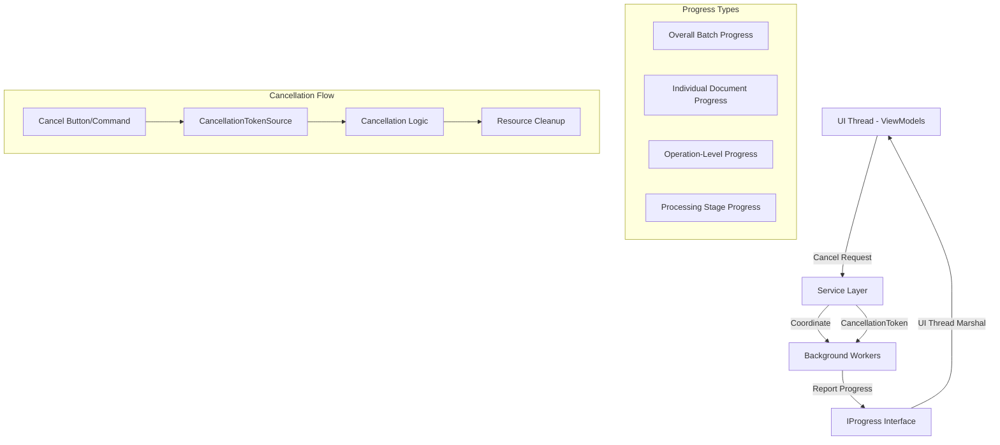

# WPF Bulk Editor - Progress Reporting & Cancellation Mechanisms

## 🎯 **Progress Reporting Philosophy**

### **Core Principles**

- **User-Centric Feedback**: Always inform users about current operation status
- **Granular Progress**: Report progress at multiple levels (overall, document, operation)
- **Cancellation-Ready**: Every long-running operation must support cancellation
- **Performance-Aware**: Minimal overhead for progress reporting
- **Thread-Safe**: Safe cross-thread progress updates
- **Predictive**: Estimate remaining time and completion

### **Progress Reporting Architecture**



## 📊 **Progress Data Models**

### **Hierarchical Progress Structure**

```csharp
/// <summary>
/// Base progress report interface
/// </summary>
public interface IProgressReport
{
    string OperationName { get; }
    double PercentageComplete { get; }
    string CurrentStatus { get; }
    DateTime StartTime { get; }
    TimeSpan Elapsed { get; }
    TimeSpan? EstimatedTimeRemaining { get; }
    bool CanCancel { get; }
    string? ErrorMessage { get; }
}

/// <summary>
/// Overall batch processing progress
/// </summary>
public class BatchProgressReport : IProgressReport
{
    public string OperationName { get; set; } = "Batch Processing";
    public double PercentageComplete { get; set; }
    public string CurrentStatus { get; set; } = string.Empty;
    public DateTime StartTime { get; set; }
    public TimeSpan Elapsed => DateTime.UtcNow - StartTime;
    public TimeSpan? EstimatedTimeRemaining { get; set; }
    public bool CanCancel { get; set; } = true;
    public string? ErrorMessage { get; set; }

    // Batch-specific properties
    public int TotalDocuments { get; set; }
    public int CompletedDocuments { get; set; }
    public int SuccessfulDocuments { get; set; }
    public int FailedDocuments { get; set; }
    public int CurrentDocumentIndex { get; set; }
    public string CurrentDocumentName { get; set; } = string.Empty;
    public DocumentProgressReport? CurrentDocumentProgress { get; set; }

    // Performance metrics
    public double DocumentsPerMinute { get; set; }
    public double AverageDocumentTime { get; set; }
    public long MemoryUsageMB { get; set; }

    // Detailed breakdown
    public List<DocumentProgressSummary> DocumentSummaries { get; set; } = new();
}

/// <summary>
/// Individual document processing progress
/// </summary>
public class DocumentProgressReport : IProgressReport
{
    public string OperationName { get; set; } = "Document Processing";
    public double PercentageComplete { get; set; }
    public string CurrentStatus { get; set; } = string.Empty;
    public DateTime StartTime { get; set; }
    public TimeSpan Elapsed => DateTime.UtcNow - StartTime;
    public TimeSpan? EstimatedTimeRemaining { get; set; }
    public bool CanCancel { get; set; } = true;
    public string? ErrorMessage { get; set; }

    // Document-specific properties
    public string DocumentPath { get; set; } = string.Empty;
    public string DocumentName => Path.GetFileName(DocumentPath);
    public long DocumentSizeBytes { get; set; }
    public ProcessingStage CurrentStage { get; set; }
    public int TotalStages { get; set; } = 8;
    public int CompletedStages { get; set; }

    // Processing details
    public int TotalHyperlinks { get; set; }
    public int ProcessedHyperlinks { get; set; }
    public int UpdatedHyperlinks { get; set; }
    public int ErrorHyperlinks { get; set; }
    public string? BackupPath { get; set; }

    // Stage breakdown
    public Dictionary<ProcessingStage, StageProgress> StageDetails { get; set; } = new();
}

/// <summary>
/// Stage-level progress within document processing
/// </summary>
public class StageProgressReport : IProgressReport
{
    public string OperationName { get; set; } = string.Empty;
    public double PercentageComplete { get; set; }
    public string CurrentStatus { get; set; } = string.Empty;
    public DateTime StartTime { get; set; }
    public TimeSpan Elapsed => DateTime.UtcNow - StartTime;
    public TimeSpan? EstimatedTimeRemaining { get; set; }
    public bool CanCancel { get; set; } = true;
    public string? ErrorMessage { get; set; }

    // Stage-specific properties
    public ProcessingStage Stage { get; set; }
    public string StageDescription { get; set; } = string.Empty;
    public int CurrentItem { get; set; }
    public int TotalItems { get; set; }
    public string? CurrentItemName { get; set; }

    // Operation metrics
    public double ItemsPerSecond { get; set; }
    public long ProcessedBytes { get; set; }
    public long TotalBytes { get; set; }
}

/// <summary>
/// Progress information for individual processing stages
/// </summary>
public class StageProgress
{
    public ProcessingStage Stage { get; set; }
    public string Name { get; set; } = string.Empty;
    public string Description { get; set; } = string.Empty;
    public bool IsCompleted { get; set; }
    public bool IsActive { get; set; }
    public bool HasError { get; set; }
    public string? ErrorMessage { get; set; }
    public TimeSpan? Duration { get; set; }
    public double Weight { get; set; } = 1.0; // For weighted progress calculation
}

/// <summary>
/// Summary information for completed/failed documents
/// </summary>
public class DocumentProgressSummary
{
    public string DocumentPath { get; set; } = string.Empty;
    public string DocumentName => Path.GetFileName(DocumentPath);
    public DocumentProcessingStatus Status { get; set; }
    public TimeSpan ProcessingTime { get; set; }
    public int HyperlinksProcessed { get; set; }
    public int HyperlinksUpdated { get; set; }
    public string? ErrorMessage { get; set; }
    public DateTime CompletedAt { get; set; }
}

/// <summary>
/// Processing stages enumeration with metadata
/// </summary>
public enum ProcessingStage
{
    [StageInfo("Initializing", "Preparing document for processing", 5)]
    Initialization = 0,

    [StageInfo("Validating", "Checking document format and accessibility", 10)]
    Validation = 1,

    [StageInfo("Creating Backup", "Creating safety backup of original document", 15)]
    BackupCreation = 2,

    [StageInfo("Loading Document", "Opening and parsing document content", 20)]
    DocumentLoading = 3,

    [StageInfo("Extracting Hyperlinks", "Finding and analyzing hyperlinks", 30)]
    HyperlinkExtraction = 4,

    [StageInfo("API Communication", "Retrieving document metadata", 40)]
    ApiCommunication = 5,

    [StageInfo("Updating Hyperlinks", "Applying updates to document hyperlinks", 60)]
    HyperlinkUpdate = 6,

    [StageInfo("Saving Document", "Writing changes to document file", 80)]
    DocumentSaving = 7,

    [StageInfo("Generating Changelog", "Creating processing report", 90)]
    ChangelogGeneration = 8,

    [StageInfo("Cleanup", "Finalizing and cleaning up resources", 100)]
    Cleanup = 9
}

/// <summary>
/// Attribute for stage metadata
/// </summary>
[AttributeUsage(AttributeTargets.Field)]
public class StageInfoAttribute : Attribute
{
    public string Name { get; }
    public string Description { get; }
    public double PercentageComplete { get; }

    public StageInfoAttribute(string name, string description, double percentageComplete)
    {
        Name = name;
        Description = description;
        PercentageComplete = percentageComplete;
    }
}
```

## 🔄 **Progress Reporting Services**

### **Centralized Progress Management**

```csharp
/// <summary>
/// Central service for managing progress reporting across the application
/// </summary>
public class ProgressReportingService : IProgressReportingService, IDisposable
{
    private readonly ILogger<ProgressReportingService> _logger;
    private readonly Subject<IProgressReport> _progressStream = new();
    private readonly ConcurrentDictionary<string, IProgressTracker> _activeTrackers = new();
    private readonly Timer _performanceUpdateTimer;

    public ProgressReportingService(ILogger<ProgressReportingService> logger)
    {
        _logger = logger;

        // Update performance metrics every second
        _performanceUpdateTimer = new Timer(UpdatePerformanceMetrics, null,
            TimeSpan.FromSeconds(1), TimeSpan.FromSeconds(1));
    }

    public IObservable<IProgressReport> ProgressStream => _progressStream.AsObservable();

    public IBatchProgressTracker CreateBatchTracker(string operationName, int totalDocuments)
    {
        var tracker = new BatchProgressTracker(operationName, totalDocuments, _logger);
        var trackerId = Guid.NewGuid().ToString();

        _activeTrackers.TryAdd(trackerId, tracker);

        // Subscribe to tracker's progress updates
        tracker.ProgressUpdates.Subscribe(progress =>
        {
            _progressStream.OnNext(progress);
            _logger.LogDebug("Batch progress update: {PercentageComplete:F1}% - {CurrentStatus}",
                progress.PercentageComplete, progress.CurrentStatus);
        });

        tracker.Completed += () => _activeTrackers.TryRemove(trackerId, out _);

        return tracker;
    }

    public IDocumentProgressTracker CreateDocumentTracker(string documentPath, ProcessingStage[] stages)
    {
        var tracker = new DocumentProgressTracker(documentPath, stages, _logger);
        var trackerId = Guid.NewGuid().ToString();

        _activeTrackers.TryAdd(trackerId, tracker);

        tracker.ProgressUpdates.Subscribe(progress =>
        {
            _progressStream.OnNext(progress);
            _logger.LogDebug("Document progress update: {DocumentName} - {Stage} - {PercentageComplete:F1}%",
                progress.DocumentName, progress.CurrentStage, progress.PercentageComplete);
        });

        tracker.Completed += () => _activeTrackers.TryRemove(trackerId, out _);

        return tracker;
    }

    public IStageProgressTracker CreateStageTracker(ProcessingStage stage, int totalItems)
    {
        var tracker = new StageProgressTracker(stage, totalItems, _logger);
        var trackerId = Guid.NewGuid().ToString();

        _activeTrackers.TryAdd(trackerId, tracker);

        tracker.ProgressUpdates.Subscribe(progress =>
        {
            _progressStream.OnNext(progress);
        });

        tracker.Completed += () => _activeTrackers.TryRemove(trackerId, out _);

        return tracker;
    }

    public ProgressStatistics GetCurrentStatistics()
    {
        var activeTrackers = _activeTrackers.Values.ToList();

        return new ProgressStatistics
        {
            ActiveOperations = activeTrackers.Count,
            TotalOperationsStarted = _totalOperationsStarted,
            TotalOperationsCompleted = _totalOperationsCompleted,
            AverageOperationTime = _averageOperationTime,
            CurrentMemoryUsage = GC.GetTotalMemory(false) / (1024.0 * 1024.0), // MB
            PeakMemoryUsage = _peakMemoryUsage
        };
    }

    private void UpdatePerformanceMetrics(object? state)
    {
        try
        {
            var currentMemory = GC.GetTotalMemory(false) / (1024.0 * 1024.0);
            _peakMemoryUsage = Math.Max(_peakMemoryUsage, currentMemory);

            // Update performance metrics in active trackers
            foreach (var tracker in _activeTrackers.Values)
            {
                if (tracker is BatchProgressTracker batchTracker)
                {
                    batchTracker.UpdatePerformanceMetrics();
                }
            }
        }
        catch (Exception ex)
        {
            _logger.LogError(ex, "Error updating performance metrics");
        }
    }

    public void Dispose()
    {
        _performanceUpdateTimer?.Dispose();
        _progressStream?.Dispose();

        foreach (var tracker in _activeTrackers.Values)
        {
            tracker.Dispose();
        }

        _activeTrackers.Clear();
    }
}

/// <summary>
/// Batch-level progress tracker
/// </summary>
public class BatchProgressTracker : IBatchProgressTracker, IDisposable
{
    private readonly string _operationName;
    private readonly int _totalDocuments;
    private readonly ILogger _logger;
    private readonly Subject<BatchProgressReport> _progressSubject = new();
    private readonly List<DocumentProgressSummary> _completedDocuments = new();
    private readonly CancellationTokenSource _cancellationTokenSource = new();

    private BatchProgressReport _currentProgress;
    private int _completedCount;
    private int _successfulCount;
    private int _failedCount;
    private readonly Stopwatch _overallStopwatch = new();
    private readonly Stopwatch _documentStopwatch = new();

    public BatchProgressTracker(string operationName, int totalDocuments, ILogger logger)
    {
        _operationName = operationName;
        _totalDocuments = totalDocuments;
        _logger = logger;

        _currentProgress = new BatchProgressReport
        {
            OperationName = operationName,
            TotalDocuments = totalDocuments,
            StartTime = DateTime.UtcNow
        };

        _overallStopwatch.Start();
    }

    public IObservable<BatchProgressReport> ProgressUpdates => _progressSubject.AsObservable();
    public CancellationToken CancellationToken => _cancellationTokenSource.Token;
    public event Action? Completed;

    public void StartDocument(string documentPath)
    {
        _currentProgress.CurrentDocumentIndex = _completedCount;
        _currentProgress.CurrentDocumentName = Path.GetFileName(documentPath);
        _currentProgress.CurrentStatus = $"Processing {_currentProgress.CurrentDocumentName}...";

        _documentStopwatch.Restart();

        ReportProgress();
    }

    public void CompleteDocument(string documentPath, bool success, string? errorMessage = null)
    {
        _documentStopwatch.Stop();

        _completedCount++;
        if (success)
            _successfulCount++;
        else
            _failedCount++;

        var summary = new DocumentProgressSummary
        {
            DocumentPath = documentPath,
            Status = success ? DocumentProcessingStatus.Completed : DocumentProcessingStatus.Error,
            ProcessingTime = _documentStopwatch.Elapsed,
            ErrorMessage = errorMessage,
            CompletedAt = DateTime.UtcNow
        };

        _completedDocuments.Add(summary);

        // Update overall progress
        _currentProgress.CompletedDocuments = _completedCount;
        _currentProgress.SuccessfulDocuments = _successfulCount;
        _currentProgress.FailedDocuments = _failedCount;
        _currentProgress.PercentageComplete = (double)_completedCount / _totalDocuments * 100;

        // Calculate estimated time remaining
        if (_completedCount > 0)
        {
            var averageTimePerDocument = _overallStopwatch.Elapsed.TotalMilliseconds / _completedCount;
            var remainingDocuments = _totalDocuments - _completedCount;
            _currentProgress.EstimatedTimeRemaining = TimeSpan.FromMilliseconds(
                averageTimePerDocument * remainingDocuments);
        }

        if (_completedCount >= _totalDocuments)
        {
            _currentProgress.CurrentStatus = "Processing completed";
            _currentProgress.PercentageComplete = 100;
            Complete();
        }
        else
        {
            _currentProgress.CurrentStatus = $"Completed {_completedCount} of {_totalDocuments} documents";
        }

        ReportProgress();
    }

    public void UpdateDocumentProgress(DocumentProgressReport documentProgress)
    {
        _currentProgress.CurrentDocumentProgress = documentProgress;

        // Calculate weighted progress including current document
        var baseProgress = (double)_completedCount / _totalDocuments * 100;
        var currentDocumentWeight = (1.0 / _totalDocuments) * 100;
        var currentDocumentProgress = documentProgress.PercentageComplete * currentDocumentWeight / 100;

        _currentProgress.PercentageComplete = baseProgress + currentDocumentProgress;

        ReportProgress();
    }

    public void UpdatePerformanceMetrics()
    {
        if (_completedCount > 0)
        {
            var elapsedMinutes = _overallStopwatch.Elapsed.TotalMinutes;
            _currentProgress.DocumentsPerMinute = _completedCount / Math.Max(elapsedMinutes, 0.01);
            _currentProgress.AverageDocumentTime = _overallStopwatch.Elapsed.TotalSeconds / _completedCount;
        }

        _currentProgress.MemoryUsageMB = GC.GetTotalMemory(false) / (1024 * 1024);
    }

    public void Cancel()
    {
        _cancellationTokenSource.Cancel();
        _currentProgress.CurrentStatus = "Cancelling...";
        _currentProgress.CanCancel = false;
        ReportProgress();
    }

    public void ReportError(string errorMessage)
    {
        _currentProgress.ErrorMessage = errorMessage;
        _currentProgress.CurrentStatus = $"Error: {errorMessage}";
        ReportProgress();
    }

    private void Complete()
    {
        _overallStopwatch.Stop();
        _currentProgress.CanCancel = false;
        _currentProgress.DocumentSummaries = _completedDocuments.ToList();

        Completed?.Invoke();

        _logger.LogInformation("Batch processing completed: {SuccessfulCount}/{TotalCount} successful in {ElapsedTime}",
            _successfulCount, _totalDocuments, _overallStopwatch.Elapsed);
    }

    private void ReportProgress()
    {
        _progressSubject.OnNext(_currentProgress);
    }

    public void Dispose()
    {
        _overallStopwatch.Stop();
        _documentStopwatch.Stop();
        _cancellationTokenSource.Dispose();
        _progressSubject.Dispose();
    }
}

/// <summary>
/// Document-level progress tracker
/// </summary>
public class DocumentProgressTracker : IDocumentProgressTracker, IDisposable
{
    private readonly string _documentPath;
    private readonly ProcessingStage[] _stages;
    private readonly ILogger _logger;
    private readonly Subject<DocumentProgressReport> _progressSubject = new();
    private readonly CancellationTokenSource _cancellationTokenSource = new();

    private DocumentProgressReport _currentProgress;
    private int _currentStageIndex;
    private readonly Stopwatch _stageStopwatch = new();

    public DocumentProgressTracker(string documentPath, ProcessingStage[] stages, ILogger logger)
    {
        _documentPath = documentPath;
        _stages = stages;
        _logger = logger;

        _currentProgress = new DocumentProgressReport
        {
            DocumentPath = documentPath,
            TotalStages = stages.Length,
            StartTime = DateTime.UtcNow
        };

        // Initialize stage details
        foreach (var stage in stages)
        {
            var stageInfo = GetStageInfo(stage);
            _currentProgress.StageDetails[stage] = new StageProgress
            {
                Stage = stage,
                Name = stageInfo.Name,
                Description = stageInfo.Description,
                Weight = stageInfo.PercentageComplete / 100.0
            };
        }
    }

    public IObservable<DocumentProgressReport> ProgressUpdates => _progressSubject.AsObservable();
    public CancellationToken CancellationToken => _cancellationTokenSource.Token;
    public event Action? Completed;

    public void StartStage(ProcessingStage stage)
    {
        _currentStageIndex = Array.IndexOf(_stages, stage);
        _currentProgress.CurrentStage = stage;
        _currentProgress.CompletedStages = _currentStageIndex;

        var stageInfo = GetStageInfo(stage);
        _currentProgress.CurrentStatus = stageInfo.Description;

        // Mark stage as active
        if (_currentProgress.StageDetails.TryGetValue(stage, out var stageProgress))
        {
            stageProgress.IsActive = true;
        }

        _stageStopwatch.Restart();

        CalculateOverallProgress();
        ReportProgress();
    }

    public void CompleteStage(ProcessingStage stage, bool success = true, string? errorMessage = null)
    {
        _stageStopwatch.Stop();

        if (_currentProgress.StageDetails.TryGetValue(stage, out var stageProgress))
        {
            stageProgress.IsCompleted = success;
            stageProgress.IsActive = false;
            stageProgress.HasError = !success;
            stageProgress.ErrorMessage = errorMessage;
            stageProgress.Duration = _stageStopwatch.Elapsed;
        }

        if (!success)
        {
            _currentProgress.ErrorMessage = errorMessage;
        }

        CalculateOverallProgress();
        ReportProgress();

        // Check if all stages completed
        if (stage == _stages.Last() && success)
        {
            Complete();
        }
    }

    public void UpdateStageProgress(ProcessingStage stage, int currentItem, int totalItems, string? itemName = null)
    {
        if (_currentProgress.CurrentStage != stage) return;

        var stageWeight = _currentProgress.StageDetails[stage].Weight;
        var stageProgress = totalItems > 0 ? (double)currentItem / totalItems : 0;

        CalculateOverallProgress(stageProgress);

        _currentProgress.CurrentStatus = itemName != null
            ? $"Processing {itemName} ({currentItem}/{totalItems})"
            : $"Processing item {currentItem} of {totalItems}";

        ReportProgress();
    }

    public void UpdateHyperlinkProgress(int total, int processed, int updated, int errors)
    {
        _currentProgress.TotalHyperlinks = total;
        _currentProgress.ProcessedHyperlinks = processed;
        _currentProgress.UpdatedHyperlinks = updated;
        _currentProgress.ErrorHyperlinks = errors;

        ReportProgress();
    }

    private void CalculateOverallProgress(double currentStageProgress = 0)
    {
        double totalProgress = 0;

        for (int i = 0; i < _stages.Length; i++)
        {
            var stage = _stages[i];
            var stageWeight = _currentProgress.StageDetails[stage].Weight;

            if (i < _currentStageIndex)
            {
                // Completed stages contribute full weight
                totalProgress += stageWeight;
            }
            else if (i == _currentStageIndex)
            {
                // Current stage contributes partial weight
                totalProgress += stageWeight * currentStageProgress;
            }
            // Future stages contribute nothing
        }

        _currentProgress.PercentageComplete = Math.Min(totalProgress * 100, 100);

        // Calculate estimated time remaining
        if (_currentProgress.PercentageComplete > 0)
        {
            var elapsed = _currentProgress.Elapsed.TotalMilliseconds;
            var estimatedTotal = elapsed / (_currentProgress.PercentageComplete / 100);
            _currentProgress.EstimatedTimeRemaining = TimeSpan.FromMilliseconds(estimatedTotal - elapsed);
        }
    }

    private StageInfoAttribute GetStageInfo(ProcessingStage stage)
    {
        var field = typeof(ProcessingStage).GetField(stage.ToString());
        return field?.GetCustomAttribute<StageInfoAttribute>()
            ?? new StageInfoAttribute(stage.ToString(), "Processing...", 10);
    }

    public void Cancel()
    {
        _cancellationTokenSource.Cancel();
        _currentProgress.CurrentStatus = "Cancelling...";
        _currentProgress.CanCancel = false;
        ReportProgress();
    }

    private void Complete()
    {
        _currentProgress.PercentageComplete = 100;
        _currentProgress.CurrentStatus = "Processing completed";
        _currentProgress.CanCancel = false;

        Completed?.Invoke();
    }

    private void ReportProgress()
    {
        _progressSubject.OnNext(_currentProgress);
    }

    public void Dispose()
    {
        _stageStopwatch.Stop();
        _cancellationTokenSource.Dispose();
        _progressSubject.Dispose();
    }
}
```

## ❌ **Cancellation Management**

### **Robust Cancellation System**

```csharp
/// <summary>
/// Comprehensive cancellation management service
/// </summary>
public class CancellationManager : ICancellationManager
{
    private readonly ILogger<CancellationManager> _logger;
    private readonly ConcurrentDictionary<string, CancellationOperation> _activeOperations = new();
    private readonly Subject<CancellationNotification> _cancellationNotifications = new();

    public CancellationManager(ILogger<CancellationManager> logger)
    {
        _logger = logger;
    }

    public IObservable<CancellationNotification> CancellationNotifications =>
        _cancellationNotifications.AsObservable();

    public ICancellationOperation RegisterOperation(string operationName, CancellationStrategy strategy = CancellationStrategy.Cooperative)
    {
        var operation = new CancellationOperation(operationName, strategy, _logger);
        _activeOperations.TryAdd(operation.Id, operation);

        operation.CancellationRequested += (id, reason) =>
        {
            _cancellationNotifications.OnNext(new CancellationNotification
            {
                OperationId = id,
                OperationName = operationName,
                Reason = reason,
                Timestamp = DateTime.UtcNow
            });
        };

        operation.Completed += () =>
        {
            _activeOperations.TryRemove(operation.Id, out _);
        };

        return operation;
    }

    public async Task<bool> CancelOperationAsync(string operationId, string reason = "User requested")
    {
        if (_activeOperations.TryGetValue(operationId, out var operation))
        {
            return await operation.CancelAsync(reason);
        }

        return false;
    }

    public async Task CancelAllOperationsAsync(string reason = "Shutdown requested")
    {
        var operations = _activeOperations.Values.ToList();
        var cancellationTasks = operations.Select(op => op.CancelAsync(reason));

        await Task.WhenAll(cancellationTasks);
    }

    public CancellationStatistics GetStatistics()
    {
        return new CancellationStatistics
        {
            ActiveOperations = _activeOperations.Count,
            TotalOperationsRegistered = _totalOperationsRegistered,
            TotalOperationsCancelled = _totalOperationsCancelled,
            AverageCancellationTime = _averageCancellationTime
        };
    }
}

/// <summary>
/// Individual cancellation operation management
/// </summary>
public class CancellationOperation : ICancellationOperation, IDisposable
{
    private readonly string _operationName;
    private readonly CancellationStrategy _strategy;
    private readonly ILogger _logger;
    private readonly CancellationTokenSource _cancellationTokenSource = new();
    private readonly List<IDisposable> _cleanupActions = new();
    private readonly Stopwatch _operationStopwatch = new();

    public string Id { get; } = Guid.NewGuid().ToString();
    public string OperationName => _operationName;
    public CancellationToken Token => _cancellationTokenSource.Token;
    public bool IsCancellationRequested => _cancellationTokenSource.IsCancellationRequested;
    public TimeSpan Elapsed => _operationStopwatch.Elapsed;

    public event Action<string, string>? CancellationRequested;
    public event Action? Completed;

    public CancellationOperation(string operationName, CancellationStrategy strategy, ILogger logger)
    {
        _operationName = operationName;
        _strategy = strategy;
        _logger = logger;
        _operationStopwatch.Start();
    }

    public async Task<bool> CancelAsync(string reason = "User requested")
    {
        try
        {
            _logger.LogInformation("Cancellation requested for operation {OperationName}: {Reason}",
                _operationName, reason);

            CancellationRequested?.Invoke(Id, reason);

            var cancellationStopwatch = Stopwatch.StartNew();

            switch (_strategy)
            {
                case CancellationStrategy.Immediate:
                    _cancellationTokenSource.Cancel();
                    break;

                case CancellationStrategy.Cooperative:
                    _cancellationTokenSource.Cancel();
                    // Wait for operation to acknowledge cancellation
                    await WaitForCooperativeCancellation();
                    break;

                case CancellationStrategy.Graceful:
                    await RequestGracefulCancellation();
                    _cancellationTokenSource.Cancel();
                    break;

                case CancellationStrategy.AfterCurrentItem:
                    await RequestAfterCurrentItemCancellation();
                    _cancellationTokenSource.Cancel();
                    break;
            }

            cancellationStopwatch.Stop();

            _logger.LogInformation("Operation {OperationName} cancelled in {CancellationTime}ms",
                _operationName, cancellationStopwatch.ElapsedMilliseconds);

            return true;
        }
        catch (Exception ex)
        {
            _logger.LogError(ex, "Error cancelling operation {OperationName}", _operationName);
            return false;
        }
    }

    public void RegisterCleanupAction(IDisposable cleanupAction)
    {
        _cleanupActions.Add(cleanupAction);
    }

    public void RegisterCleanupAction(Action cleanupAction)
    {
        _cleanupActions.Add(new DisposableAction(cleanupAction));
    }

    public void ThrowIfCancellationRequested()
    {
        _cancellationTokenSource.Token.ThrowIfCancellationRequested();
    }

    public void Complete()
    {
        _operationStopwatch.Stop();

        // Execute cleanup actions
        foreach (var cleanup in _cleanupActions)
        {
            try
            {
                cleanup.Dispose();
            }
            catch (Exception ex)
            {
                _logger.LogError(ex, "Error during cleanup for operation {OperationName}", _operationName);
            }
        }

        Completed?.Invoke();

        _logger.LogDebug("Operation {OperationName} completed in {ElapsedTime}",
            _operationName, _operationStopwatch.Elapsed);
    }

    private async Task WaitForCooperativeCancellation()
    {
        // Wait up to 5 seconds for cooperative cancellation
        var timeout = Task.Delay(TimeSpan.FromSeconds(5));
        var cancellation = Task.Run(() =>
        {
            while (!_cancellationTokenSource.IsCancellationRequested)
            {
                Thread.Sleep(100);
            }
        });

        await Task.WhenAny(timeout, cancellation);
    }

    private async Task RequestGracefulCancellation()
    {
        // Implementation would signal operation to complete current major step
        await Task.Delay(100); // Placeholder
    }

    private async Task RequestAfterCurrentItemCancellation()
    {
        // Implementation would signal operation to complete current item
        await Task.Delay(100); // Placeholder
    }

    public void Dispose()
    {
        Complete();
        _cancellationTokenSource.Dispose();

        foreach (var cleanup in _cleanupActions)
        {
            cleanup.Dispose();
        }

        _cleanupActions.Clear();
    }
}

/// <summary>
/// Cancellation strategies
/// </summary>
public enum CancellationStrategy
{
    /// <summary>
    /// Cancel immediately without waiting
    /// </summary>
    Immediate,

    /// <summary>
    /// Cancel cooperatively, waiting for operation acknowledgment
    /// </summary>
    Cooperative,

    /// <summary>
    /// Complete current major operation before cancelling
    /// </summary>
    Graceful,

    /// <summary>
    /// Complete current item/document before cancelling
    /// </summary>
    AfterCurrentItem
}

/// <summary>
/// Cancellation notification data
/// </summary>
public class CancellationNotification
{
    public string OperationId { get; set; } = string.Empty;
    public string OperationName { get; set; } = string.Empty;
    public string Reason { get; set; } = string.Empty;
    public DateTime Timestamp { get; set; }
}

/// <summary>
/// Helper for disposable actions
/// </summary>
public class DisposableAction : IDisposable
{
    private readonly Action _action;
    private bool _disposed;

    public DisposableAction(Action action)
    {
        _action = action;
    }

    public void Dispose()
    {
        if (!_disposed)
        {
            _action?.Invoke();
            _disposed = true;
        }
    }
}
```

## 🎛️ **UI Integration Patterns**

### **ViewModel Progress Integration**

```csharp
/// <summary>
/// Progress-aware base ViewModel with cancellation support
/// </summary>
public abstract partial class ProgressAwareViewModel : BaseViewModel
{
    private readonly IProgressReportingService _progressService;
    private readonly ICancellationManager _cancellationManager;
    private readonly CompositeDisposable _subscriptions = new();

    [ObservableProperty]
    private bool isOperationActive;

    [ObservableProperty]
    private double overallProgress;

    [ObservableProperty]
    private string currentOperation = string.Empty;

    [ObservableProperty]
    private string operationDetails = string.Empty;

    [ObservableProperty]
    private TimeSpan? estimatedTimeRemaining;

    [ObservableProperty]
    private bool canCancel = true;

    [ObservableProperty]
    private ObservableCollection<ProgressStepViewModel> progressSteps = new();

    protected ProgressAwareViewModel(
        IProgressReportingService progressService,
        ICancellationManager cancellationManager,
        ILogger logger) : base(logger)
    {
        _progressService = progressService;
        _cancellationManager = cancellationManager;

        SetupProgressSubscription();
    }

    protected async Task<T> ExecuteWithProgressAsync<T>(
        Func<IProgress<IProgressReport>, CancellationToken, Task<T>> operation,
        string operationName,
        CancellationStrategy cancellationStrategy = CancellationStrategy.Cooperative)
    {
        using var cancellationOperation = _cancellationManager.RegisterOperation(operationName, cancellationStrategy);

        IsOperationActive = true;
        CanCancel = true;
        CurrentOperation = operationName;

        try
        {
            var progress = new Progress<IProgressReport>(OnProgressReceived);
            var result = await operation(progress, cancellationOperation.Token);

            OnOperationCompleted(true);
            return result;
        }
        catch (OperationCanceledException)
        {
            OnOperationCompleted(false, "Operation was cancelled");
            throw;
        }
        catch (Exception ex)
        {
            OnOperationCompleted(false, ex.Message);
            throw;
        }
        finally
        {
            IsOperationActive = false;
            cancellationOperation.Complete();
        }
    }

    [RelayCommand(CanExecute = nameof(CanCancel))]
    protected virtual async Task CancelOperationAsync()
    {
        CanCancel = false;
        CurrentOperation = "Cancelling...";

        // Cancel through cancellation manager
        await _cancellationManager.CancelAllOperationsAsync("User requested cancellation");
    }

    private void SetupProgressSubscription()
    {
        _progressService.ProgressStream
            .ObserveOn(Application.Current.Dispatcher)
            .Subscribe(OnProgressReceived)
            .DisposeWith(_subscriptions);
    }

    private void OnProgressReceived(IProgressReport progress)
    {
        OverallProgress = progress.PercentageComplete;
        CurrentOperation = progress.OperationName;
        OperationDetails = progress.CurrentStatus;
        EstimatedTimeRemaining = progress.EstimatedTimeRemaining;

        // Update step progress for document processing
        if (progress is DocumentProgressReport docProgress)
        {
            UpdateDocumentProgressSteps(docProgress);
        }
        else if (progress is BatchProgressReport batchProgress)
        {
            UpdateBatchProgressDisplay(batchProgress);
        }
    }

    private void UpdateDocumentProgressSteps(DocumentProgressReport progress)
    {
        // Update or create progress step ViewModels
        foreach (var stageDetail in progress.StageDetails)
        {
            var stepVm = ProgressSteps.FirstOrDefault(s => s.Stage == stageDetail.Key);
            if (stepVm == null)
            {
                stepVm = new ProgressStepViewModel
                {
                    Stage = stageDetail.Key,
                    Name = stageDetail.Value.Name,
                    Description = stageDetail.Value.Description
                };
                ProgressSteps.Add(stepVm);
            }

            stepVm.IsCompleted = stageDetail.Value.IsCompleted;
            stepVm.IsActive = stageDetail.Value.IsActive;
            stepVm.HasError = stageDetail.Value.HasError;
            stepVm.ErrorMessage = stageDetail.Value.ErrorMessage;
            stepVm.Duration = stageDetail.Value.Duration;
        }
    }

    private void UpdateBatchProgressDisplay(BatchProgressReport progress)
    {
        // Update batch-specific UI elements
        // This would be implemented in derived ViewModels
    }

    protected virtual void OnOperationCompleted(bool success, string? message = null)
    {
        IsOperationActive = false;
        CanCancel = false;

        if (success)
        {
            OverallProgress = 100;
            CurrentOperation = "Completed";
            OperationDetails = message ?? "Operation completed successfully";
        }
        else
        {
            CurrentOperation = "Failed";
            OperationDetails = message ?? "Operation failed";
            SetErrorState(message ?? "Operation failed");
        }
    }

    public override void Dispose()
    {
        _subscriptions.Dispose();
        base.Dispose();
    }
}

/// <summary>
/// ViewModel for individual progress steps
/// </summary>
public partial class ProgressStepViewModel : ObservableObject
{
    [ObservableProperty]
    private ProcessingStage stage;

    [ObservableProperty]
    private string name = string.Empty;

    [ObservableProperty]
    private string description = string.Empty;

    [ObservableProperty]
    private bool isCompleted;

    [ObservableProperty]
    private bool isActive;

    [ObservableProperty]
    private bool hasError;

    [ObservableProperty]
    private string? errorMessage;

    [ObservableProperty]
    private TimeSpan? duration;

    public string StatusIcon => HasError ? "AlertCircle" : IsCompleted ? "CheckCircle" : IsActive ? "Clock" : "Circle";
    public string StatusColor => HasError ? "Error" : IsCompleted ? "Success" : IsActive ? "Primary" : "Disabled";
}
```

## 🔄 **Integration with Document Processing**

### **Service Integration Example**

```csharp
/// <summary>
/// Document processing service with integrated progress reporting
/// </summary>
public class DocumentProcessingService : IDocumentProcessingService
{
    private readonly IProgressReportingService _progressService;
    private readonly ICancellationManager _cancellationManager;
    // ... other dependencies

    public async Task<ProcessingResult> ProcessDocumentAsync(
        string filePath,
        IProgress<ProgressUpdate>? progress = null,
        CancellationToken cancellationToken = default)
    {
        using var cancellationOperation = _cancellationManager.RegisterOperation(
            $"Process {Path.GetFileName(filePath)}",
            CancellationStrategy.AfterCurrentItem);

        using var documentTracker = _progressService.CreateDocumentTracker(filePath,
            Enum.GetValues<ProcessingStage>());

        var linkedToken = CancellationTokenSource.CreateLinkedTokenSource(
            cancellationToken, cancellationOperation.Token).Token;

        try
        {
            // Stage 1: Validation
            documentTracker.StartStage(ProcessingStage.Validation);
            var validationResult = await ValidateDocumentAsync(filePath, linkedToken);
            documentTracker.CompleteStage(ProcessingStage.Validation, validationResult.IsValid,
                validationResult.IsValid ? null : string.Join(", ", validationResult.Errors));

            if (!validationResult.IsValid)
                return ProcessingResult.Failed(validationResult.Errors.First());

            // Stage 2: Backup Creation
            documentTracker.StartStage(ProcessingStage.BackupCreation);
            var backup = await CreateBackupAsync(filePath, linkedToken);
            documentTracker.CompleteStage(ProcessingStage.BackupCreation);

            // Register cleanup action
            cancellationOperation.RegisterCleanupAction(() =>
            {
                if (backup != null)
                {
                    // Restore from backup if cancelled
                    RestoreFromBackupAsync(backup, linkedToken).Wait();
                }
            });

            // Continue with other stages...
            // Each stage reports progress and checks for cancellation

            return ProcessingResult.Success();
        }
        catch (OperationCanceledException)
        {
            return ProcessingResult.Cancelled();
        }
        catch (Exception ex)
        {
            return ProcessingResult.Failed(ex.Message);
        }
    }
}
```

This comprehensive progress reporting and cancellation system provides excellent user feedback, robust cancellation handling, and seamless integration with the MVVM architecture and document processing workflow.
