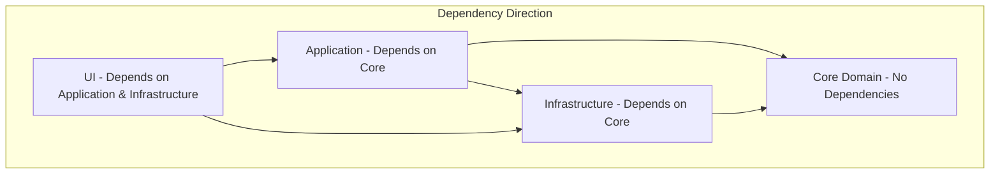

# WPF Bulk Editor - Project Structure Design

## 🏗️ **Clean Architecture Implementation**

### **Architecture Layers Overview**



### **Solution Structure with Rationale**

## 📁 **BulkEditor.Core** (Domain Layer)

_The heart of the application - contains business entities and rules with zero external dependencies_

```
BulkEditor.Core/
├── Models/                             # Domain Entities
│   ├── Document.cs                     # Represents Word document with metadata
│   ├── Hyperlink.cs                    # Hyperlink entity with validation rules
│   ├── ProcessingResult.cs             # Result aggregation for operations
│   ├── ApiResponse.cs                  # API response data structure
│   ├── ChangelogEntry.cs               # Individual changelog item
│   ├── BackupInfo.cs                   # Backup metadata and validation
│   └── ProcessingStatistics.cs         # Performance and operation metrics
├── Enums/                              # Domain Enumerations
│   ├── DocumentStatus.cs               # Active, Expired, NotFound, Processing
│   ├── HyperlinkStatus.cs              # Valid, Broken, Updated, Removed
│   ├── ProcessingOperation.cs          # Extract, Validate, Update, Backup
│   ├── ChangelogCategory.cs            # Updated, Expired, NotFound, Error, TitleChange
│   └── ThemeType.cs                    # Light, Dark, System
├── ValueObjects/                       # Immutable value objects
│   ├── ContentId.cs                    # Content ID with validation (6-digit format)
│   ├── LookupId.cs                     # Lookup ID with regex validation
│   ├── DocumentPath.cs                 # File path with validation
│   └── UrlAddress.cs                   # URL with validation and parsing
├── Exceptions/                         # Domain-specific exceptions
│   ├── DocumentProcessingException.cs  # Document-related errors
│   ├── ApiCommunicationException.cs    # API communication failures
│   ├── InvalidContentIdException.cs    # Content ID validation failures
│   └── HyperlinkValidationException.cs # Hyperlink processing errors
└── Constants/                          # Domain constants
    ├── RegexPatterns.cs                # Lookup ID, Content ID patterns
    ├── UrlConstants.cs                 # Base URLs, endpoints
    └── FileExtensions.cs               # Supported document types
```

**Rationale**: The Core layer contains pure business logic without any framework dependencies. This ensures testability and allows the business rules to remain stable regardless of UI or infrastructure changes.

## 📁 **BulkEditor.Application** (Application Layer)

_Orchestrates business workflows and coordinates between the UI and infrastructure_

```
BulkEditor.Application/
├── Services/                           # Application Services
│   ├── Abstractions/                   # Service Contracts
│   │   ├── IDocumentProcessingService.cs    # Document workflow orchestration
│   │   ├── IApiService.cs                   # External API communication
│   │   ├── IHyperlinkService.cs             # Hyperlink manipulation logic
│   │   ├── IChangelogService.cs             # Changelog generation and formatting
│   │   ├── IFileSystemService.cs            # File operations and backup management
│   │   ├── IConfigurationService.cs         # Settings management
│   │   ├── IProgressReportingService.cs     # Progress tracking and reporting
│   │   ├── IThemeService.cs                 # Theme management
│   │   └── IValidationService.cs            # Business rule validation
│   └── Implementations/                # Service Implementations
│       ├── DocumentProcessingService.cs     # Main document processing workflow
│       ├── ApiService.cs                    # HTTP API communication
│       ├── HyperlinkService.cs              # Hyperlink extraction and updates
│       ├── ChangelogService.cs              # Changelog creation logic
│       ├── FileSystemService.cs             # File I/O operations
│       ├── ConfigurationService.cs          # Configuration persistence
│       ├── ProgressReportingService.cs      # Progress event management
│       ├── ThemeService.cs                  # Theme switching logic
│       └── ValidationService.cs             # Input validation
├── DTOs/                               # Data Transfer Objects
│   ├── ProcessingRequest.cs            # Batch processing request
│   ├── ApiRequest.cs                   # API call payload
│   ├── ApiResponseDto.cs               # API response deserialization
│   ├── ProgressUpdate.cs               # Progress reporting data
│   ├── DocumentInfo.cs                 # Document metadata for UI
│   └── ChangelogSummary.cs             # Changelog summary for UI
├── Extensions/                         # Application-specific extensions
│   ├── DocumentExtensions.cs          # Document manipulation helpers
│   ├── HyperlinkExtensions.cs          # Hyperlink processing helpers
│   ├── CollectionExtensions.cs         # Collection manipulation utilities
│   └── TaskExtensions.cs               # Async operation helpers
├── Validators/                         # Input validation logic
│   ├── DocumentPathValidator.cs        # File path validation
│   ├── ApiRequestValidator.cs          # API request validation
│   └── ConfigurationValidator.cs       # Settings validation
└── Mappers/                           # Object mapping logic
    ├── DocumentMapper.cs               # Domain to DTO mapping
    ├── ApiResponseMapper.cs            # API response to domain mapping
    └── ChangelogMapper.cs              # Changelog formatting
```

**Rationale**: The Application layer contains use cases and business workflows. It coordinates between the domain and infrastructure while remaining independent of specific UI or data access technologies.

## 📁 **BulkEditor.Infrastructure** (Infrastructure Layer)

_Handles external concerns like file I/O, HTTP communication, and configuration_

```
BulkEditor.Infrastructure/
├── Configuration/                      # Strongly-typed configuration
│   ├── AppSettings.cs                  # Application configuration model
│   ├── UserSettings.cs                 # User preference model
│   ├── ApiSettings.cs                  # API configuration
│   ├── LoggingSettings.cs              # Serilog configuration
│   ├── ProcessingSettings.cs           # Processing behavior settings
│   └── ThemeSettings.cs                # UI theme preferences
├── Logging/                            # Structured logging implementation
│   ├── LoggingConfiguration.cs         # Serilog setup and configuration
│   ├── StructuredLogger.cs             # Custom logging wrapper
│   ├── LogContextEnricher.cs           # Additional log context
│   └── FileLoggerProvider.cs           # File-based logging provider
├── Http/                               # HTTP client infrastructure
│   ├── ApiClient.cs                    # Configured HTTP client
│   ├── HttpClientConfiguration.cs      # Client setup and policies
│   ├── RetryPolicyProvider.cs          # Retry logic for failed requests
│   └── ApiResponseHandler.cs           # Response processing logic
├── FileSystem/                         # File system operations
│   ├── BackupManager.cs                # Document backup creation/management
│   ├── DocumentReader.cs               # OpenXML document reading
│   ├── DocumentWriter.cs               # OpenXML document writing
│   ├── PathValidator.cs                # File path security validation
│   └── FileSystemWatcher.cs            # File change monitoring
├── Persistence/                        # Data persistence
│   ├── SettingsRepository.cs           # User settings persistence
│   ├── CacheRepository.cs              # API response caching
│   └── LogRepository.cs                # Log data access
└── Security/                          # Security implementations
    ├── InputSanitizer.cs               # Input validation and sanitization
    ├── PathSecurityValidator.cs        # Path traversal prevention
    └── ApiKeyManager.cs                # Secure API key handling
```

**Rationale**: Infrastructure handles all external dependencies and I/O operations. This layer can be easily swapped or modified without affecting business logic.

## 📁 **BulkEditor.UI** (Presentation Layer)

_WPF user interface implementation with MVVM pattern_

```
BulkEditor.UI/
├── Views/                              # XAML User Interface
│   ├── MainWindow.xaml(.cs)            # Primary application window
│   ├── SettingsWindow.xaml(.cs)        # Configuration management
│   ├── ProgressWindow.xaml(.cs)        # Processing progress display
│   ├── LogViewWindow.xaml(.cs)         # Log viewing interface
│   ├── AboutWindow.xaml(.cs)           # Application information
│   └── ErrorDialog.xaml(.cs)           # Error display dialog
├── ViewModels/                         # MVVM View Models
│   ├── Base/
│   │   ├── BaseViewModel.cs            # Common ViewModel functionality
│   │   ├── RelayCommand.cs             # Command implementation
│   │   └── NotifyPropertyChanged.cs    # Property change notification
│   ├── MainWindowViewModel.cs          # Main UI logic and state
│   ├── SettingsWindowViewModel.cs      # Settings management logic
│   ├── ProgressWindowViewModel.cs      # Progress tracking logic
│   ├── LogViewWindowViewModel.cs       # Log display logic
│   └── ErrorDialogViewModel.cs         # Error handling logic
├── Controls/                           # Custom User Controls
│   ├── FileDropZone.xaml(.cs)          # Drag & drop file selection
│   ├── ProgressIndicator.xaml(.cs)     # Progress visualization
│   ├── ThemeToggle.xaml(.cs)           # Theme switching control
│   ├── DocumentListView.xaml(.cs)      # Document display list
│   └── StatusBar.xaml(.cs)             # Application status display
├── Converters/                         # Value Converters for XAML
│   ├── StatusToColorConverter.cs       # Status enum to color mapping
│   ├── BoolToVisibilityConverter.cs    # Boolean to Visibility conversion
│   ├── ProgressToPercentageConverter.cs # Progress value formatting
│   ├── FilePathToNameConverter.cs      # Path to filename extraction
│   └── DateTimeToStringConverter.cs    # Date formatting
├── Resources/                          # UI Resources and Styling
│   ├── Styles/
│   │   ├── MaterialDesignStyles.xaml   # Material Design implementation
│   │   ├── CustomStyles.xaml           # Application-specific styles
│   │   ├── ButtonStyles.xaml           # Button styling
│   │   └── WindowStyles.xaml           # Window chrome styling
│   ├── Themes/
│   │   ├── LightTheme.xaml             # Light theme resources
│   │   ├── DarkTheme.xaml              # Dark theme resources
│   │   └── ThemeManager.cs             # Theme switching logic
│   ├── Icons/                          # Application icons
│   │   ├── AppIcon.ico                 # Main application icon
│   │   └── MaterialIcons.xaml          # Material Design icons
│   └── Localization/
│       ├── Resources.resx              # Default language resources
│       └── Resources.es.resx           # Spanish localization (future)
├── Behaviors/                          # UI Behaviors
│   ├── DragDropBehavior.cs             # File drag & drop handling
│   ├── AutoScrollBehavior.cs           # Automatic scrolling
│   └── WindowStateBehavior.cs          # Window state persistence
├── Services/                           # UI-specific services
│   ├── DialogService.cs                # Modal dialog management
│   ├── WindowManager.cs                # Window lifecycle management
│   └── UIThreadDispatcher.cs           # UI thread synchronization
└── App.xaml(.cs)                       # Application entry point and setup
```

**Rationale**: The UI layer focuses purely on presentation concerns. ViewModels handle UI logic while Views handle only display. This separation ensures testability and maintainability.

## 📁 **BulkEditor.Tests** (Test Layer)

_Comprehensive testing strategy covering all layers_

```
BulkEditor.Tests/
├── Unit/                               # Unit Tests (isolated components)
│   ├── Core/
│   │   ├── Models/
│   │   │   ├── DocumentTests.cs
│   │   │   ├── HyperlinkTests.cs
│   │   │   └── ValueObjectTests.cs
│   │   └── Validators/
│   │       └── BusinessRuleTests.cs
│   ├── Application/
│   │   ├── Services/
│   │   │   ├── DocumentProcessingServiceTests.cs
│   │   │   ├── HyperlinkServiceTests.cs
│   │   │   └── ChangelogServiceTests.cs
│   │   └── Validators/
│   │       └── InputValidationTests.cs
│   ├── Infrastructure/
│   │   ├── Http/
│   │   │   └── ApiClientTests.cs
│   │   ├── FileSystem/
│   │   │   └── BackupManagerTests.cs
│   │   └── Configuration/
│   │       └── SettingsTests.cs
│   └── UI/
│       ├── ViewModels/
│       │   ├── MainWindowViewModelTests.cs
│       │   └── SettingsViewModelTests.cs
│       └── Converters/
│           └── ValueConverterTests.cs
├── Integration/                        # Integration Tests (multiple components)
│   ├── DocumentProcessingIntegrationTests.cs
│   ├── ApiIntegrationTests.cs
│   ├── FileSystemIntegrationTests.cs
│   └── EndToEndWorkflowTests.cs
├── TestData/                          # Test artifacts and sample data
│   ├── SampleDocuments/
│   │   ├── ValidDocument.docx
│   │   ├── InvalidDocument.docx
│   │   └── LargeDocument.docx
│   ├── ApiResponses/
│   │   ├── SuccessResponse.json
│   │   ├── ErrorResponse.json
│   │   └── EmptyResponse.json
│   └── Configurations/
│       ├── TestAppSettings.json
│       └── TestUserSettings.json
├── Helpers/                           # Test utilities and mocks
│   ├── MockServices/
│   │   ├── MockApiService.cs
│   │   ├── MockFileSystemService.cs
│   │   └── MockConfigurationService.cs
│   ├── TestDataBuilder.cs             # Test data generation
│   ├── DocumentTestHelper.cs          # Document manipulation for tests
│   └── AssertionExtensions.cs         # Custom assertions
└── Performance/                       # Performance and load tests
    ├── BulkProcessingPerformanceTests.cs
    ├── MemoryUsageTests.cs
    └── ConcurrencyTests.cs
```

**Rationale**: Comprehensive testing ensures reliability and maintainability. Tests are organized by layer and type, making it easy to identify and run specific test categories.

## 🔧 **Project Configuration Files**

### **Solution Level Configuration**

```
BulkEditor.sln                         # Visual Studio solution file
Directory.Build.props                  # Common MSBuild properties
Directory.Build.targets                # Common MSBuild targets
Directory.Packages.props               # Central package management
.editorconfig                          # Code formatting rules
.gitignore                            # Git ignore patterns
README.md                             # Project documentation
```

### **Package Dependencies by Project**

#### **BulkEditor.Core**

- No external dependencies (pure .NET)

#### **BulkEditor.Application**

```xml
<PackageReference Include="Microsoft.Extensions.DependencyInjection.Abstractions" />
<PackageReference Include="Microsoft.Extensions.Logging.Abstractions" />
<PackageReference Include="System.Text.Json" />
```

#### **BulkEditor.Infrastructure**

```xml
<PackageReference Include="DocumentFormat.OpenXml" />
<PackageReference Include="Microsoft.Extensions.Configuration" />
<PackageReference Include="Microsoft.Extensions.Http" />
<PackageReference Include="Serilog" />
<PackageReference Include="Serilog.Sinks.Console" />
<PackageReference Include="Serilog.Sinks.File" />
<PackageReference Include="Serilog.Extensions.Logging" />
```

#### **BulkEditor.UI**

```xml
<PackageReference Include="MaterialDesignThemes" />
<PackageReference Include="MaterialDesignColors" />
<PackageReference Include="MaterialDesignExtensions" />
<PackageReference Include="CommunityToolkit.Mvvm" />
<PackageReference Include="Microsoft.Extensions.Hosting" />
<PackageReference Include="Microsoft.Extensions.DependencyInjection" />
```

## 📐 **Architectural Principles Applied**

### **Dependency Inversion Principle**

- High-level modules don't depend on low-level modules
- Both depend on abstractions (interfaces)
- Abstractions don't depend on details

### **Single Responsibility Principle**

- Each class has one reason to change
- Services handle specific business concerns
- ViewModels handle specific UI concerns

### **Open/Closed Principle**

- Open for extension, closed for modification
- New features added through new implementations
- Existing code remains untouched

### **Interface Segregation Principle**

- Clients don't depend on unused interface methods
- Small, focused interfaces
- Role-based interface design

### **Don't Repeat Yourself (DRY)**

- Common functionality extracted to base classes
- Shared utilities in Extensions folders
- Configuration-driven behavior where appropriate

This project structure ensures maintainability, testability, and scalability while following established architectural patterns and .NET conventions.
