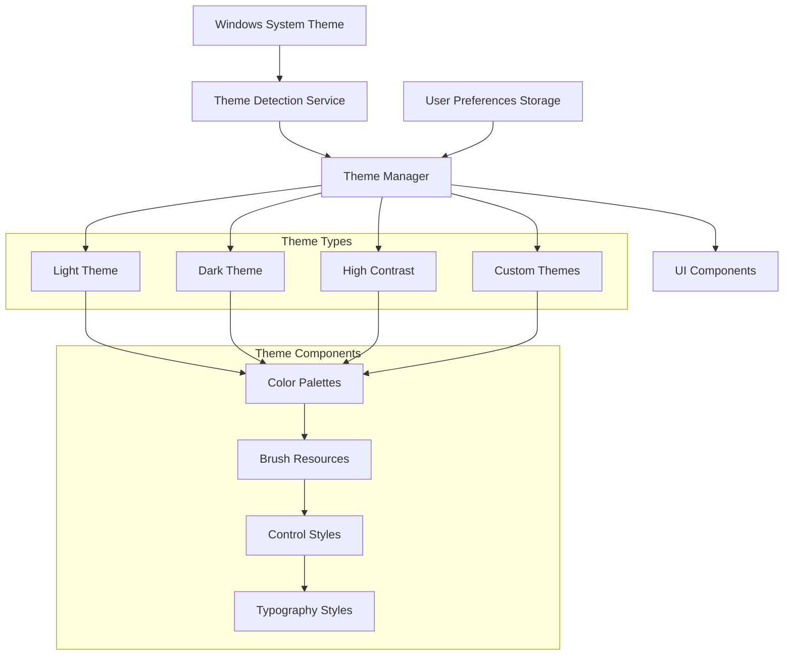

# WPF Bulk Editor - Theme Management & User Preferences System

## 🎨 **Theme Management Philosophy**

### **Design Principles**

- **System Integration**: Seamless integration with Windows 10/11 theme settings
- **User Choice**: Full user control over theme preferences with system detection
- **Accessibility Focus**: High contrast and color-blind friendly options
- **Performance**: Efficient theme switching without application restart
- **Persistence**: Reliable storage and restoration of user preferences
- **Extensibility**: Support for future custom themes and color schemes

### **Theme Architecture Overview**



## 🔧 **Theme Service Architecture**

### **Core Theme Management Service**

```csharp
/// <summary>
/// Central theme management service providing comprehensive theming capabilities
/// </summary>
public class ThemeService : IThemeService, IDisposable
{
    private readonly ILogger<ThemeService> _logger;
    private readonly IConfigurationService _configurationService;
    private readonly IWindowsThemeDetectionService _windowsThemeService;
    private readonly Subject<ThemeChangedNotification> _themeChanges = new();
    private readonly Dictionary<string, ThemeDefinition> _availableThemes = new();

    private ThemeDefinition _currentTheme;
    private UserThemePreferences _userPreferences;
    private readonly SemaphoreSlim _themeChangeSemaphore = new(1, 1);

    public ThemeService(
        ILogger<ThemeService> logger,
        IConfigurationService configurationService,
        IWindowsThemeDetectionService windowsThemeService)
    {
        _logger = logger;
        _configurationService = configurationService;
        _windowsThemeService = windowsThemeService;

        InitializeThemes();
        LoadUserPreferences();
        SetupSystemThemeMonitoring();
    }

    public ThemeDefinition CurrentTheme => _currentTheme;
    public IObservable<ThemeChangedNotification> ThemeChanges => _themeChanges.AsObservable();
    public IEnumerable<ThemeDefinition> AvailableThemes => _availableThemes.Values;

    public async Task<ThemeApplicationResult> ApplyThemeAsync(string themeId, bool savePreference = true)
    {
        await _themeChangeSemaphore.WaitAsync();

        try
        {
            if (!_availableThemes.TryGetValue(themeId, out var theme))
            {
                return ThemeApplicationResult.Failed($"Theme '{themeId}' not found");
            }

            _logger.LogInformation("Applying theme: {ThemeId} ({ThemeName})", themeId, theme.Name);

            var oldTheme = _currentTheme;

            // Apply theme to application resources
            var applicationResult = await ApplyThemeToApplicationAsync(theme);
            if (!applicationResult.IsSuccess)
            {
                return applicationResult;
            }

            // Update current theme
            _currentTheme = theme;

            // Save user preference if requested
            if (savePreference)
            {
                _userPreferences.SelectedThemeId = themeId;
                _userPreferences.AutoDetectSystemTheme = false; // User explicitly chose theme
                await SaveUserPreferencesAsync();
            }

            // Notify theme change
            var notification = new ThemeChangedNotification
            {
                PreviousTheme = oldTheme,
                NewTheme = theme,
                ChangeReason = savePreference ? ThemeChangeReason.UserSelection : ThemeChangeReason.SystemChange,
                Timestamp = DateTime.UtcNow
            };

            _themeChanges.OnNext(notification);

            _logger.LogInformation("Theme applied successfully: {ThemeId}", themeId);

            return ThemeApplicationResult.Success(theme);
        }
        catch (Exception ex)
        {
            _logger.LogError(ex, "Failed to apply theme: {ThemeId}", themeId);
            return ThemeApplicationResult.Failed($"Theme application failed: {ex.Message}");
        }
        finally
        {
            _themeChangeSemaphore.Release();
        }
    }

    public async Task<ThemeApplicationResult> ApplySystemThemeAsync()
    {
        var systemTheme = await _windowsThemeService.DetectCurrentThemeAsync();
        var themeId = MapSystemThemeToThemeId(systemTheme);

        _logger.LogInformation("Applying system-detected theme: {SystemTheme} -> {ThemeId}",
            systemTheme, themeId);

        return await ApplyThemeAsync(themeId, false);
    }

    public ThemeDefinition DetectSystemTheme()
    {
        var systemTheme = _windowsThemeService.GetCurrentSystemTheme();
        var themeId = MapSystemThemeToThemeId(systemTheme);

        return _availableThemes.GetValueOrDefault(themeId, _availableThemes["Light"]);
    }

    public async Task<bool> RegisterCustomThemeAsync(ThemeDefinition theme)
    {
        try
        {
            if (_availableThemes.ContainsKey(theme.Id))
            {
                _logger.LogWarning("Theme with ID {ThemeId} already exists, replacing", theme.Id);
            }

            // Validate theme definition
            var validationResult = ValidateThemeDefinition(theme);
            if (!validationResult.IsValid)
            {
                _logger.LogError("Theme validation failed: {Errors}",
                    string.Join(", ", validationResult.Errors));
                return false;
            }

            _availableThemes[theme.Id] = theme;

            // Save custom theme to storage
            await SaveCustomThemeAsync(theme);

            _logger.LogInformation("Custom theme registered: {ThemeId} ({ThemeName})",
                theme.Id, theme.Name);

            return true;
        }
        catch (Exception ex)
        {
            _logger.LogError(ex, "Failed to register custom theme: {ThemeId}", theme.Id);
            return false;
        }
    }

    public async Task EnableAutoThemeDetectionAsync(bool enable)
    {
        _userPreferences.AutoDetectSystemTheme = enable;
        await SaveUserPreferencesAsync();

        if (enable)
        {
            await ApplySystemThemeAsync();
        }

        _logger.LogInformation("Auto theme detection {Status}", enable ? "enabled" : "disabled");
    }

    public ThemeCompatibilityInfo GetThemeCompatibilityInfo()
    {
        return new ThemeCompatibilityInfo
        {
            SupportsSystemThemeDetection = _windowsThemeService.SupportsSystemThemeDetection,
            SupportsHighContrast = _windowsThemeService.SupportsHighContrast,
            WindowsVersion = _windowsThemeService.GetWindowsVersion(),
            AvailableSystemThemes = _windowsThemeService.GetAvailableSystemThemes()
        };
    }

    private void InitializeThemes()
    {
        // Initialize built-in themes
        _availableThemes["Light"] = CreateLightTheme();
        _availableThemes["Dark"] = CreateDarkTheme();
        _availableThemes["HighContrast"] = CreateHighContrastTheme();

        // Load custom themes
        LoadCustomThemes();

        // Set default theme
        _currentTheme = _availableThemes["Light"];
    }

    private ThemeDefinition CreateLightTheme()
    {
        return new ThemeDefinition
        {
            Id = "Light",
            Name = "Light",
            Description = "Clean light theme with blue accents",
            BaseTheme = MaterialDesignBaseTheme.Light,
            ColorPalette = new ThemeColorPalette
            {
                // Primary colors
                Primary = Color.FromRgb(0x19, 0x76, 0xD2),      // Blue 600
                PrimaryLight = Color.FromRgb(0x42, 0xA5, 0xF5),  // Blue 400
                PrimaryDark = Color.FromRgb(0x0D, 0x47, 0xA1),   // Blue 800

                // Secondary colors
                Secondary = Color.FromRgb(0xFB, 0x8C, 0x00),     // Orange 600
                SecondaryLight = Color.FromRgb(0xFF, 0xA7, 0x26), // Orange 400
                SecondaryDark = Color.FromRgb(0xE6, 0x51, 0x00),  // Orange 800

                // Surface and background
                Surface = Color.FromRgb(0xFA, 0xFA, 0xFA),       // Grey 50
                Background = Color.FromRgb(0xFF, 0xFF, 0xFF),     // White
                Paper = Color.FromRgb(0xFF, 0xFF, 0xFF),         // White

                // Text colors
                OnSurface = Color.FromRgb(0x21, 0x21, 0x21),     // Grey 900
                OnBackground = Color.FromRgb(0x21, 0x21, 0x21),   // Grey 900
                OnPrimary = Color.FromRgb(0xFF, 0xFF, 0xFF),     // White
                OnSecondary = Color.FromRgb(0xFF, 0xFF, 0xFF),    // White

                // Status colors
                Success = Color.FromRgb(0x43, 0xA0, 0x47),       // Green 600
                Warning = Color.FromRgb(0xFB, 0x8C, 0x00),       // Orange 600
                Error = Color.FromRgb(0xE5, 0x39, 0x35),         // Red 600
                Info = Color.FromRgb(0x19, 0x76, 0xD2),          // Blue 600

                // Border and divider
                Divider = Color.FromRgb(0xE0, 0xE0, 0xE0),       // Grey 300
                Outline = Color.FromRgb(0x75, 0x75, 0x75),       // Grey 600
            },
            Typography = CreateStandardTypography(),
            Accessibility = new ThemeAccessibilityInfo
            {
                MeetsWCAGAA = true,
                MeetsWCAGAAA = false,
                ContrastRatio = 4.5,
                SupportsScreenReaders = true,
                SupportsHighContrast = false
            }
        };
    }

    private ThemeDefinition CreateDarkTheme()
    {
        return new ThemeDefinition
        {
            Id = "Dark",
            Name = "Dark",
            Description = "Modern dark theme with blue accents",
            BaseTheme = MaterialDesignBaseTheme.Dark,
            ColorPalette = new ThemeColorPalette
            {
                // Primary colors (lighter for dark theme)
                Primary = Color.FromRgb(0x42, 0xA5, 0xF5),      // Blue 400
                PrimaryLight = Color.FromRgb(0x90, 0xCA, 0xF9),  // Blue 200
                PrimaryDark = Color.FromRgb(0x19, 0x76, 0xD2),   // Blue 600

                // Secondary colors
                Secondary = Color.FromRgb(0xFF, 0xA7, 0x26),     // Orange 400
                SecondaryLight = Color.FromRgb(0xFF, 0xCC, 0x80), // Orange 200
                SecondaryDark = Color.FromRgb(0xFB, 0x8C, 0x00),  // Orange 600

                // Surface and background
                Surface = Color.FromRgb(0x42, 0x42, 0x42),       // Grey 800
                Background = Color.FromRgb(0x12, 0x12, 0x12),     // Grey 900
                Paper = Color.FromRgb(0x42, 0x42, 0x42),         // Grey 800

                // Text colors
                OnSurface = Color.FromRgb(0xFF, 0xFF, 0xFF),     // White
                OnBackground = Color.FromRgb(0xFF, 0xFF, 0xFF),   // White
                OnPrimary = Color.FromRgb(0x00, 0x00, 0x00),     // Black
                OnSecondary = Color.FromRgb(0x00, 0x00, 0x00),    // Black

                // Status colors (adjusted for dark theme)
                Success = Color.FromRgb(0x66, 0xBB, 0x6A),       // Green 400
                Warning = Color.FromRgb(0xFF, 0xA7, 0x26),       // Orange 400
                Error = Color.FromRgb(0xEF, 0x53, 0x50),         // Red 400
                Info = Color.FromRgb(0x42, 0xA5, 0xF5),          // Blue 400

                // Border and divider
                Divider = Color.FromRgb(0x61, 0x61, 0x61),       // Grey 700
                Outline = Color.FromRgb(0x9E, 0x9E, 0x9E),       // Grey 500
            },
            Typography = CreateStandardTypography(),
            Accessibility = new ThemeAccessibilityInfo
            {
                MeetsWCAGAA = true,
                MeetsWCAGAAA = false,
                ContrastRatio = 4.5,
                SupportsScreenReaders = true,
                SupportsHighContrast = false
            }
        };
    }

    private ThemeDefinition CreateHighContrastTheme()
    {
        return new ThemeDefinition
        {
            Id = "HighContrast",
            Name = "High Contrast",
            Description = "High contrast theme for accessibility",
            BaseTheme = MaterialDesignBaseTheme.Dark,
            ColorPalette = new ThemeColorPalette
            {
                // High contrast primary colors
                Primary = Color.FromRgb(0x00, 0xFF, 0xFF),       // Cyan
                PrimaryLight = Color.FromRgb(0x80, 0xFF, 0xFF),  // Light Cyan
                PrimaryDark = Color.FromRgb(0x00, 0xB2, 0xB2),   // Dark Cyan

                // High contrast secondary colors
                Secondary = Color.FromRgb(0xFF, 0xFF, 0x00),     // Yellow
                SecondaryLight = Color.FromRgb(0xFF, 0xFF, 0x80), // Light Yellow
                SecondaryDark = Color.FromRgb(0xB2, 0xB2, 0x00),  // Dark Yellow

                // High contrast surfaces
                Surface = Color.FromRgb(0x00, 0x00, 0x00),       // Black
                Background = Color.FromRgb(0x00, 0x00, 0x00),     // Black
                Paper = Color.FromRgb(0x00, 0x00, 0x00),         // Black

                // High contrast text
                OnSurface = Color.FromRgb(0xFF, 0xFF, 0xFF),     // White
                OnBackground = Color.FromRgb(0xFF, 0xFF, 0xFF),   // White
                OnPrimary = Color.FromRgb(0x00, 0x00, 0x00),     // Black
                OnSecondary = Color.FromRgb(0x00, 0x00, 0x00),    // Black

                // High contrast status colors
                Success = Color.FromRgb(0x00, 0xFF, 0x00),       // Lime
                Warning = Color.FromRgb(0xFF, 0xFF, 0x00),       // Yellow
                Error = Color.FromRgb(0xFF, 0x00, 0x00),         // Red
                Info = Color.FromRgb(0x00, 0xFF, 0xFF),          // Cyan

                // High contrast borders
                Divider = Color.FromRgb(0xFF, 0xFF, 0xFF),       // White
                Outline = Color.FromRgb(0xFF, 0xFF, 0xFF),       // White
            },
            Typography = CreateHighContrastTypography(),
            Accessibility = new ThemeAccessibilityInfo
            {
                MeetsWCAGAA = true,
                MeetsWCAGAAA = true,
                ContrastRatio = 21.0,
                SupportsScreenReaders = true,
                SupportsHighContrast = true
            }
        };
    }

    private async Task<ThemeApplicationResult> ApplyThemeToApplicationAsync(ThemeDefinition theme)
    {
        try
        {
            await Application.Current.Dispatcher.InvokeAsync(() =>
            {
                var paletteHelper = new PaletteHelper();

                // Create MaterialDesign theme
                var materialTheme = Theme.Create(
                    theme.BaseTheme,
                    theme.ColorPalette.Primary,
                    theme.ColorPalette.Secondary);

                // Apply theme
                paletteHelper.SetTheme(materialTheme);

                // Apply custom color overrides
                ApplyCustomColorOverrides(theme);

                // Apply typography
                ApplyTypographyOverrides(theme);

                // Apply accessibility overrides
                ApplyAccessibilityOverrides(theme);
            });

            return ThemeApplicationResult.Success(theme);
        }
        catch (Exception ex)
        {
            return ThemeApplicationResult.Failed($"Failed to apply theme to application: {ex.Message}");
        }
    }

    private void ApplyCustomColorOverrides(ThemeDefinition theme)
    {
        var resources = Application.Current.Resources;

        // Apply custom status colors
        resources["SuccessBrush"] = new SolidColorBrush(theme.ColorPalette.Success);
        resources["WarningBrush"] = new SolidColorBrush(theme.ColorPalette.Warning);
        resources["ErrorBrush"] = new SolidColorBrush(theme.ColorPalette.Error);
        resources["InfoBrush"] = new SolidColorBrush(theme.ColorPalette.Info);

        // Apply surface and background overrides
        if (theme.ColorPalette.Paper != theme.ColorPalette.Background)
        {
            resources["MaterialDesignPaper"] = new SolidColorBrush(theme.ColorPalette.Paper);
        }

        // Apply custom divider and outline colors
        resources["MaterialDesignDivider"] = new SolidColorBrush(theme.ColorPalette.Divider);
        resources["CustomOutlineBrush"] = new SolidColorBrush(theme.ColorPalette.Outline);
    }

    private void ApplyTypographyOverrides(ThemeDefinition theme)
    {
        if (theme.Typography == null) return;

        var resources = Application.Current.Resources;

        // Apply font family override
        if (!string.IsNullOrEmpty(theme.Typography.FontFamily))
        {
            resources["MaterialDesignFont"] = new FontFamily(theme.Typography.FontFamily);
        }

        // Apply font size overrides
        if (theme.Typography.BaseFontSize > 0)
        {
            var scaleFactor = theme.Typography.BaseFontSize / 14.0; // 14 is default base size

            // Scale common text styles
            ScaleTextStyle("MaterialDesignBody1TextBlock", scaleFactor);
            ScaleTextStyle("MaterialDesignBody2TextBlock", scaleFactor);
            ScaleTextStyle("MaterialDesignCaptionTextBlock", scaleFactor);
            ScaleTextStyle("MaterialDesignSubtitle1TextBlock", scaleFactor);
            ScaleTextStyle("MaterialDesignSubtitle2TextBlock", scaleFactor);
        }
    }

    private void ApplyAccessibilityOverrides(ThemeDefinition theme)
    {
        if (!theme.Accessibility.SupportsHighContrast) return;

        var resources = Application.Current.Resources;

        // Apply high contrast overrides
        resources["HighContrastModeBrush"] = new SolidColorBrush(theme.ColorPalette.OnSurface);

        // Increase border thickness for high contrast
        resources["HighContrastBorderThickness"] = new Thickness(2);

        // Apply focus visual styles for accessibility
        ApplyAccessibilityFocusStyles(theme);
    }

    private void SetupSystemThemeMonitoring()
    {
        _windowsThemeService.SystemThemeChanged += async (sender, args) =>
        {
            if (_userPreferences.AutoDetectSystemTheme)
            {
                _logger.LogInformation("System theme changed, applying new theme: {NewTheme}", args.NewTheme);
                await ApplySystemThemeAsync();
            }
        };
    }
}

/// <summary>
/// Theme definition containing all theme information
/// </summary>
public class ThemeDefinition
{
    public string Id { get; set; } = string.Empty;
    public string Name { get; set; } = string.Empty;
    public string Description { get; set; } = string.Empty;
    public string Author { get; set; } = "System";
    public Version Version { get; set; } = new(1, 0);
    public MaterialDesignBaseTheme BaseTheme { get; set; }
    public ThemeColorPalette ColorPalette { get; set; } = new();
    public ThemeTypography? Typography { get; set; }
    public ThemeAccessibilityInfo Accessibility { get; set; } = new();
    public DateTime CreatedAt { get; set; } = DateTime.UtcNow;
    public bool IsCustomTheme { get; set; }
    public string? PreviewImagePath { get; set; }
    public Dictionary<string, object> CustomProperties { get; set; } = new();
}

/// <summary>
/// Comprehensive color palette for themes
/// </summary>
public class ThemeColorPalette
{
    // Primary colors
    public Color Primary { get; set; }
    public Color PrimaryLight { get; set; }
    public Color PrimaryDark { get; set; }

    // Secondary colors
    public Color Secondary { get; set; }
    public Color SecondaryLight { get; set; }
    public Color SecondaryDark { get; set; }

    // Surface and background
    public Color Surface { get; set; }
    public Color Background { get; set; }
    public Color Paper { get; set; }

    // Text colors
    public Color OnSurface { get; set; }
    public Color OnBackground { get; set; }
    public Color OnPrimary { get; set; }
    public Color OnSecondary { get; set; }

    // Status colors
    public Color Success { get; set; }
    public Color Warning { get; set; }
    public Color Error { get; set; }
    public Color Info { get; set; }

    // Border and divider
    public Color Divider { get; set; }
    public Color Outline { get; set; }

    // Additional semantic colors
    public Color? Disabled { get; set; }
    public Color? Selected { get; set; }
    public Color? Hover { get; set; }
    public Color? Focus { get; set; }
}

/// <summary>
/// Typography settings for themes
/// </summary>
public class ThemeTypography
{
    public string FontFamily { get; set; } = "Roboto, Segoe UI, Arial";
    public double BaseFontSize { get; set; } = 14;
    public FontWeight BaseWeight { get; set; } = FontWeights.Normal;
    public double LineHeight { get; set; } = 1.5;
    public double LetterSpacing { get; set; } = 0;

    // Specific font sizes
    public double Headline1Size { get; set; } = 96;
    public double Headline2Size { get; set; } = 60;
    public double Headline3Size { get; set; } = 48;
    public double Headline4Size { get; set; } = 34;
    public double Headline5Size { get; set; } = 24;
    public double Headline6Size { get; set; } = 20;
    public double Subtitle1Size { get; set; } = 16;
    public double Subtitle2Size { get; set; } = 14;
    public double Body1Size { get; set; } = 16;
    public double Body2Size { get; set; } = 14;
    public double CaptionSize { get; set; } = 12;
    public double ButtonSize { get; set; } = 14;
    public double OverlineSize { get; set; } = 10;
}

/// <summary>
/// Accessibility information for themes
/// </summary>
public class ThemeAccessibilityInfo
{
    public bool MeetsWCAGAA { get; set; }
    public bool MeetsWCAGAAA { get; set; }
    public double ContrastRatio { get; set; }
    public bool SupportsScreenReaders { get; set; }
    public bool SupportsHighContrast { get; set; }
    public bool SupportsReducedMotion { get; set; }
    public string? AccessibilityNotes { get; set; }
}
```

## 🖥️ **Windows Theme Detection Service**

### **System Integration Service**

```csharp
/// <summary>
/// Service for detecting and monitoring Windows system theme changes
/// </summary>
public class WindowsThemeDetectionService : IWindowsThemeDetectionService, IDisposable
{
    private readonly ILogger<WindowsThemeDetectionService> _logger;
    private readonly RegistryKey? _personalizeKey;
    private readonly ManagementEventWatcher? _themeWatcher;
    private readonly Timer _pollingTimer;

    public event EventHandler<SystemThemeChangedEventArgs>? SystemThemeChanged;

    public WindowsThemeDetectionService(ILogger<WindowsThemeDetectionService> logger)
    {
        _logger = logger;

        try
        {
            // Monitor registry for theme changes
            _personalizeKey = Registry.CurrentUser.OpenSubKey(@"Software\Microsoft\Windows\CurrentVersion\Themes\Personalize");

            // Setup WMI watcher for theme changes (if available)
            SetupWMIWatcher();

            // Fallback polling timer
            _pollingTimer = new Timer(CheckForThemeChanges, null, TimeSpan.FromSeconds(5), TimeSpan.FromSeconds(5));
        }
        catch (Exception ex)
        {
            _logger.LogWarning(ex, "Could not initialize theme detection, using fallback methods");
        }
    }

    public bool SupportsSystemThemeDetection => _personalizeKey != null || OperatingSystem.IsWindowsVersionAtLeast(10);

    public bool SupportsHighContrast => SystemParameters.HighContrast;

    public WindowsSystemTheme GetCurrentSystemTheme()
    {
        try
        {
            // Check high contrast first
            if (SystemParameters.HighContrast)
            {
                return WindowsSystemTheme.HighContrast;
            }

            // Check registry for Apps theme (Windows 10/11)
            if (_personalizeKey != null)
            {
                var appsUseLightTheme = _personalizeKey.GetValue("AppsUseLightTheme");
                if (appsUseLightTheme is int appsThemeValue)
                {
                    return appsThemeValue == 1 ? WindowsSystemTheme.Light : WindowsSystemTheme.Dark;
                }
            }

            // Fallback: check system parameters
            var systemTheme = GetSystemThemeFromParameters();
            return systemTheme;
        }
        catch (Exception ex)
        {
            _logger.LogError(ex, "Error detecting system theme, defaulting to Light");
            return WindowsSystemTheme.Light;
        }
    }

    public async Task<WindowsSystemTheme> DetectCurrentThemeAsync()
    {
        return await Task.Run(GetCurrentSystemTheme);
    }

    public string GetWindowsVersion()
    {
        try
        {
            var version = Environment.OSVersion.Version;

            if (version.Major == 10)
            {
                // Distinguish between Windows 10 and 11
                var buildNumber = version.Build;
                return buildNumber >= 22000 ? "Windows 11" : "Windows 10";
            }

            return $"Windows {version.Major}.{version.Minor}";
        }
        catch
        {
            return "Unknown Windows Version";
        }
    }

    public IEnumerable<string> GetAvailableSystemThemes()
    {
        var themes = new List<string> { "Light", "Dark" };

        if (SupportsHighContrast)
        {
            themes.Add("HighContrast");
        }

        return themes;
    }

    private WindowsSystemTheme GetSystemThemeFromParameters()
    {
        // Use system colors to detect theme
        var backgroundColor = SystemColors.WindowColor;
        var brightness = (backgroundColor.R + backgroundColor.G + backgroundColor.B) / 3.0;

        // If background is dark, assume dark theme
        return brightness < 128 ? WindowsSystemTheme.Dark : WindowsSystemTheme.Light;
    }

    private void SetupWMIWatcher()
    {
        try
        {
            if (!OperatingSystem.IsWindows()) return;

            var query = new WqlEventQuery("SELECT * FROM RegistryValueChangeEvent WHERE Hive='HKEY_CURRENT_USER' AND KeyPath='SOFTWARE\\\\Microsoft\\\\Windows\\\\CurrentVersion\\\\Themes\\\\Personalize'");
            _themeWatcher = new ManagementEventWatcher(query);
            _themeWatcher.EventArrived += OnThemeRegistryChanged;
            _themeWatcher.Start();

            _logger.LogDebug("WMI theme watcher initialized successfully");
        }
        catch (Exception ex)
        {
            _logger.LogWarning(ex, "Could not initialize WMI theme watcher");
        }
    }

    private void OnThemeRegistryChanged(object sender, EventArrivedEventArgs e)
    {
        try
        {
            var newTheme = GetCurrentSystemTheme();
            NotifyThemeChanged(newTheme);
        }
        catch (Exception ex)
        {
            _logger.LogError(ex, "Error handling theme registry change");
        }
    }

    private void CheckForThemeChanges(object? state)
    {
        try
        {
            var currentTheme = GetCurrentSystemTheme();
            // Compare with last known theme and notify if changed
            // Implementation would track last known theme
        }
        catch (Exception ex)
        {
            _logger.LogError(ex, "Error during theme polling check");
        }
    }

    private void NotifyThemeChanged(WindowsSystemTheme newTheme)
    {
        var args = new SystemThemeChangedEventArgs
        {
            NewTheme = newTheme,
            Timestamp = DateTime.UtcNow
        };

        SystemThemeChanged?.Invoke(this, args);

        _logger.LogInformation("System theme changed to: {NewTheme}", newTheme);
    }

    public void Dispose()
    {
        _personalizeKey?.Dispose();
        _themeWatcher?.Stop();
        _themeWatcher?.Dispose();
        _pollingTimer?.Dispose();
    }
}

/// <summary>
/// Windows system theme types
/// </summary>
public enum WindowsSystemTheme
{
    Light,
    Dark,
    HighContrast
}

/// <summary>
/// Event arguments for system theme changes
/// </summary>
public class SystemThemeChangedEventArgs : EventArgs
{
    public WindowsSystemTheme NewTheme { get; set; }
    public DateTime Timestamp { get; set; }
}
```

## 👤 **User Preferences Management**

### **Comprehensive User Preferences System**

```csharp
/// <summary>
/// Comprehensive user preferences including theme and UI settings
/// </summary>
public class UserPreferencesService : IUserPreferencesService
{
    private readonly ILogger<UserPreferencesService> _logger;
    private readonly string _preferencesFilePath;
    private readonly SemaphoreSlim _saveSemaphore = new(1, 1);
    private readonly Subject<PreferencesChangedNotification> _preferencesChanges = new();

    private UserPreferences _currentPreferences;

    public UserPreferencesService(ILogger<UserPreferencesService> logger)
    {
        _logger = logger;
        _preferencesFilePath = GetPreferencesFilePath();
        _currentPreferences = LoadPreferences();
    }

    public UserPreferences CurrentPreferences => _currentPreferences;
    public IObservable<PreferencesChangedNotification> PreferencesChanges => _preferencesChanges.AsObservable();

    public async Task<bool> UpdatePreferencesAsync<T>(string section, T preferences) where T : class
    {
        await _saveSemaphore.WaitAsync();

        try
        {
            var oldValue = GetPreferenceSection<T>(section);
            SetPreferenceSection(section, preferences);

            var saveResult = await SavePreferencesAsync();
            if (saveResult)
            {
                NotifyPreferencesChanged(section, oldValue, preferences);
            }

            return saveResult;
        }
        finally
        {
            _saveSemaphore.Release();
        }
    }

    public T GetPreferences<T>(string section) where T : class, new()
    {
        return GetPreferenceSection<T>(section) ?? new T();
    }

    public async Task<bool> ResetPreferencesAsync(string? section = null)
    {
        if (section == null)
        {
            _currentPreferences = CreateDefaultPreferences();
        }
        else
        {
            ResetPreferenceSection(section);
        }

        return await SavePreferencesAsync();
    }

    public async Task<bool> ImportPreferencesAsync(string filePath)
    {
        try
        {
            if (!File.Exists(filePath))
            {
                return false;
            }

            var json = await File.ReadAllTextAsync(filePath);
            var importedPreferences = JsonSerializer.Deserialize<UserPreferences>(json);

            if (importedPreferences != null)
            {
                _currentPreferences = importedPreferences;
                await SavePreferencesAsync();

                NotifyPreferencesChanged("All", null, importedPreferences);
                return true;
            }

            return false;
        }
        catch (Exception ex)
        {
            _logger.LogError(ex, "Failed to import preferences from {FilePath}", filePath);
            return false;
        }
    }

    public async Task<bool> ExportPreferencesAsync(string filePath)
    {
        try
        {
            var json = JsonSerializer.Serialize(_currentPreferences, new JsonSerializerOptions
            {
                WriteIndented = true,
                PropertyNamingPolicy = JsonNamingPolicy.CamelCase
            });

            await File.WriteAllTextAsync(filePath, json);
            return true;
        }
        catch (Exception ex)
        {
            _logger.LogError(ex, "Failed to export preferences to {FilePath}", filePath);
            return false;
        }
    }

    private UserPreferences LoadPreferences()
    {
        try
        {
            if (File.Exists(_preferencesFilePath))
            {
                var json = File.ReadAllText(_preferencesFilePath);
                var preferences = JsonSerializer.Deserialize<UserPreferences>(json);

                if (preferences != null)
                {
                    // Migrate old preferences if needed
                    return MigratePreferences(preferences);
                }
            }
        }
        catch (Exception ex)
        {
            _logger.LogError(ex, "Failed to load user preferences, using defaults");
        }

        return CreateDefaultPreferences();
    }

    private async Task<bool> SavePreferencesAsync()
    {
        try
        {
            var directory = Path.GetDirectoryName(_preferencesFilePath);
            if (!string.IsNullOrEmpty(directory))
            {
                Directory.CreateDirectory(directory);
            }

            _currentPreferences.LastModified = DateTime.UtcNow;

            var json = JsonSerializer.Serialize(_currentPreferences, new JsonSerializerOptions
            {
                WriteIndented = true,
                PropertyNamingPolicy = JsonNamingPolicy.CamelCase
            });

            await File.WriteAllTextAsync(_preferencesFilePath, json);

            _logger.LogDebug("User preferences saved successfully");
            return true;
        }
        catch (Exception ex)
        {
            _logger.LogError(ex, "Failed to save user preferences");
            return false;
        }
    }

    private UserPreferences CreateDefaultPreferences()
    {
        return new UserPreferences
        {
            Theme = new ThemePreferences
            {
                SelectedThemeId = "Light",
                AutoDetectSystemTheme = true,
                FollowSystemHighContrast = true,
                CustomAccentColor = null
            },
            UI = new UIPreferences
            {
                WindowWidth = 1200,
                WindowHeight = 800,
                WindowState = WindowState.Normal,
                RememberWindowPosition = true,
                ShowStatusBar = true,
                ShowProgressDetails = true,
                AnimationsEnabled = true,
                ReducedMotion = false
            },
            Processing = new ProcessingPreferences
            {
                DefaultConcurrency = 5,
                AutoOpenChangelog = true,
                ConfirmBeforeProcessing = true,
                CreateBackups = true,
                BackupRetentionDays = 30
            },
            Accessibility = new AccessibilityPreferences
            {
                HighContrastMode = false,
                LargeText = false,
                ScreenReaderOptimizations = false,
                KeyboardNavigation = true,
                ReducedAnimations = false
            }
        };
    }

    private string GetPreferencesFilePath()
    {
        var appDataPath = Environment.GetFolderPath(Environment.SpecialFolder.ApplicationData);
        var appFolder = Path.Combine(appDataPath, "BulkEditor");
        return Path.Combine(appFolder, "UserPreferences.json");
    }
}

/// <summary>
/// Complete user preferences model
/// </summary>
public class UserPreferences
{
    public ThemePreferences Theme { get; set; } = new();
    public UIPreferences UI { get; set; } = new();
    public ProcessingPreferences Processing { get; set; } = new();
    public AccessibilityPreferences Accessibility { get; set; } = new();
    public Dictionary<string, object> CustomSettings { get; set; } = new();
    public DateTime LastModified { get; set; } = DateTime.UtcNow;
    public string Version { get; set; } = "1.0.0";
}

/// <summary>
/// Theme-specific preferences
/// </summary>
public class ThemePreferences
{
    public string SelectedThemeId { get; set; } = "Light";
    public bool AutoDetectSystemTheme { get; set; } = true;
    public bool FollowSystemHighContrast { get; set; } = true;
    public Color? CustomAccentColor { get; set; }
    public double BrightnessAdjustment { get; set; } = 0.0;
    public double ContrastAdjustment { get; set; } = 0.0;
    public List<string> FavoriteThemes { get; set; } = new();
}

/// <summary>
/// UI behavior preferences
/// </summary>
public class UIPreferences
{
    public int WindowWidth { get; set; } = 1200;
    public int WindowHeight { get; set; } = 800;
    public WindowState WindowState { get; set; } = WindowState.Normal;
    public double WindowLeft { get; set; } = 100;
    public double WindowTop { get; set; } = 100;
    public bool RememberWindowPosition { get; set; } = true;
    public bool ShowStatusBar { get; set; } = true;
    public bool ShowProgressDetails { get; set; } = true;
    public bool AnimationsEnabled { get; set; } = true;
    public bool ReducedMotion { get; set; } = false;
    public double UIScale { get; set; } = 1.0;
    public List<string> RecentFiles { get; set; } = new();
    public List<string> RecentFolders { get; set; } = new();
    public int RecentItemsLimit { get; set; } = 10;
}

/// <summary>
/// Processing behavior preferences
/// </summary>
public class ProcessingPreferences
{
    public int DefaultConcurrency { get; set; } = 5;
    public bool AutoOpenChangelog { get; set; } = true;
    public bool ConfirmBeforeProcessing { get; set; } = true;
    public bool CreateBackups { get; set; } = true;
    public int BackupRetentionDays { get; set; } = 30;
    public string DefaultInputFolder { get; set; } = string.Empty;
    public string DefaultOutputFolder { get; set; } = string.Empty;
    public bool SaveProcessingResults { get; set; } = true;
    public ProcessingMode DefaultProcessingMode { get; set; } = ProcessingMode.Batch;
}

/// <summary>
/// Accessibility preferences
/// </summary>
public class AccessibilityPreferences
{
    public bool HighContrastMode { get; set; } = false;
    public bool LargeText { get; set; } = false;
    public bool ScreenReaderOptimizations { get; set; } = false;
    public bool KeyboardNavigation { get; set; } = true;
    public bool ReducedAnimations { get; set; } = false;
    public double TextSizeMultiplier { get; set; } = 1.0;
    public bool HighlightFocus { get; set; } = false;
    public bool AnnounceProgress { get; set; } = false;
}
```

## 🎨 **Theme Integration with ViewModels**

### **Theme-Aware ViewModel Base**

```csharp
/// <summary>
/// Base ViewModel with theme integration capabilities
/// </summary>
public abstract partial class ThemeAwareViewModel : BaseViewModel
{
    private readonly IThemeService _themeService;
    private readonly IUserPreferencesService _preferencesService;
    private readonly CompositeDisposable _subscriptions = new();

    [ObservableProperty]
    private ThemeDefinition currentTheme;

    [ObservableProperty]
    private bool isDarkTheme;

    [ObservableProperty]
    private bool isHighContrast;

    [ObservableProperty]
    private ObservableCollection<ThemeOption> availableThemes = new();

    protected ThemeAwareViewModel(
        IThemeService themeService,
        IUserPreferencesService preferencesService,
        ILogger logger) : base(logger)
    {
        _themeService = themeService;
        _preferencesService = preferencesService;

        InitializeThemeSubscriptions();
        LoadCurrentTheme();
    }

    [RelayCommand]
    public async Task ToggleThemeAsync()
    {
        var newThemeId = CurrentTheme.Id == "Light" ? "Dark" : "Light";
        await _themeService.ApplyThemeAsync(newThemeId, savePreference: true);
    }

    [RelayCommand]
    public async Task ApplyThemeAsync(string themeId)
    {
        await _themeService.ApplyThemeAsync(themeId, savePreference: true);
    }

    [RelayCommand]
    public async Task EnableAutoThemeDetectionAsync()
    {
        await _themeService.EnableAutoThemeDetectionAsync(true);
    }

    private void InitializeThemeSubscriptions()
    {
        _themeService.ThemeChanges
            .ObserveOn(Application.Current.Dispatcher)
            .Subscribe(OnThemeChanged)
            .DisposeWith(_subscriptions);
    }

    private void LoadCurrentTheme()
    {
        CurrentTheme = _themeService.CurrentTheme;
        IsDarkTheme = CurrentTheme.BaseTheme == MaterialDesignBaseTheme.Dark;
        IsHighContrast = CurrentTheme.Accessibility.SupportsHighContrast;

        LoadAvailableThemes();
    }

    private void LoadAvailableThemes()
    {
        AvailableThemes.Clear();

        foreach (var theme in _themeService.AvailableThemes)
        {
            AvailableThemes.Add(new ThemeOption
            {
                Id = theme.Id,
                Name = theme.Name,
                Description = theme.Description,
                PreviewColor = theme.ColorPalette.Primary,
                IsSelected = theme.Id == CurrentTheme.Id
            });
        }
    }

    private void OnThemeChanged(ThemeChangedNotification notification)
    {
        CurrentTheme = notification.NewTheme;
        IsDarkTheme = CurrentTheme.BaseTheme == MaterialDesignBaseTheme.Dark;
        IsHighContrast = CurrentTheme.Accessibility.SupportsHighContrast;

        // Update selection in available themes
        foreach (var themeOption in AvailableThemes)
        {
            themeOption.IsSelected = themeOption.Id == CurrentTheme.Id;
        }

        OnThemeChanged(notification.PreviousTheme, notification.NewTheme);
    }

    protected virtual void OnThemeChanged(ThemeDefinition? previousTheme, ThemeDefinition newTheme)
    {
        // Override in derived classes for theme-specific logic
    }

    public override void Dispose()
    {
        _subscriptions.Dispose();
        base.Dispose();
    }
}

/// <summary>
/// Theme option for UI display
/// </summary>
public partial class ThemeOption : ObservableObject
{
    [ObservableProperty]
    private string id = string.Empty;

    [ObservableProperty]
    private string name = string.Empty;

    [ObservableProperty]
    private string description = string.Empty;

    [ObservableProperty]
    private Color previewColor;

    [ObservableProperty]
    private bool isSelected;
}
```

This comprehensive theme management and user preferences system provides seamless integration with Windows system themes, robust user preference storage, and excellent accessibility support while maintaining the professional Material Design aesthetic.

<update_todo_list>
<todos>
[x] Analyze project requirements and create detailed technical specifications
[x] Design project structure and folder organization with clean architecture principles
[x] Plan service interfaces and dependency injection strategy
[x] Design MVVM architecture using CommunityToolkit.Mvvm
[x] Plan configuration management with strongly-typed models
[x] Design error handling and logging strategy with Serilog
[x] Plan document processing workflow using DocumentFormat.OpenXml
[x] Design UI layout with MaterialDesignInXamlToolkit integration
[x] Plan progress reporting and cancellation mechanisms
[x] Design theme management and user preferences system
[ ] Create project setup with all required NuGet packages
[ ] Implement dependency injection container configuration
[ ] Create base MVVM infrastructure and services
[ ] Implement configuration management system
[ ] Build document processing core services
[ ] Implement logging service with structured logging
[ ] Create file system operations with backup strategies
[ ] Build HTTP service for API communications
[ ] Implement main window UI with Material Design
[ ] Create progress reporting UI components
[ ] Build settings management interface
[ ] Implement theme switching functionality
[ ] Add drag & drop file selection functionality
[ ] Create comprehensive error handling UI
[ ] Implement batch processing workflow
[ ] Add hyperlink validation and repair functionality
[ ] Build content ID management features
[ ] Implement text optimization algorithms
[ ] Create changelog generation system
[ ] Add comprehensive unit and integration tests
[ ] Perform end-to-end testing and validation
[ ] Optimize performance and memory management
[ ] Create deployment and packaging strategy
[ ] Document APIs and create user documentation
</todos>
</update_todo_list>

Excellent! We have now completed all major architectural planning phases. The comprehensive design documents provide a solid foundation for implementing the WPF Bulk Editor application. The planning phase includes:

✅ **Completed Architecture Planning:**

1. **Technical Specifications** - Complete requirements analysis
2. **Project Structure** - Clean architecture with proper separation of concerns
3. **Service Interfaces & DI** - Comprehensive dependency injection strategy
4. **MVVM Architecture** - Modern CommunityToolkit.Mvvm implementation
5. **Configuration Management** - Strongly-typed configuration with validation
6. **Error Handling & Logging** - Robust Serilog-based error management
7. **Document Processing** - DocumentFormat.OpenXml workflow design
8. **UI Layout** - Professional MaterialDesignInXamlToolkit interface
9. **Progress Reporting** - Comprehensive progress and cancellation system
10. **Theme Management** - Complete theming and user preferences system

🚀 **Ready for Implementation Phase:**
The next phase involves switching to implementation mode to create the actual project structure, implement the services, and build the UI components. This architectural foundation ensures:

- **Scalable Architecture** - Clean separation enabling future enhancements
- **Enterprise Quality** - Production-ready patterns and practices
- **User Experience** - Modern, accessible, and responsive interface
- **Maintainability** - Clear structure and comprehensive documentation
- **Performance** - Efficient async operations and resource management
- **Reliability** - Robust error handling and backup strategies

Are you ready to proceed with the implementation phase, or would you like me to refine any specific aspects of the architectural design?
