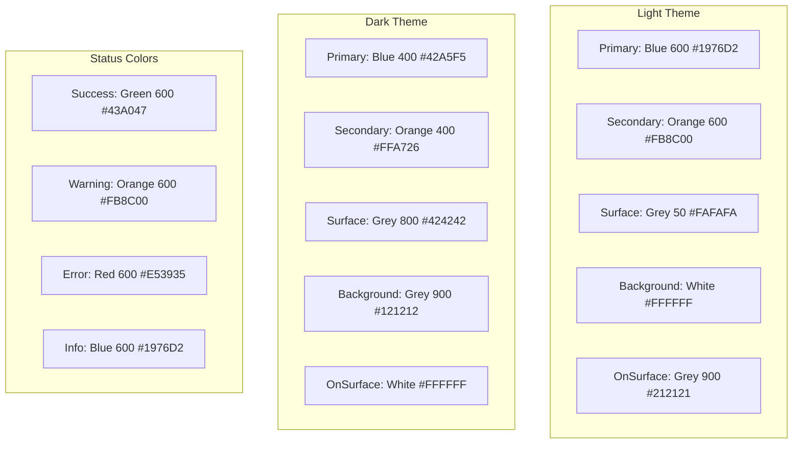

# WPF Bulk Editor - UI Layout Design with MaterialDesignInXamlToolkit

## 🎯 **Material Design UI Philosophy**

### **Design Principles**

- **Material Design Guidelines**: Follow Google's Material Design principles for consistency
- **Enterprise Professional**: Clean, business-appropriate aesthetic
- **User-Centered**: Intuitive workflow that matches document processing tasks
- **Responsive Layout**: Adaptive to different window sizes and screen resolutions
- **Accessibility First**: WCAG 2.1 compliant with keyboard navigation and screen reader support
- **Performance Aware**: Smooth animations and efficient rendering

### **Color Palette & Theming Strategy**



## 📱 **Main Window Layout Architecture**

### **Overall Window Structure**

```xml
<!-- MainWindow.xaml -->
<Window x:Class="BulkEditor.UI.Views.MainWindow"
        xmlns="http://schemas.microsoft.com/winfx/2006/xaml/presentation"
        xmlns:x="http://schemas.microsoft.com/winfx/2006/xaml"
        xmlns:materialDesign="http://materialdesigninxaml.net/winfx/xaml/themes"
        xmlns:controls="clr-namespace:BulkEditor.UI.Controls"
        xmlns:converters="clr-namespace:BulkEditor.UI.Converters"
        Title="{Binding WindowTitle}"
        Height="800" Width="1200"
        MinHeight="600" MinWidth="800"
        WindowStartupLocation="CenterScreen"
        TextElement.Foreground="{DynamicResource MaterialDesignBody}"
        TextElement.FontWeight="Regular"
        TextElement.FontSize="13"
        TextOptions.TextFormattingMode="Ideal"
        TextOptions.TextRenderingMode="Auto"
        Background="{DynamicResource MaterialDesignPaper}"
        FontFamily="{DynamicResource MaterialDesignFont}">

    <materialDesign:DialogHost Identifier="RootDialog" SnackbarMessageQueue="{Binding MessageQueue}">
        <Grid>
            <Grid.RowDefinitions>
                <RowDefinition Height="Auto" /> <!-- App Bar -->
                <RowDefinition Height="*" />    <!-- Main Content -->
                <RowDefinition Height="Auto" /> <!-- Status Bar -->
            </Grid.RowDefinitions>

            <!-- Application Bar -->
            <materialDesign:ColorZone Grid.Row="0"
                                    Mode="PrimaryMid"
                                    Padding="16,8"
                                    materialDesign:ElevationAssist.Elevation="Dp4">
                <!-- App Bar Content -->
            </materialDesign:ColorZone>

            <!-- Main Content Area -->
            <Grid Grid.Row="1">
                <Grid.ColumnDefinitions>
                    <ColumnDefinition Width="320" MinWidth="250" /> <!-- File Management Panel -->
                    <ColumnDefinition Width="Auto" />              <!-- Splitter -->
                    <ColumnDefinition Width="*" MinWidth="400" />  <!-- Processing Panel -->
                </Grid.ColumnDefinitions>

                <!-- File Management Panel -->
                <materialDesign:Card Grid.Column="0"
                                   Margin="8"
                                   materialDesign:ElevationAssist.Elevation="Dp2">
                    <!-- File Management Content -->
                </materialDesign:Card>

                <!-- Splitter -->
                <GridSplitter Grid.Column="1"
                            Width="5"
                            HorizontalAlignment="Center"
                            VerticalAlignment="Stretch"
                            Background="{DynamicResource MaterialDesignDivider}" />

                <!-- Processing Panel -->
                <materialDesign:Card Grid.Column="2"
                                   Margin="8"
                                   materialDesign:ElevationAssist.Elevation="Dp2">
                    <!-- Processing Content -->
                </materialDesign:Card>
            </Grid>

            <!-- Status Bar -->
            <StatusBar Grid.Row="2"
                     Background="{DynamicResource MaterialDesignToolBarBackground}">
                <!-- Status Bar Content -->
            </StatusBar>
        </Grid>
    </materialDesign:DialogHost>
</Window>
```

### **Application Bar Design**

```xml
<!-- Application Bar with Navigation and Actions -->
<Grid>
    <Grid.ColumnDefinitions>
        <ColumnDefinition Width="Auto" />  <!-- App Title & Icon -->
        <ColumnDefinition Width="*" />     <!-- Navigation -->
        <ColumnDefinition Width="Auto" />  <!-- Actions -->
    </Grid.ColumnDefinitions>

    <!-- App Title Section -->
    <StackPanel Grid.Column="0" Orientation="Horizontal" VerticalAlignment="Center">
        <materialDesign:PackIcon Kind="FileDocumentEdit"
                               Foreground="{DynamicResource MaterialDesignDarkForeground}"
                               Width="32" Height="32"
                               Margin="0,0,12,0" />
        <TextBlock Text="{Binding WindowTitle}"
                 Style="{StaticResource MaterialDesignHeadline6TextBlock}"
                 Foreground="{DynamicResource MaterialDesignDarkForeground}"
                 VerticalAlignment="Center" />
    </StackPanel>

    <!-- Navigation Menu -->
    <Menu Grid.Column="1"
          Background="Transparent"
          Margin="24,0,0,0"
          VerticalAlignment="Center">

        <MenuItem Header="File"
                Style="{StaticResource MaterialDesignMenuItem}"
                Foreground="{DynamicResource MaterialDesignDarkForeground}">
            <MenuItem Header="Add Files..."
                    Command="{Binding AddFilesCommand}"
                    Icon="{materialDesign:PackIcon Kind=FileMultiple}" />
            <MenuItem Header="Add Folder..."
                    Command="{Binding AddFolderCommand}"
                    Icon="{materialDesign:PackIcon Kind=Folder}" />
            <Separator />
            <MenuItem Header="Clear All"
                    Command="{Binding ClearDocumentsCommand}"
                    Icon="{materialDesign:PackIcon Kind=Close}" />
            <Separator />
            <MenuItem Header="Exit"
                    Command="{Binding ExitCommand}"
                    Icon="{materialDesign:PackIcon Kind=ExitToApp}" />
        </MenuItem>

        <MenuItem Header="Processing"
                Style="{StaticResource MaterialDesignMenuItem}"
                Foreground="{DynamicResource MaterialDesignDarkForeground}">
            <MenuItem Header="Start Processing"
                    Command="{Binding StartProcessingCommand}"
                    Icon="{materialDesign:PackIcon Kind=Play}" />
            <MenuItem Header="Cancel Processing"
                    Command="{Binding CancelProcessingCommand}"
                    Icon="{materialDesign:PackIcon Kind=Stop}" />
            <Separator />
            <MenuItem Header="View Results"
                    Command="{Binding ViewResultsCommand}"
                    Icon="{materialDesign:PackIcon Kind=FileChart}" />
        </MenuItem>

        <MenuItem Header="Tools"
                Style="{StaticResource MaterialDesignMenuItem}"
                Foreground="{DynamicResource MaterialDesignDarkForeground}">
            <MenuItem Header="Settings..."
                    Command="{Binding OpenSettingsCommand}"
                    Icon="{materialDesign:PackIcon Kind=Settings}" />
            <MenuItem Header="View Logs..."
                    Command="{Binding ViewLogsCommand}"
                    Icon="{materialDesign:PackIcon Kind=FileDocument}" />
            <Separator />
            <MenuItem Header="About..."
                    Command="{Binding ShowAboutCommand}"
                    Icon="{materialDesign:PackIcon Kind=Information}" />
        </MenuItem>
    </Menu>

    <!-- Action Buttons -->
    <StackPanel Grid.Column="2" Orientation="Horizontal" VerticalAlignment="Center">
        <!-- Theme Toggle -->
        <ToggleButton Style="{StaticResource MaterialDesignActionToggleButton}"
                    IsChecked="{Binding IsDarkTheme}"
                    Command="{Binding ToggleThemeCommand}"
                    ToolTip="Toggle Dark/Light Theme"
                    Margin="8,0">
            <ToggleButton.Content>
                <materialDesign:PackIcon Kind="Brightness6"
                                       Foreground="{DynamicResource MaterialDesignDarkForeground}" />
            </ToggleButton.Content>
        </ToggleButton>

        <!-- Settings -->
        <Button Style="{StaticResource MaterialDesignToolButton}"
              Command="{Binding OpenSettingsCommand}"
              ToolTip="Settings"
              Margin="8,0">
            <materialDesign:PackIcon Kind="Settings"
                                   Foreground="{DynamicResource MaterialDesignDarkForeground}" />
        </Button>
    </StackPanel>
</Grid>
```

## 📁 **File Management Panel**

### **Document List Interface**

```xml
<!-- File Management Panel Content -->
<Grid>
    <Grid.RowDefinitions>
        <RowDefinition Height="Auto" />  <!-- Header & Actions -->
        <RowDefinition Height="*" />     <!-- Document List -->
        <RowDefinition Height="Auto" />  <!-- Footer Info -->
    </Grid.RowDefinitions>

    <!-- Panel Header -->
    <Grid Grid.Row="0" Margin="16,16,16,8">
        <Grid.ColumnDefinitions>
            <ColumnDefinition Width="*" />
            <ColumnDefinition Width="Auto" />
        </Grid.ColumnDefinitions>

        <TextBlock Grid.Column="0"
                 Text="Documents"
                 Style="{StaticResource MaterialDesignHeadline6TextBlock}"
                 VerticalAlignment="Center" />

        <StackPanel Grid.Column="1" Orientation="Horizontal">
            <Button Style="{StaticResource MaterialDesignIconButton}"
                  Command="{Binding AddFilesCommand}"
                  ToolTip="Add Files">
                <materialDesign:PackIcon Kind="Plus" />
            </Button>

            <Button Style="{StaticResource MaterialDesignIconButton}"
                  Command="{Binding RemoveSelectedCommand}"
                  ToolTip="Remove Selected">
                <materialDesign:PackIcon Kind="Minus" />
            </Button>

            <Button Style="{StaticResource MaterialDesignIconButton}"
                  Command="{Binding ClearAllCommand}"
                  ToolTip="Clear All">
                <materialDesign:PackIcon Kind="DeleteSweep" />
            </Button>
        </StackPanel>
    </Grid>

    <!-- Drop Zone Overlay -->
    <controls:FileDropZone Grid.Row="1"
                         x:Name="DropZone"
                         Visibility="{Binding Documents.Count, Converter={StaticResource CountToVisibilityConverter}}"
                         AllowDrop="True"
                         Drop="DropZone_Drop"
                         DragEnter="DropZone_DragEnter"
                         DragLeave="DropZone_DragLeave">
        <StackPanel HorizontalAlignment="Center" VerticalAlignment="Center" Opacity="0.6">
            <materialDesign:PackIcon Kind="FileUpload"
                                   Width="64" Height="64"
                                   Margin="0,0,0,16"
                                   Foreground="{DynamicResource MaterialDesignBodyLight}" />
            <TextBlock Text="Drop Word documents here"
                     Style="{StaticResource MaterialDesignSubtitle1TextBlock}"
                     HorizontalAlignment="Center"
                     Foreground="{DynamicResource MaterialDesignBodyLight}" />
            <TextBlock Text="or click the + button to browse"
                     Style="{StaticResource MaterialDesignCaptionTextBlock}"
                     HorizontalAlignment="Center"
                     Foreground="{DynamicResource MaterialDesignBodyLight}" />
        </StackPanel>
    </controls:FileDropZone>

    <!-- Document List -->
    <ListView Grid.Row="1"
            ItemsSource="{Binding Documents}"
            SelectedItem="{Binding SelectedDocument}"
            SelectionMode="Extended"
            Visibility="{Binding Documents.Count, Converter={StaticResource CountToVisibilityConverter}, ConverterParameter=Inverse}"
            materialDesign:ListViewAssist.ListViewItemPadding="8,4">

        <ListView.ItemContainerStyle>
            <Style TargetType="ListViewItem" BasedOn="{StaticResource MaterialDesignListViewItem}">
                <Setter Property="HorizontalContentAlignment" Value="Stretch" />
                <Style.Triggers>
                    <DataTrigger Binding="{Binding Status}" Value="Processing">
                        <Setter Property="Background" Value="{DynamicResource MaterialDesignSelection}" />
                    </DataTrigger>
                    <DataTrigger Binding="{Binding Status}" Value="Completed">
                        <Setter Property="Background" Value="{DynamicResource MaterialDesignValidationErrorBrush}" />
                        <Setter Property="Opacity" Value="0.1" />
                    </DataTrigger>
                    <DataTrigger Binding="{Binding Status}" Value="Error">
                        <Setter Property="Background" Value="{DynamicResource MaterialDesignValidationErrorBrush}" />
                        <Setter Property="Opacity" Value="0.2" />
                    </DataTrigger>
                </Style.Triggers>
            </Style>
        </ListView.ItemContainerStyle>

        <ListView.ItemTemplate>
            <DataTemplate>
                <Grid Margin="0,4">
                    <Grid.RowDefinitions>
                        <RowDefinition Height="Auto" />
                        <RowDefinition Height="Auto" />
                        <RowDefinition Height="Auto" />
                    </Grid.RowDefinitions>
                    <Grid.ColumnDefinitions>
                        <ColumnDefinition Width="Auto" />
                        <ColumnDefinition Width="*" />
                        <ColumnDefinition Width="Auto" />
                    </Grid.ColumnDefinitions>

                    <!-- File Icon & Status -->
                    <Grid Grid.Row="0" Grid.RowSpan="3" Grid.Column="0"
                        Width="40" Height="40"
                        Margin="0,0,12,0"
                        VerticalAlignment="Top">

                        <!-- File Icon -->
                        <materialDesign:PackIcon Kind="FileWord"
                                               Width="32" Height="32"
                                               Foreground="{DynamicResource MaterialDesignBodyLight}" />

                        <!-- Status Overlay -->
                        <Ellipse Width="16" Height="16"
                               HorizontalAlignment="Right"
                               VerticalAlignment="Bottom"
                               Fill="{Binding Status, Converter={StaticResource StatusToColorConverter}}"
                               Stroke="{DynamicResource MaterialDesignPaper}"
                               StrokeThickness="2" />

                        <materialDesign:PackIcon Width="10" Height="10"
                                               HorizontalAlignment="Right"
                                               VerticalAlignment="Bottom"
                                               Foreground="White"
                                               Kind="{Binding Status, Converter={StaticResource StatusToIconConverter}}" />
                    </Grid>

                    <!-- File Name -->
                    <TextBlock Grid.Row="0" Grid.Column="1"
                             Text="{Binding DisplayName}"
                             Style="{StaticResource MaterialDesignSubtitle2TextBlock}"
                             TextTrimming="CharacterEllipsis"
                             ToolTip="{Binding FilePath}" />

                    <!-- File Info -->
                    <TextBlock Grid.Row="1" Grid.Column="1"
                             Style="{StaticResource MaterialDesignCaptionTextBlock}"
                             Foreground="{DynamicResource MaterialDesignBodyLight}">
                        <Run Text="{Binding FileSize, Converter={StaticResource FileSizeConverter}}" />
                        <Run Text="•" />
                        <Run Text="{Binding LastModified, StringFormat='{}{0:MMM dd, yyyy}'}" />
                    </TextBlock>

                    <!-- Progress Bar -->
                    <ProgressBar Grid.Row="2" Grid.Column="1"
                               Value="{Binding Progress}"
                               Maximum="100"
                               Height="4"
                               Margin="0,4,0,0"
                               Visibility="{Binding IsProcessing, Converter={StaticResource BoolToVisibilityConverter}}"
                               Style="{StaticResource MaterialDesignLinearProgressBar}" />

                    <!-- Error Message -->
                    <TextBlock Grid.Row="2" Grid.Column="1"
                             Text="{Binding ErrorMessage}"
                             Style="{StaticResource MaterialDesignCaptionTextBlock}"
                             Foreground="{DynamicResource MaterialDesignValidationErrorBrush}"
                             TextWrapping="Wrap"
                             Margin="0,4,0,0"
                             Visibility="{Binding HasError, Converter={StaticResource BoolToVisibilityConverter}}" />

                    <!-- Action Button -->
                    <Button Grid.Row="0" Grid.RowSpan="3" Grid.Column="2"
                          Style="{StaticResource MaterialDesignIconButton}"
                          Command="{Binding DataContext.RemoveDocumentCommand, RelativeSource={RelativeSource AncestorType=ListView}}"
                          CommandParameter="{Binding}"
                          ToolTip="Remove">
                        <materialDesign:PackIcon Kind="Close" Width="16" Height="16" />
                    </Button>
                </Grid>
            </DataTemplate>
        </ListView.ItemTemplate>
    </ListView>

    <!-- Footer Information -->
    <Border Grid.Row="2"
          Background="{DynamicResource MaterialDesignToolBarBackground}"
          Padding="16,8">
        <Grid>
            <Grid.ColumnDefinitions>
                <ColumnDefinition Width="*" />
                <ColumnDefinition Width="Auto" />
            </Grid.ColumnDefinitions>

            <TextBlock Grid.Column="0"
                     Style="{StaticResource MaterialDesignCaptionTextBlock}"
                     VerticalAlignment="Center">
                <Run Text="{Binding Documents.Count}" />
                <Run Text="documents" />
                <Run Text="•" />
                <Run Text="{Binding TotalFileSize, Converter={StaticResource FileSizeConverter}}" />
            </TextBlock>

            <!-- Processing Summary -->
            <StackPanel Grid.Column="1" Orientation="Horizontal"
                      Visibility="{Binding IsProcessing, Converter={StaticResource BoolToVisibilityConverter}}">
                <materialDesign:PackIcon Kind="Timer"
                                       Width="16" Height="16"
                                       Margin="0,0,4,0"
                                       VerticalAlignment="Center" />
                <TextBlock Style="{StaticResource MaterialDesignCaptionTextBlock}"
                         VerticalAlignment="Center">
                    <Run Text="{Binding ProcessedCount}" />
                    <Run Text="/" />
                    <Run Text="{Binding TotalCount}" />
                    <Run Text="completed" />
                </TextBlock>
            </StackPanel>
        </Grid>
    </Border>
</Grid>
```

## ⚙️ **Processing Panel Design**

### **Processing Control Interface**

```xml
<!-- Processing Panel Content -->
<Grid>
    <Grid.RowDefinitions>
        <RowDefinition Height="Auto" />  <!-- Processing Controls -->
        <RowDefinition Height="*" />     <!-- Progress Display -->
        <RowDefinition Height="Auto" />  <!-- Action Buttons -->
    </Grid.RowDefinitions>

    <!-- Processing Controls Header -->
    <Grid Grid.Row="0" Margin="16,16,16,8">
        <Grid.ColumnDefinitions>
            <ColumnDefinition Width="*" />
            <ColumnDefinition Width="Auto" />
        </Grid.ColumnDefinitions>

        <TextBlock Grid.Column="0"
                 Text="Processing"
                 Style="{StaticResource MaterialDesignHeadline6TextBlock}"
                 VerticalAlignment="Center" />

        <!-- Processing Mode Selection -->
        <StackPanel Grid.Column="1" Orientation="Horizontal">
            <TextBlock Text="Mode:"
                     Style="{StaticResource MaterialDesignCaptionTextBlock}"
                     VerticalAlignment="Center"
                     Margin="0,0,8,0" />

            <ComboBox materialDesign:HintAssist.Hint="Processing Mode"
                    SelectedItem="{Binding SelectedProcessingMode}"
                    ItemsSource="{Binding ProcessingModes}"
                    Width="120"
                    Style="{StaticResource MaterialDesignOutlinedComboBox}">
                <ComboBox.ItemTemplate>
                    <DataTemplate>
                        <StackPanel Orientation="Horizontal">
                            <materialDesign:PackIcon Kind="{Binding Icon}"
                                                   Width="16" Height="16"
                                                   Margin="0,0,8,0" />
                            <TextBlock Text="{Binding Name}" />
                        </StackPanel>
                    </DataTemplate>
                </ComboBox.ItemTemplate>
            </ComboBox>
        </StackPanel>
    </Grid>

    <!-- Progress Display Area -->
    <ScrollViewer Grid.Row="1"
                  VerticalScrollBarVisibility="Auto"
                  Margin="16,0">

        <StackPanel>
            <!-- Overall Progress -->
            <materialDesign:Card Margin="0,0,0,16"
                               materialDesign:ElevationAssist.Elevation="Dp1">
                <Grid Margin="16">
                    <Grid.RowDefinitions>
                        <RowDefinition Height="Auto" />
                        <RowDefinition Height="Auto" />
                        <RowDefinition Height="Auto" />
                    </Grid.RowDefinitions>

                    <!-- Progress Header -->
                    <Grid Grid.Row="0" Margin="0,0,0,8">
                        <Grid.ColumnDefinitions>
                            <ColumnDefinition Width="*" />
                            <ColumnDefinition Width="Auto" />
                        </Grid.ColumnDefinitions>

                        <TextBlock Grid.Column="0"
                                 Text="Overall Progress"
                                 Style="{StaticResource MaterialDesignSubtitle1TextBlock}" />

                        <TextBlock Grid.Column="1"
                                 Style="{StaticResource MaterialDesignSubtitle2TextBlock}"
                                 Foreground="{DynamicResource MaterialDesignBodyLight}">
                            <Run Text="{Binding ProcessingProgress, StringFormat='{}{0:F1}%'}" />
                        </TextBlock>
                    </Grid>

                    <!-- Progress Bar -->
                    <ProgressBar Grid.Row="1"
                               Value="{Binding ProcessingProgress}"
                               Maximum="100"
                               Height="8"
                               Style="{StaticResource MaterialDesignLinearProgressBar}" />

                    <!-- Current Operation -->
                    <TextBlock Grid.Row="2"
                             Text="{Binding CurrentOperation}"
                             Style="{StaticResource MaterialDesignCaptionTextBlock}"
                             Foreground="{DynamicResource MaterialDesignBodyLight}"
                             Margin="0,8,0,0"
                             Visibility="{Binding IsProcessing, Converter={StaticResource BoolToVisibilityConverter}}" />
                </Grid>
            </materialDesign:Card>

            <!-- Processing Statistics -->
            <materialDesign:Card Margin="0,0,0,16"
                               materialDesign:ElevationAssist.Elevation="Dp1"
                               Visibility="{Binding HasProcessingStats, Converter={StaticResource BoolToVisibilityConverter}}">
                <Grid Margin="16">
                    <Grid.RowDefinitions>
                        <RowDefinition Height="Auto" />
                        <RowDefinition Height="Auto" />
                    </Grid.RowDefinitions>

                    <TextBlock Grid.Row="0"
                             Text="Statistics"
                             Style="{StaticResource MaterialDesignSubtitle1TextBlock}"
                             Margin="0,0,0,12" />

                    <UniformGrid Grid.Row="1" Columns="4" Rows="2">
                        <!-- Processed -->
                        <StackPanel Margin="0,0,16,8">
                            <TextBlock Text="{Binding ProcessedCount}"
                                     Style="{StaticResource MaterialDesignHeadline4TextBlock}"
                                     Foreground="{DynamicResource PrimaryHueMidBrush}"
                                     HorizontalAlignment="Center" />
                            <TextBlock Text="Processed"
                                     Style="{StaticResource MaterialDesignCaptionTextBlock}"
                                     HorizontalAlignment="Center"
                                     Foreground="{DynamicResource MaterialDesignBodyLight}" />
                        </StackPanel>

                        <!-- Successful -->
                        <StackPanel Margin="0,0,16,8">
                            <TextBlock Text="{Binding SuccessfulCount}"
                                     Style="{StaticResource MaterialDesignHeadline4TextBlock}"
                                     Foreground="{StaticResource SuccessBrush}"
                                     HorizontalAlignment="Center" />
                            <TextBlock Text="Successful"
                                     Style="{StaticResource MaterialDesignCaptionTextBlock}"
                                     HorizontalAlignment="Center"
                                     Foreground="{DynamicResource MaterialDesignBodyLight}" />
                        </StackPanel>

                        <!-- Warnings -->
                        <StackPanel Margin="0,0,16,8">
                            <TextBlock Text="{Binding WarningCount}"
                                     Style="{StaticResource MaterialDesignHeadline4TextBlock}"
                                     Foreground="{StaticResource WarningBrush}"
                                     HorizontalAlignment="Center" />
                            <TextBlock Text="Warnings"
                                     Style="{StaticResource MaterialDesignCaptionTextBlock}"
                                     HorizontalAlignment="Center"
                                     Foreground="{DynamicResource MaterialDesignBodyLight}" />
                        </StackPanel>

                        <!-- Errors -->
                        <StackPanel Margin="0,0,16,8">
                            <TextBlock Text="{Binding ErrorCount}"
                                     Style="{StaticResource MaterialDesignHeadline4TextBlock}"
                                     Foreground="{StaticResource ErrorBrush}"
                                     HorizontalAlignment="Center" />
                            <TextBlock Text="Errors"
                                     Style="{StaticResource MaterialDesignCaptionTextBlock}"
                                     HorizontalAlignment="Center"
                                     Foreground="{DynamicResource MaterialDesignBodyLight}" />
                        </StackPanel>

                        <!-- Processing Time -->
                        <StackPanel Margin="0,0,16,0">
                            <TextBlock Text="{Binding ElapsedTime, StringFormat='{}{0:mm\\:ss}'}"
                                     Style="{StaticResource MaterialDesignHeadline4TextBlock}"
                                     Foreground="{DynamicResource MaterialDesignBody}"
                                     HorizontalAlignment="Center" />
                            <TextBlock Text="Time"
                                     Style="{StaticResource MaterialDesignCaptionTextBlock}"
                                     HorizontalAlignment="Center"
                                     Foreground="{DynamicResource MaterialDesignBodyLight}" />
                        </StackPanel>

                        <!-- Average Speed -->
                        <StackPanel Margin="0,0,16,0">
                            <TextBlock Text="{Binding AverageSpeed, StringFormat='{}{0:F1}/min'}"
                                     Style="{StaticResource MaterialDesignHeadline4TextBlock}"
                                     Foreground="{DynamicResource MaterialDesignBody}"
                                     HorizontalAlignment="Center" />
                            <TextBlock Text="Docs/Min"
                                     Style="{StaticResource MaterialDesignCaptionTextBlock}"
                                     HorizontalAlignment="Center"
                                     Foreground="{DynamicResource MaterialDesignBodyLight}" />
                        </StackPanel>

                        <!-- Links Updated -->
                        <StackPanel Margin="0,0,16,0">
                            <TextBlock Text="{Binding LinksUpdated}"
                                     Style="{StaticResource MaterialDesignHeadline4TextBlock}"
                                     Foreground="{DynamicResource MaterialDesignBody}"
                                     HorizontalAlignment="Center" />
                            <TextBlock Text="Links Updated"
                                     Style="{StaticResource MaterialDesignCaptionTextBlock}"
                                     HorizontalAlignment="Center"
                                     Foreground="{DynamicResource MaterialDesignBodyLight}" />
                        </StackPanel>

                        <!-- API Calls -->
                        <StackPanel Margin="0,0,16,0">
                            <TextBlock Text="{Binding ApiCalls}"
                                     Style="{StaticResource MaterialDesignHeadline4TextBlock}"
                                     Foreground="{DynamicResource MaterialDesignBody}"
                                     HorizontalAlignment="Center" />
                            <TextBlock Text="API Calls"
                                     Style="{StaticResource MaterialDesignCaptionTextBlock}"
                                     HorizontalAlignment="Center"
                                     Foreground="{DynamicResource MaterialDesignBodyLight}" />
                        </StackPanel>
                    </UniformGrid>
                </Grid>
            </materialDesign:Card>

            <!-- Recent Activity Log -->
            <materialDesign:Card materialDesign:ElevationAssist.Elevation="Dp1">
                <Grid Margin="16">
                    <Grid.RowDefinitions>
                        <RowDefinition Height="Auto" />
                        <RowDefinition Height="Auto" />
                    </Grid.RowDefinitions>

                    <Grid Grid.Row="0" Margin="0,0,0,12">
                        <Grid.ColumnDefinitions>
                            <ColumnDefinition Width="*" />
                            <ColumnDefinition Width="Auto" />
                        </Grid.ColumnDefinitions>

                        <TextBlock Grid.Column="0"
                                 Text="Recent Activity"
                                 Style="{StaticResource MaterialDesignSubtitle1TextBlock}" />

                        <Button Grid.Column="1"
                              Style="{StaticResource MaterialDesignIconButton}"
                              Command="{Binding ClearLogCommand}"
                              ToolTip="Clear Log">
                            <materialDesign:PackIcon Kind="Delete" Width="16" Height="16" />
                        </Button>
                    </Grid>

                    <ItemsControl Grid.Row="1"
                                ItemsSource="{Binding RecentActivity}"
                                MaxHeight="200"
                                ScrollViewer.VerticalScrollBarVisibility="Auto">
                        <ItemsControl.ItemTemplate>
                            <DataTemplate>
                                <Grid Margin="0,2">
                                    <Grid.ColumnDefinitions>
                                        <ColumnDefinition Width="Auto" />
                                        <ColumnDefinition Width="*" />
                                        <ColumnDefinition Width="Auto" />
                                    </Grid.ColumnDefinitions>

                                    <materialDesign:PackIcon Grid.Column="0"
                                                           Kind="{Binding Level, Converter={StaticResource LogLevelToIconConverter}}"
                                                           Foreground="{Binding Level, Converter={StaticResource LogLevelToColorConverter}}"
                                                           Width="16" Height="16"
                                                           Margin="0,0,8,0"
                                                           VerticalAlignment="Top" />

                                    <TextBlock Grid.Column="1"
                                             Text="{Binding Message}"
                                             Style="{StaticResource MaterialDesignCaptionTextBlock}"
                                             TextWrapping="Wrap" />

                                    <TextBlock Grid.Column="2"
                                             Text="{Binding Timestamp, StringFormat='{}{0:HH:mm:ss}'}"
                                             Style="{StaticResource MaterialDesignCaptionTextBlock}"
                                             Foreground="{DynamicResource MaterialDesignBodyLight}"
                                             Margin="8,0,0,0"
                                             VerticalAlignment="Top" />
                                </Grid>
                            </DataTemplate>
                        </ItemsControl.ItemTemplate>
                    </ItemsControl>
                </Grid>
            </materialDesign:Card>
        </StackPanel>
    </ScrollViewer>

    <!-- Action Buttons -->
    <Grid Grid.Row="2" Margin="16">
        <Grid.ColumnDefinitions>
            <ColumnDefinition Width="*" />
            <ColumnDefinition Width="Auto" />
            <ColumnDefinition Width="Auto" />
        </Grid.ColumnDefinitions>

        <!-- Settings Button -->
        <Button Grid.Column="0"
              Style="{StaticResource MaterialDesignOutlinedButton}"
              Command="{Binding OpenSettingsCommand}"
              HorizontalAlignment="Left"
              Margin="0,0,8,0">
            <StackPanel Orientation="Horizontal">
                <materialDesign:PackIcon Kind="Settings" Margin="0,0,8,0" />
                <TextBlock Text="Settings" />
            </StackPanel>
        </Button>

        <!-- Cancel Button -->
        <Button Grid.Column="1"
              Style="{StaticResource MaterialDesignOutlinedButton}"
              Command="{Binding CancelProcessingCommand}"
              IsEnabled="{Binding IsProcessing}"
              Margin="0,0,8,0"
              Visibility="{Binding IsProcessing, Converter={StaticResource BoolToVisibilityConverter}}">
            <StackPanel Orientation="Horizontal">
                <materialDesign:PackIcon Kind="Stop" Margin="0,0,8,0" />
                <TextBlock Text="Cancel" />
            </StackPanel>
        </Button>

        <!-- Start Processing Button -->
        <Button Grid.Column="2"
              Style="{StaticResource MaterialDesignRaisedButton}"
              Command="{Binding StartProcessingCommand}"
              IsEnabled="{Binding CanStartProcessing}">
            <StackPanel Orientation="Horizontal">
                <materialDesign:PackIcon Kind="{Binding ProcessingButtonIcon}" Margin="0,0,8,0" />
                <TextBlock Text="{Binding ProcessingButtonText}" />
            </StackPanel>
        </Button>
    </Grid>
</Grid>
```

## 🎨 **Custom Controls and Components**

### **FileDropZone Custom Control**

```xml
<!-- FileDropZone.xaml -->
<UserControl x:Class="BulkEditor.UI.Controls.FileDropZone"
            xmlns="http://schemas.microsoft.com/winfx/2006/xaml/presentation"
            xmlns:x="http://schemas.microsoft.com/winfx/2006/xaml"
            xmlns:materialDesign="http://materialdesigninxaml.net/winfx/xaml/themes">

    <Border x:Name="DropBorder"
          Background="Transparent"
          BorderBrush="{DynamicResource MaterialDesignDivider}"
          BorderThickness="2"
          CornerRadius="8"
          AllowDrop="True">

        <ContentPresenter x:Name="ContentPresenter" />

        <!-- Drop Overlay -->
        <Border x:Name="DropOverlay"
              Background="{DynamicResource PrimaryHueMidBrush}"
              Opacity="0.1"
              CornerRadius="6"
              Visibility="Collapsed">

            <StackPanel HorizontalAlignment="Center" VerticalAlignment="Center">
                <materialDesign:PackIcon Kind="FileUpload"
                                       Width="48" Height="48"
                                       Foreground="{DynamicResource PrimaryHueMidBrush}"
                                       Margin="0,0,0,8" />
                <TextBlock Text="Drop files here"
                         Style="{StaticResource MaterialDesignSubtitle1TextBlock}"
                         Foreground="{DynamicResource PrimaryHueMidBrush}"
                         HorizontalAlignment="Center" />
            </StackPanel>
        </Border>
    </Border>
</UserControl>
```

### **ProgressIndicator Custom Control**

```xml
<!-- ProgressIndicator.xaml -->
<UserControl x:Class="BulkEditor.UI.Controls.ProgressIndicator"
            xmlns="http://schemas.microsoft.com/winfx/2006/xaml/presentation"
            xmlns:x="http://schemas.microsoft.com/winfx/2006/xaml"
            xmlns:materialDesign="http://materialdesigninxaml.net/winfx/xaml/themes">

    <Grid>
        <Grid.RowDefinitions>
            <RowDefinition Height="Auto" />
            <RowDefinition Height="Auto" />
            <RowDefinition Height="Auto" />
        </Grid.RowDefinitions>

        <!-- Circular Progress for Individual Operations -->
        <materialDesign:Card Grid.Row="0"
                           materialDesign:ElevationAssist.Elevation="Dp2"
                           Width="120" Height="120"
                           Margin="0,0,0,16">
            <Grid>
                <ProgressBar Style="{StaticResource MaterialDesignCircularProgressBar}"
                           Value="{Binding PercentageComplete}"
                           Maximum="100"
                           Width="80" Height="80" />

                <TextBlock Text="{Binding PercentageComplete, StringFormat='{}{0:F0}%'}"
                         Style="{StaticResource MaterialDesignSubtitle1TextBlock}"
                         HorizontalAlignment="Center"
                         VerticalAlignment="Center" />
            </Grid>
        </materialDesign:Card>

        <!-- Operation Name -->
        <TextBlock Grid.Row="1"
                 Text="{Binding CurrentOperation}"
                 Style="{StaticResource MaterialDesignSubtitle2TextBlock}"
                 HorizontalAlignment="Center"
                 TextAlignment="Center"
                 TextWrapping="Wrap"
                 Margin="0,0,0,8" />

        <!-- Sub-operation Details -->
        <TextBlock Grid.Row="2"
                 Text="{Binding SubOperation}"
                 Style="{StaticResource MaterialDesignCaptionTextBlock}"
                 Foreground="{DynamicResource MaterialDesignBodyLight}"
                 HorizontalAlignment="Center"
                 TextAlignment="Center"
                 TextWrapping="Wrap" />
    </Grid>
</UserControl>
```

## 🎨 **Theme and Styling Resources**

### **Application Resource Dictionary**

```xml
<!-- App.xaml Resource Definitions -->
<Application.Resources>
    <ResourceDictionary>
        <ResourceDictionary.MergedDictionaries>
            <!-- Material Design -->
            <materialDesign:BundledTheme BaseTheme="Light" PrimaryColor="Blue" SecondaryColor="Orange" />
            <ResourceDictionary Source="pack://application:,,,/MaterialDesignThemes.Wpf;component/Themes/MaterialDesignTheme.Defaults.xaml" />

            <!-- Custom Styles -->
            <ResourceDictionary Source="Resources/Styles/CustomStyles.xaml" />
            <ResourceDictionary Source="Resources/Styles/MaterialDesignStyles.xaml" />

            <!-- Converters -->
            <ResourceDictionary Source="Resources/Converters/ValueConverters.xaml" />
        </ResourceDictionary.MergedDictionaries>

        <!-- Status Colors -->
        <SolidColorBrush x:Key="SuccessBrush" Color="#43A047" />
        <SolidColorBrush x:Key="WarningBrush" Color="#FB8C00" />
        <SolidColorBrush x:Key="ErrorBrush" Color="#E53935" />
        <SolidColorBrush x:Key="InfoBrush" Color="#1976D2" />
        <SolidColorBrush x:Key="ProcessingBrush" Color="#9C27B0" />

        <!-- Custom Styles -->
        <Style x:Key="StatusCardStyle" TargetType="materialDesign:Card">
            <Setter Property="materialDesign:ElevationAssist.Elevation" Value="Dp2" />
            <Setter Property="Margin" Value="8" />
            <Setter Property="Padding" Value="16" />
        </Style>

        <Style x:Key="StatisticTextStyle" TargetType="TextBlock" BasedOn="{StaticResource MaterialDesignHeadline4TextBlock}">
            <Setter Property="HorizontalAlignment" Value="Center" />
            <Setter Property="FontWeight" Value="Bold" />
        </Style>

        <Style x:Key="StatisticLabelStyle" TargetType="TextBlock" BasedOn="{StaticResource MaterialDesignCaptionTextBlock}">
            <Setter Property="HorizontalAlignment" Value="Center" />
            <Setter Property="Foreground" Value="{DynamicResource MaterialDesignBodyLight}" />
            <Setter Property="Margin" Value="0,4,0,0" />
        </Style>

        <!-- Animation Storyboards -->
        <Storyboard x:Key="SuccessFlashAnimation">
            <ColorAnimationUsingKeyFrames Storyboard.TargetProperty="(Border.Background).(SolidColorBrush.Color)">
                <EasingColorKeyFrame KeyTime="0:0:0" Value="Transparent" />
                <EasingColorKeyFrame KeyTime="0:0:0.2" Value="#43A047" />
                <EasingColorKeyFrame KeyTime="0:0:1" Value="Transparent" />
            </ColorAnimationUsingKeyFrames>
        </Storyboard>

        <Storyboard x:Key="ErrorFlashAnimation">
            <ColorAnimationUsingKeyFrames Storyboard.TargetProperty="(Border.Background).(SolidColorBrush.Color)">
                <EasingColorKeyFrame KeyTime="0:0:0" Value="Transparent" />
                <EasingColorKeyFrame KeyTime="0:0:0.2" Value="#E53935" />
                <EasingColorKeyFrame KeyTime="0:0:1" Value="Transparent" />
            </ColorAnimationUsingKeyFrames>
        </Storyboard>
    </ResourceDictionary>
</Application.Resources>
```

## 📱 **Responsive Design Considerations**

### **Window State Management**

```xml
<!-- Responsive Grid Definitions -->
<Grid.ColumnDefinitions>
    <!-- Auto-hide file panel on smaller screens -->
    <ColumnDefinition Width="{Binding WindowWidth, Converter={StaticResource WindowWidthToFilePanelWidthConverter}}"
                      MinWidth="0" />
    <ColumnDefinition Width="Auto" />
    <ColumnDefinition Width="*" MinWidth="400" />
</Grid.ColumnDefinitions>

<!-- Responsive Toolbar -->
<ToolBar ToolBarTray.IsLocked="True"
         materialDesign:ToolBarAssist.ClipToBounds="False">

    <!-- Primary Actions (Always Visible) -->
    <Button Command="{Binding AddFilesCommand}"
            Style="{StaticResource MaterialDesignToolButton}"
            ToolTip="Add Files">
        <materialDesign:PackIcon Kind="Plus" />
    </Button>

    <Button Command="{Binding StartProcessingCommand}"
            Style="{StaticResource MaterialDesignToolButton}"
            ToolTip="Start Processing">
        <materialDesign:PackIcon Kind="Play" />
    </Button>

    <Separator />

    <!-- Secondary Actions (Hidden on small screens) -->
    <Button Command="{Binding OpenSettingsCommand}"
            Style="{StaticResource MaterialDesignToolButton}"
            ToolTip="Settings"
            Visibility="{Binding WindowWidth, Converter={StaticResource WindowWidthToVisibilityConverter}, ConverterParameter=800}">
        <materialDesign:PackIcon Kind="Settings" />
    </Button>

    <!-- Overflow Menu for Small Screens -->
    <materialDesign:PopupBox PlacementMode="BottomAndAlignRightEdges"
                           Visibility="{Binding WindowWidth, Converter={StaticResource WindowWidthToVisibilityConverter}, ConverterParameter=800, ConverterInverse=True}">
        <StackPanel>
            <Button Content="Settings" Command="{Binding OpenSettingsCommand}" />
            <Button Content="View Logs" Command="{Binding ViewLogsCommand}" />
            <Button Content="About" Command="{Binding ShowAboutCommand}" />
        </StackPanel>
    </materialDesign:PopupBox>
</ToolBar>
```

## ♿ **Accessibility Features**

### **Keyboard Navigation and Screen Reader Support**

```xml
<!-- Accessibility Properties -->
<ListView AutomationProperties.Name="Document List"
          AutomationProperties.HelpText="List of documents to be processed. Use arrow keys to navigate, Space to select, Delete to remove."
          KeyboardNavigation.TabNavigation="Local">

    <ListView.ItemContainerStyle>
        <Style TargetType="ListViewItem" BasedOn="{StaticResource MaterialDesignListViewItem}">
            <Setter Property="AutomationProperties.Name" Value="{Binding DisplayName}" />
            <Setter Property="AutomationProperties.HelpText"
                    Value="{Binding Status, Converter={StaticResource StatusToAccessibilityTextConverter}}" />
        </Style>
    </ListView.ItemContainerStyle>
</ListView>

<!-- High Contrast Support -->
<Style x:Key="HighContrastAwareStyle" TargetType="Border">
    <Style.Triggers>
        <DataTrigger Binding="{x:Static SystemParameters.HighContrast}" Value="True">
            <Setter Property="BorderBrush" Value="{DynamicResource {x:Static SystemColors.WindowTextBrushKey}}" />
            <Setter Property="BorderThickness" Value="2" />
        </DataTrigger>
    </Style.Triggers>
</Style>

<!-- Screen Reader Announcements -->
<TextBlock x:Name="ScreenReaderAnnouncements"
           Text="{Binding ScreenReaderText}"
           AutomationProperties.LiveSetting="Assertive"
           Visibility="Collapsed" />
```

This comprehensive UI design provides a modern, professional interface using MaterialDesignInXamlToolkit that supports enterprise-grade document processing workflows with excellent usability, accessibility, and visual appeal.
