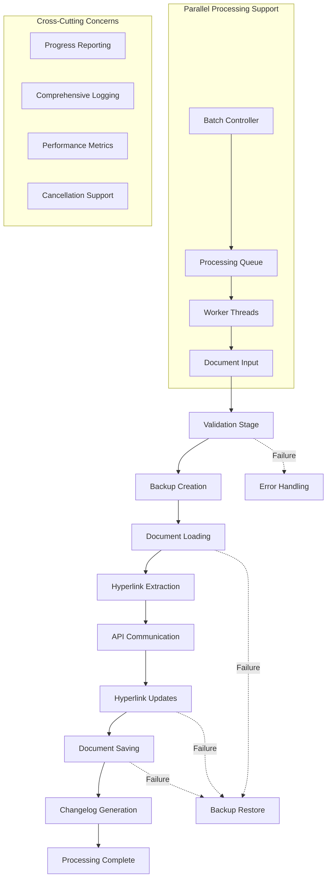

# WPF Bulk Editor - Document Processing Workflow with DocumentFormat.OpenXml

## 🎯 **Document Processing Architecture Overview**

### **Core Processing Philosophy**

- **Atomic Operations**: Each document processed as an isolated transaction
- **Backup-First**: Always create backup before any modifications
- **Fail-Safe Processing**: Rollback capability for any failed operations
- **Memory Efficient**: Stream-based processing for large documents
- **Async-First**: Non-blocking operations with progress reporting
- **Concurrent Safe**: Support for parallel document processing

### **Processing Pipeline Architecture**



## 📋 **Document Processing Stages**

### **Stage 1: Document Validation and Preparation**

```csharp
/// <summary>
/// Document validation and preparation service
/// </summary>
public class DocumentValidationService : IDocumentValidationService
{
    private readonly ILogger<DocumentValidationService> _logger;
    private readonly SecuritySettings _securitySettings;
    private readonly ProcessingSettings _processingSettings;

    public DocumentValidationService(
        ILogger<DocumentValidationService> logger,
        IOptions<SecuritySettings> securitySettings,
        IOptions<ProcessingSettings> processingSettings)
    {
        _logger = logger;
        _securitySettings = securitySettings.Value;
        _processingSettings = processingSettings.Value;
    }

    public async Task<ValidationResult> ValidateDocumentAsync(string filePath, CancellationToken cancellationToken = default)
    {
        using var tracker = _logger.BeginScope("DocumentValidation_{FilePath}", Path.GetFileName(filePath));

        var result = new ValidationResult { FilePath = filePath };

        try
        {
            // File existence and accessibility
            if (!await ValidateFileAccessAsync(filePath, cancellationToken))
            {
                result.AddError("File does not exist or is not accessible");
                return result;
            }

            // File extension validation
            if (!ValidateFileExtension(filePath))
            {
                result.AddError($"File extension not supported. Allowed: {string.Join(", ", _securitySettings.AllowedFileExtensions)}");
                return result;
            }

            // File size validation
            var fileSize = new FileInfo(filePath).Length;
            var maxSizeBytes = _securitySettings.MaxFileSizeMB * 1024 * 1024;
            if (fileSize > maxSizeBytes)
            {
                result.AddError($"File size ({fileSize / (1024.0 * 1024.0):F2} MB) exceeds maximum allowed size ({_securitySettings.MaxFileSizeMB} MB)");
                return result;
            }

            // Document format validation
            var formatValidation = await ValidateDocumentFormatAsync(filePath, cancellationToken);
            if (!formatValidation.IsValid)
            {
                result.Errors.AddRange(formatValidation.Errors);
                return result;
            }

            // Security validation (path traversal, etc.)
            if (_securitySettings.ValidateFilePaths && !ValidateSecurePath(filePath))
            {
                result.AddError("File path contains potentially unsafe characters");
                return result;
            }

            // Document content validation
            var contentValidation = await ValidateDocumentContentAsync(filePath, cancellationToken);
            result.Warnings.AddRange(contentValidation.Warnings);

            if (!contentValidation.IsValid)
            {
                result.Errors.AddRange(contentValidation.Errors);
                return result;
            }

            result.IsValid = true;
            result.DocumentInfo = await GetDocumentInfoAsync(filePath, cancellationToken);

            _logger.LogInformation("Document validation successful for {FilePath}", filePath);

            return result;
        }
        catch (Exception ex)
        {
            _logger.LogError(ex, "Document validation failed for {FilePath}", filePath);
            result.AddError($"Validation failed: {ex.Message}");
            return result;
        }
    }

    private async Task<ValidationResult> ValidateDocumentFormatAsync(string filePath, CancellationToken cancellationToken)
    {
        var result = new ValidationResult();

        try
        {
            using var stream = File.OpenRead(filePath);
            using var document = WordprocessingDocument.Open(stream, false);

            // Validate document structure
            if (document.MainDocumentPart == null)
            {
                result.AddError("Document does not contain a main document part");
                return result;
            }

            if (document.MainDocumentPart.Document?.Body == null)
            {
                result.AddError("Document body is missing or corrupted");
                return result;
            }

            // Check for password protection
            if (document.MainDocumentPart.DocumentSettingsPart?.Settings?.DocumentProtection != null)
            {
                result.AddWarning("Document is password protected and may not process correctly");
            }

            // Validate document compatibility
            var appVersion = document.ExtendedFilePropertiesPart?.Properties?.Application?.Text;
            if (!string.IsNullOrEmpty(appVersion))
            {
                _logger.LogDebug("Document created with: {Application}", appVersion);
            }

            result.IsValid = true;
        }
        catch (OpenXmlPackageException ex)
        {
            result.AddError($"Invalid Word document format: {ex.Message}");
        }
        catch (Exception ex)
        {
            result.AddError($"Document format validation error: {ex.Message}");
        }

        return result;
    }

    private async Task<ValidationResult> ValidateDocumentContentAsync(string filePath, CancellationToken cancellationToken)
    {
        var result = new ValidationResult();

        try
        {
            using var stream = File.OpenRead(filePath);
            using var document = WordprocessingDocument.Open(stream, false);

            var hyperlinkCount = CountHyperlinks(document);
            var lookupIdCount = CountLookupIds(document);

            if (hyperlinkCount == 0)
            {
                result.AddWarning("Document contains no hyperlinks to process");
            }

            if (lookupIdCount == 0)
            {
                result.AddWarning("Document contains no valid Lookup IDs to process");
            }

            _logger.LogInformation("Document contains {HyperlinkCount} hyperlinks, {LookupIdCount} valid Lookup IDs",
                hyperlinkCount, lookupIdCount);

            result.IsValid = true;
            result.HyperlinkCount = hyperlinkCount;
            result.LookupIdCount = lookupIdCount;
        }
        catch (Exception ex)
        {
            result.AddError($"Content validation error: {ex.Message}");
        }

        return result;
    }
}

public class ValidationResult
{
    public string FilePath { get; set; } = string.Empty;
    public bool IsValid { get; set; }
    public List<string> Errors { get; set; } = new();
    public List<string> Warnings { get; set; } = new();
    public DocumentInfo? DocumentInfo { get; set; }
    public int HyperlinkCount { get; set; }
    public int LookupIdCount { get; set; }

    public void AddError(string error) => Errors.Add(error);
    public void AddWarning(string warning) => Warnings.Add(warning);
}

public class DocumentInfo
{
    public string FilePath { get; set; } = string.Empty;
    public long FileSizeBytes { get; set; }
    public DateTime LastModified { get; set; }
    public string CreatedBy { get; set; } = string.Empty;
    public string LastModifiedBy { get; set; } = string.Empty;
    public int PageCount { get; set; }
    public int WordCount { get; set; }
    public string DocumentVersion { get; set; } = string.Empty;
}
```

### **Stage 2: Backup Creation and Management**

```csharp
/// <summary>
/// Document backup service with versioning and retention
/// </summary>
public class DocumentBackupService : IDocumentBackupService
{
    private readonly ILogger<DocumentBackupService> _logger;
    private readonly ProcessingSettings _settings;
    private readonly string _backupDirectory;

    public DocumentBackupService(
        ILogger<DocumentBackupService> logger,
        IOptions<ProcessingSettings> settings)
    {
        _logger = logger;
        _settings = settings.Value;
        _backupDirectory = Environment.ExpandEnvironmentVariables(_settings.BackupLocation);

        EnsureBackupDirectoryExists();
    }

    public async Task<BackupInfo> CreateBackupAsync(string originalFilePath, CancellationToken cancellationToken = default)
    {
        var fileName = Path.GetFileNameWithoutExtension(originalFilePath);
        var extension = Path.GetExtension(originalFilePath);
        var timestamp = DateTime.UtcNow.ToString("yyyyMMdd_HHmmss");
        var backupFileName = $"{fileName}_backup_{timestamp}{extension}";
        var backupPath = Path.Combine(_backupDirectory, backupFileName);

        try
        {
            // Create backup with progress tracking for large files
            using var sourceStream = new FileStream(originalFilePath, FileMode.Open, FileAccess.Read);
            using var destinationStream = new FileStream(backupPath, FileMode.Create, FileAccess.Write);

            var buffer = new byte[81920]; // 80KB buffer
            var totalBytes = sourceStream.Length;
            var copiedBytes = 0L;

            int bytesRead;
            while ((bytesRead = await sourceStream.ReadAsync(buffer, 0, buffer.Length, cancellationToken)) > 0)
            {
                await destinationStream.WriteAsync(buffer, 0, bytesRead, cancellationToken);
                copiedBytes += bytesRead;

                // Report progress for large files
                if (totalBytes > 10 * 1024 * 1024) // > 10MB
                {
                    var progress = (double)copiedBytes / totalBytes * 100;
                    _logger.LogDebug("Backup progress: {Progress:F1}%", progress);
                }

                cancellationToken.ThrowIfCancellationRequested();
            }

            // Verify backup integrity
            var originalHash = await CalculateFileHashAsync(originalFilePath, cancellationToken);
            var backupHash = await CalculateFileHashAsync(backupPath, cancellationToken);

            if (originalHash != backupHash)
            {
                File.Delete(backupPath);
                throw new FileSystemException("Backup verification failed - hash mismatch", backupPath, FileOperation.Backup);
            }

            var backupInfo = new BackupInfo
            {
                OriginalFilePath = originalFilePath,
                BackupFilePath = backupPath,
                CreatedAt = DateTime.UtcNow,
                FileSizeBytes = new FileInfo(backupPath).Length,
                FileHash = backupHash,
                IsVerified = true
            };

            // Save backup metadata
            await SaveBackupMetadataAsync(backupInfo, cancellationToken);

            _logger.LogInformation("Backup created successfully: {BackupPath}", backupPath);

            return backupInfo;
        }
        catch (Exception ex)
        {
            // Clean up incomplete backup
            if (File.Exists(backupPath))
            {
                try { File.Delete(backupPath); } catch { }
            }

            _logger.LogError(ex, "Failed to create backup for {OriginalPath}", originalFilePath);
            throw new FileSystemException($"Backup creation failed: {ex.Message}", originalFilePath, FileOperation.Backup, ex);
        }
    }

    public async Task<RestoreResult> RestoreFromBackupAsync(BackupInfo backupInfo, string? targetPath = null, CancellationToken cancellationToken = default)
    {
        targetPath ??= backupInfo.OriginalFilePath;

        try
        {
            // Verify backup integrity before restore
            if (!await VerifyBackupIntegrityAsync(backupInfo, cancellationToken))
            {
                return RestoreResult.Failed("Backup integrity verification failed");
            }

            // Create restore point of current file if it exists
            RestorePoint? restorePoint = null;
            if (File.Exists(targetPath))
            {
                restorePoint = await CreateRestorePointAsync(targetPath, cancellationToken);
            }

            // Perform restore
            File.Copy(backupInfo.BackupFilePath, targetPath, overwrite: true);

            // Verify restore
            var restoredHash = await CalculateFileHashAsync(targetPath, cancellationToken);
            if (restoredHash != backupInfo.FileHash)
            {
                // Restore failed, rollback if possible
                if (restorePoint != null)
                {
                    File.Copy(restorePoint.FilePath, targetPath, overwrite: true);
                }

                return RestoreResult.Failed("Restore verification failed");
            }

            _logger.LogInformation("Backup restored successfully to {TargetPath}", targetPath);

            return RestoreResult.Success(targetPath, restorePoint);
        }
        catch (Exception ex)
        {
            _logger.LogError(ex, "Failed to restore backup {BackupPath}", backupInfo.BackupFilePath);
            return RestoreResult.Failed($"Restore failed: {ex.Message}");
        }
    }

    public async Task<CleanupResult> CleanupOldBackupsAsync(int retentionDays, CancellationToken cancellationToken = default)
    {
        var cutoffDate = DateTime.UtcNow.AddDays(-retentionDays);
        var cleanupResult = new CleanupResult();

        try
        {
            var backupFiles = Directory.GetFiles(_backupDirectory, "*_backup_*.*")
                .Where(f => File.GetCreationTimeUtc(f) < cutoffDate)
                .ToList();

            foreach (var backupFile in backupFiles)
            {
                try
                {
                    var fileInfo = new FileInfo(backupFile);
                    File.Delete(backupFile);

                    cleanupResult.DeletedFiles.Add(backupFile);
                    cleanupResult.FreedSpaceBytes += fileInfo.Length;

                    _logger.LogDebug("Deleted old backup: {BackupFile}", backupFile);
                }
                catch (Exception ex)
                {
                    cleanupResult.FailedDeletes.Add(backupFile, ex.Message);
                    _logger.LogWarning(ex, "Failed to delete backup file: {BackupFile}", backupFile);
                }

                cancellationToken.ThrowIfCancellationRequested();
            }

            // Clean up metadata for deleted backups
            await CleanupBackupMetadataAsync(cleanupResult.DeletedFiles, cancellationToken);

            _logger.LogInformation("Backup cleanup completed. Deleted {Count} files, freed {SizeMB:F2} MB",
                cleanupResult.DeletedFiles.Count, cleanupResult.FreedSpaceBytes / (1024.0 * 1024.0));

            return cleanupResult;
        }
        catch (Exception ex)
        {
            _logger.LogError(ex, "Backup cleanup failed");
            cleanupResult.CleanupError = ex.Message;
            return cleanupResult;
        }
    }

    private async Task<string> CalculateFileHashAsync(string filePath, CancellationToken cancellationToken)
    {
        using var sha256 = SHA256.Create();
        using var stream = File.OpenRead(filePath);

        var hashBytes = await sha256.ComputeHashAsync(stream, cancellationToken);
        return Convert.ToBase64String(hashBytes);
    }
}

public class BackupInfo
{
    public string OriginalFilePath { get; set; } = string.Empty;
    public string BackupFilePath { get; set; } = string.Empty;
    public DateTime CreatedAt { get; set; }
    public long FileSizeBytes { get; set; }
    public string FileHash { get; set; } = string.Empty;
    public bool IsVerified { get; set; }
    public string? Metadata { get; set; }
}

public class RestoreResult
{
    public bool IsSuccess { get; private set; }
    public string Message { get; private set; } = string.Empty;
    public string? RestoredFilePath { get; private set; }
    public RestorePoint? RestorePoint { get; private set; }

    public static RestoreResult Success(string restoredPath, RestorePoint? restorePoint = null)
    {
        return new RestoreResult
        {
            IsSuccess = true,
            Message = "Restore completed successfully",
            RestoredFilePath = restoredPath,
            RestorePoint = restorePoint
        };
    }

    public static RestoreResult Failed(string message)
    {
        return new RestoreResult { IsSuccess = false, Message = message };
    }
}

public class CleanupResult
{
    public List<string> DeletedFiles { get; set; } = new();
    public Dictionary<string, string> FailedDeletes { get; set; } = new();
    public long FreedSpaceBytes { get; set; }
    public string? CleanupError { get; set; }
}
```

### **Stage 3: Hyperlink Extraction and Analysis**

```csharp
/// <summary>
/// Service for extracting and analyzing hyperlinks from Word documents
/// </summary>
public class HyperlinkExtractionService : IHyperlinkExtractionService
{
    private readonly ILogger<HyperlinkExtractionService> _logger;
    private readonly Regex _lookupIdPattern;
    private readonly ProcessingSettings _settings;

    public HyperlinkExtractionService(
        ILogger<HyperlinkExtractionService> logger,
        IOptions<ProcessingSettings> settings)
    {
        _logger = logger;
        _settings = settings.Value;

        // Regex pattern from Base_File.vba: (TSRC-[^-]+-[0-9]{6}|CMS-[^-]+-[0-9]{6})
        _lookupIdPattern = new Regex(@"(TSRC-[^-]+-[0-9]{6}|CMS-[^-]+-[0-9]{6})",
            RegexOptions.Compiled | RegexOptions.IgnoreCase);
    }

    public async Task<HyperlinkExtractionResult> ExtractHyperlinksAsync(
        string filePath,
        IProgress<ExtractionProgress>? progress = null,
        CancellationToken cancellationToken = default)
    {
        var result = new HyperlinkExtractionResult { DocumentPath = filePath };

        try
        {
            using var stream = File.OpenRead(filePath);
            using var document = WordprocessingDocument.Open(stream, false);

            var hyperlinks = new List<ExtractedHyperlink>();
            var invisibleHyperlinks = new List<InvisibleHyperlink>();
            var lookupIds = new HashSet<string>(StringComparer.OrdinalIgnoreCase);

            // Extract hyperlinks from main document
            progress?.Report(new ExtractionProgress("Extracting hyperlinks from main document", 10));
            await ExtractFromMainDocumentAsync(document.MainDocumentPart!, hyperlinks, invisibleHyperlinks, lookupIds, cancellationToken);

            // Extract hyperlinks from headers
            progress?.Report(new ExtractionProgress("Extracting hyperlinks from headers", 30));
            await ExtractFromHeadersAsync(document.MainDocumentPart!, hyperlinks, invisibleHyperlinks, lookupIds, cancellationToken);

            // Extract hyperlinks from footers
            progress?.Report(new ExtractionProgress("Extracting hyperlinks from footers", 50));
            await ExtractFromFootersAsync(document.MainDocumentPart!, hyperlinks, invisibleHyperlinks, lookupIds, cancellationToken);

            // Extract hyperlinks from footnotes and endnotes
            progress?.Report(new ExtractionProgress("Extracting hyperlinks from notes", 70));
            await ExtractFromNotesAsync(document.MainDocumentPart!, hyperlinks, invisibleHyperlinks, lookupIds, cancellationToken);

            // Extract hyperlinks from textboxes and shapes
            progress?.Report(new ExtractionProgress("Extracting hyperlinks from textboxes", 90));
            await ExtractFromTextBoxesAsync(document.MainDocumentPart!, hyperlinks, invisibleHyperlinks, lookupIds, cancellationToken);

            // Analyze and categorize hyperlinks
            progress?.Report(new ExtractionProgress("Analyzing hyperlink patterns", 95));
            result.Hyperlinks = hyperlinks;
            result.InvisibleHyperlinks = invisibleHyperlinks;
            result.UniqueLookupIds = lookupIds.ToList();
            result.Statistics = CalculateStatistics(hyperlinks, invisibleHyperlinks, lookupIds);

            progress?.Report(new ExtractionProgress("Extraction completed", 100));

            _logger.LogInformation("Extracted {HyperlinkCount} hyperlinks, {LookupIdCount} unique Lookup IDs from {DocumentPath}",
                hyperlinks.Count, lookupIds.Count, filePath);

            result.IsSuccess = true;
            return result;
        }
        catch (Exception ex)
        {
            _logger.LogError(ex, "Failed to extract hyperlinks from {DocumentPath}", filePath);
            result.IsSuccess = false;
            result.ErrorMessage = ex.Message;
            return result;
        }
    }

    private async Task ExtractFromMainDocumentAsync(
        MainDocumentPart mainPart,
        List<ExtractedHyperlink> hyperlinks,
        List<InvisibleHyperlink> invisibleHyperlinks,
        HashSet<string> lookupIds,
        CancellationToken cancellationToken)
    {
        var body = mainPart.Document.Body;
        if (body == null) return;

        await ProcessElementForHyperlinksAsync(body, mainPart, hyperlinks, invisibleHyperlinks, lookupIds, cancellationToken);
    }

    private async Task ProcessElementForHyperlinksAsync(
        OpenXmlElement element,
        MainDocumentPart mainPart,
        List<ExtractedHyperlink> hyperlinks,
        List<InvisibleHyperlink> invisibleHyperlinks,
        HashSet<string> lookupIds,
        CancellationToken cancellationToken)
    {
        // Process hyperlinks in current element
        foreach (var hyperlink in element.Descendants<Hyperlink>())
        {
            cancellationToken.ThrowIfCancellationRequested();

            var extractedHyperlink = ExtractHyperlinkInfo(hyperlink, mainPart);

            if (extractedHyperlink.IsInvisible)
            {
                invisibleHyperlinks.Add(new InvisibleHyperlink
                {
                    HyperlinkId = extractedHyperlink.Id,
                    Address = extractedHyperlink.Address,
                    SubAddress = extractedHyperlink.SubAddress,
                    Location = extractedHyperlink.Location
                });
            }
            else
            {
                hyperlinks.Add(extractedHyperlink);

                // Extract Lookup ID if present
                var lookupId = ExtractLookupId(extractedHyperlink.Address, extractedHyperlink.SubAddress);
                if (!string.IsNullOrEmpty(lookupId))
                {
                    lookupIds.Add(lookupId);
                    extractedHyperlink.LookupId = lookupId;
                }
            }
        }

        // Process child elements recursively
        foreach (var child in element.Elements())
        {
            await ProcessElementForHyperlinksAsync(child, mainPart, hyperlinks, invisibleHyperlinks, lookupIds, cancellationToken);
        }
    }

    private ExtractedHyperlink ExtractHyperlinkInfo(Hyperlink hyperlink, MainDocumentPart mainPart)
    {
        var hyperlinkRelationship = mainPart.HyperlinkRelationships.FirstOrDefault(r => r.Id == hyperlink.Id);
        var displayText = hyperlink.InnerText?.Trim() ?? string.Empty;

        var extracted = new ExtractedHyperlink
        {
            Id = hyperlink.Id?.Value ?? string.Empty,
            DisplayText = displayText,
            Address = hyperlinkRelationship?.Uri?.ToString() ?? string.Empty,
            SubAddress = hyperlink.Anchor?.Value ?? string.Empty,
            ToolTip = hyperlink.Tooltip?.Value ?? string.Empty,
            Element = hyperlink,
            IsInvisible = string.IsNullOrWhiteSpace(displayText) && !string.IsNullOrEmpty(hyperlinkRelationship?.Uri?.ToString()),
            Location = GetElementLocation(hyperlink)
        };

        // Check for existing status indicators
        extracted.HasExpiredMarker = displayText.Contains(" - Expired", StringComparison.OrdinalIgnoreCase);
        extracted.HasNotFoundMarker = displayText.Contains(" - Not Found", StringComparison.OrdinalIgnoreCase);

        // Extract existing Content ID if present
        var contentIdMatch = Regex.Match(displayText, @" \((\d{5,6})\)$");
        if (contentIdMatch.Success)
        {
            extracted.ExistingContentId = contentIdMatch.Groups[1].Value;
        }

        return extracted;
    }

    private string? ExtractLookupId(string address, string subAddress)
    {
        var fullUrl = address + (string.IsNullOrEmpty(subAddress) ? "" : "#" + subAddress);

        // Try regex pattern first
        var match = _lookupIdPattern.Match(fullUrl);
        if (match.Success)
        {
            return match.Groups[1].Value.ToUpperInvariant();
        }

        // Try extracting from docid parameter (from VBA logic)
        var docIdIndex = fullUrl.IndexOf("docid=", StringComparison.OrdinalIgnoreCase);
        if (docIdIndex >= 0)
        {
            var startIndex = docIdIndex + 6;
            var endIndex = fullUrl.IndexOf('&', startIndex);
            var docId = endIndex > 0 ? fullUrl.Substring(startIndex, endIndex - startIndex) : fullUrl.Substring(startIndex);
            return docId.Trim();
        }

        return null;
    }

    private HyperlinkLocation GetElementLocation(Hyperlink hyperlink)
    {
        try
        {
            // This is a simplified location extraction - in practice, you'd need more complex logic
            // to accurately determine page and line numbers in OpenXML
            return new HyperlinkLocation
            {
                PageNumber = 1, // Would require complex calculation
                LineNumber = 1, // Would require complex calculation
                ParagraphIndex = GetParagraphIndex(hyperlink),
                ElementPath = GetElementXPath(hyperlink)
            };
        }
        catch
        {
            return new HyperlinkLocation { PageNumber = 0, LineNumber = 0 };
        }
    }

    private ExtractionStatistics CalculateStatistics(
        List<ExtractedHyperlink> hyperlinks,
        List<InvisibleHyperlink> invisibleHyperlinks,
        HashSet<string> lookupIds)
    {
        return new ExtractionStatistics
        {
            TotalHyperlinks = hyperlinks.Count + invisibleHyperlinks.Count,
            VisibleHyperlinks = hyperlinks.Count,
            InvisibleHyperlinks = invisibleHyperlinks.Count,
            UniqueLookupIds = lookupIds.Count,
            HyperlinksWithLookupIds = hyperlinks.Count(h => !string.IsNullOrEmpty(h.LookupId)),
            ExpiredMarkerCount = hyperlinks.Count(h => h.HasExpiredMarker),
            NotFoundMarkerCount = hyperlinks.Count(h => h.HasNotFoundMarker),
            ExistingContentIdCount = hyperlinks.Count(h => !string.IsNullOrEmpty(h.ExistingContentId))
        };
    }
}

public class ExtractedHyperlink
{
    public string Id { get; set; } = string.Empty;
    public string DisplayText { get; set; } = string.Empty;
    public string Address { get; set; } = string.Empty;
    public string SubAddress { get; set; } = string.Empty;
    public string ToolTip { get; set; } = string.Empty;
    public string? LookupId { get; set; }
    public string? ExistingContentId { get; set; }
    public bool IsInvisible { get; set; }
    public bool HasExpiredMarker { get; set; }
    public bool HasNotFoundMarker { get; set; }
    public HyperlinkLocation Location { get; set; } = new();
    public Hyperlink Element { get; set; } = null!;
}

public class HyperlinkLocation
{
    public int PageNumber { get; set; }
    public int LineNumber { get; set; }
    public int ParagraphIndex { get; set; }
    public string ElementPath { get; set; } = string.Empty;
}

public class ExtractionStatistics
{
    public int TotalHyperlinks { get; set; }
    public int VisibleHyperlinks { get; set; }
    public int InvisibleHyperlinks { get; set; }
    public int UniqueLookupIds { get; set; }
    public int HyperlinksWithLookupIds { get; set; }
    public int ExpiredMarkerCount { get; set; }
    public int NotFoundMarkerCount { get; set; }
    public int ExistingContentIdCount { get; set; }
}

public class HyperlinkExtractionResult
{
    public string DocumentPath { get; set; } = string.Empty;
    public bool IsSuccess { get; set; }
    public string? ErrorMessage { get; set; }
    public List<ExtractedHyperlink> Hyperlinks { get; set; } = new();
    public List<InvisibleHyperlink> InvisibleHyperlinks { get; set; } = new();
    public List<string> UniqueLookupIds { get; set; } = new();
    public ExtractionStatistics Statistics { get; set; } = new();
}

public class ExtractionProgress
{
    public string CurrentOperation { get; }
    public int PercentageComplete { get; }

    public ExtractionProgress(string operation, int percentage)
    {
        CurrentOperation = operation;
        PercentageComplete = percentage;
    }
}
```

### **Stage 4: API Integration and Data Retrieval**

```csharp
/// <summary>
/// Service for communicating with the document metadata API
/// </summary>
public class DocumentMetadataApiService : IDocumentMetadataApiService
{
    private readonly HttpClient _httpClient;
    private readonly ILogger<DocumentMetadataApiService> _logger;
    private readonly ApiSettings _apiSettings;
    private readonly SemaphoreSlim _rateLimitSemaphore;

    public DocumentMetadataApiService(
        HttpClient httpClient,
        ILogger<DocumentMetadataApiService> logger,
        IOptions<ApiSettings> apiSettings)
    {
        _httpClient = httpClient;
        _logger = logger;
        _apiSettings = apiSettings.Value;

        // Rate limiting: max 10 concurrent requests
        _rateLimitSemaphore = new SemaphoreSlim(10, 10);
    }

    public async Task<ApiResponseDto> GetDocumentMetadataAsync(
        IEnumerable<string> lookupIds,
        CancellationToken cancellationToken = default)
    {
        var lookupIdList = lookupIds.ToList();

        if (!lookupIdList.Any())
        {
            return new ApiResponseDto
            {
                IsSuccess = true,
                Results = new List<DocumentMetadata>(),
                Version = "N/A",
                Changes = "No lookup IDs to process"
            };
        }

        await _rateLimitSemaphore.WaitAsync(cancellationToken);

        try
        {
            using var correlationTracker = _logger.BeginScope("API_Request_{CorrelationId}", Guid.NewGuid());

            _logger.LogInformation("Requesting metadata for {Count} lookup IDs", lookupIdList.Count);

            // Build JSON request payload (matching VBA format)
            var requestPayload = new
            {
                Lookup_ID = lookupIdList.ToArray()
            };

            var jsonContent = JsonSerializer.Serialize(requestPayload);
            _logger.LogDebug("API Request payload: {JsonPayload}", jsonContent);

            using var content = new StringContent(jsonContent, Encoding.UTF8, "application/json");

            // Add correlation headers
            var correlationId = Guid.NewGuid().ToString();
            _httpClient.DefaultRequestHeaders.Remove("X-Correlation-ID");
            _httpClient.DefaultRequestHeaders.Add("X-Correlation-ID", correlationId);

            // Make API call with timeout
            using var cts = CancellationTokenSource.CreateLinkedTokenSource(cancellationToken);
            cts.CancelAfter(TimeSpan.FromSeconds(_apiSettings.TimeoutSeconds));

            var stopwatch = Stopwatch.StartNew();
            var response = await _httpClient.PostAsync("api/documents/metadata", content, cts.Token);
            stopwatch.Stop();

            _logger.LogInformation("API call completed in {ElapsedMs}ms with status {StatusCode}",
                stopwatch.ElapsedMilliseconds, response.StatusCode);

            if (!response.IsSuccessStatusCode)
            {
                var errorContent = await response.Content.ReadAsStringAsync(cancellationToken);
                _logger.LogError("API call failed with status {StatusCode}: {ErrorContent}",
                    response.StatusCode, errorContent);

                throw new ApiCommunicationException(
                    $"API call failed with status {response.StatusCode}",
                    _httpClient.BaseAddress?.ToString() ?? "Unknown",
                    (int)response.StatusCode,
                    errorContent);
            }

            var responseContent = await response.Content.ReadAsStringAsync(cancellationToken);
            _logger.LogDebug("API Response: {ResponseContent}", responseContent);

            // Parse response
            var apiResponse = ParseApiResponse(responseContent);

            _logger.LogInformation("Successfully processed API response: {ResultCount} results, Version: {Version}",
                apiResponse.Results.Count, apiResponse.Version);

            return apiResponse;
        }
        catch (OperationCanceledException) when (cancellationToken.IsCancellationRequested)
        {
            _logger.LogWarning("API call was cancelled");
            throw;
        }
        catch (OperationCanceledException)
        {
            _logger.LogError("API call timed out after {TimeoutSeconds} seconds", _apiSettings.TimeoutSeconds);
            throw new ApiCommunicationException(
                $"API call timed out after {_apiSettings.TimeoutSeconds} seconds",
                _httpClient.BaseAddress?.ToString() ?? "Unknown");
        }
        catch (HttpRequestException ex)
        {
            _logger.LogError(ex, "HTTP error during API call");
            throw new ApiCommunicationException(
                $"HTTP error: {ex.Message}",
                _httpClient.BaseAddress?.ToString() ?? "Unknown",
                innerException: ex);
        }
        catch (Exception ex)
        {
            _logger.LogError(ex, "Unexpected error during API call");
            throw new ApiCommunicationException(
                $"Unexpected error: {ex.Message}",
                _httpClient.BaseAddress?.ToString() ?? "Unknown",
                innerException: ex);
        }
        finally
        {
            _rateLimitSemaphore.Release();
        }
    }

    private ApiResponseDto ParseApiResponse(string responseContent)
    {
        try
        {
            using var document = JsonDocument.Parse(responseContent);
            var root = document.RootElement;

            var response = new ApiResponseDto
            {
                IsSuccess = true,
                Version = root.GetProperty("Version").GetString() ?? "Unknown",
                Changes = root.GetProperty("Changes").GetString() ?? "No changes"
            };

            // Parse results array
            if (root.TryGetProperty("Results", out var resultsElement))
            {
                foreach (var resultElement in resultsElement.EnumerateArray())
                {
                    var metadata = new DocumentMetadata
                    {
                        DocumentId = resultElement.GetProperty("Document_ID").GetString() ?? string.Empty,
                        ContentId = resultElement.GetProperty("Content_ID").GetString() ?? string.Empty,
                        Title = resultElement.GetProperty("Title").GetString() ?? string.Empty,
                        Status = resultElement.GetProperty("Status").GetString() ?? "Unknown"
                    };

                    // Additional optional properties
                    if (resultElement.TryGetProperty("LastModified", out var lastModifiedElement))
                    {
                        if (DateTime.TryParse(lastModifiedElement.GetString(), out var lastModified))
                        {
                            metadata.LastModified = lastModified;
                        }
                    }

                    if (resultElement.TryGetProperty("Author", out var authorElement))
                    {
                        metadata.Author = authorElement.GetString();
                    }

                    response.Results.Add(metadata);
                }
            }

            return response;
        }
        catch (JsonException ex)
        {
            _logger.LogError(ex, "Failed to parse API response JSON");
            throw new ApiCommunicationException(
                $"Invalid JSON response: {ex.Message}",
                _httpClient.BaseAddress?.ToString() ?? "Unknown",
                innerException: ex);
        }
    }

    public async Task<ApiConnectionResult> ValidateConnectionAsync(CancellationToken cancellationToken = default)
    {
        try
        {
            using var cts = CancellationTokenSource.CreateLinkedTokenSource(cancellationToken);
            cts.CancelAfter(TimeSpan.FromSeconds(10)); // Shorter timeout for health check

            var response = await _httpClient.GetAsync("health", cts.Token);

            return new ApiConnectionResult
            {
                IsConnected = response.IsSuccessStatusCode,
                StatusCode = (int)response.StatusCode,
                ResponseTime = TimeSpan.Zero, // Could measure actual response time
                Message = response.IsSuccessStatusCode ? "Connection successful" : $"Connection failed: {response.StatusCode}"
            };
        }
        catch (Exception ex)
        {
            _logger.LogError(ex, "API connection validation failed");
            return new ApiConnectionResult
            {
                IsConnected = false,
                Message = $"Connection failed: {ex.Message}"
            };
        }
    }
}

public class ApiResponseDto
{
    public bool IsSuccess { get; set; }
    public string Version { get; set; } = string.Empty;
    public string Changes { get; set; } = string.Empty;
    public List<DocumentMetadata> Results { get; set; } = new();
    public string? ErrorMessage { get; set; }
}

public class DocumentMetadata
{
    public string DocumentId { get; set; } = string.Empty;
    public string ContentId { get; set; } = string.Empty;
    public string Title { get; set; } = string.Empty;
    public string Status { get; set; } = string.Empty;
    public DateTime? LastModified { get; set; }
    public string? Author { get; set; }
}

public class ApiConnectionResult
{
    public bool IsConnected { get; set; }
    public int StatusCode { get; set; }
    public TimeSpan ResponseTime { get; set; }
    public string Message { get; set; } = string.Empty;
}
```

### **Stage 5: Document Processing Orchestration**

```csharp
/// <summary>
/// Main orchestration service that coordinates the entire document processing workflow
/// </summary>
public class DocumentProcessingOrchestrator : IDocumentProcessingService
{
    private readonly IDocumentValidationService _validationService;
    private readonly IDocumentBackupService _backupService;
    private readonly IHyperlinkExtractionService _extractionService;
    private readonly IDocumentMetadataApiService _apiService;
    private readonly IHyperlinkUpdateService _updateService;
    private readonly IChangelogService _changelogService;
    private readonly ILogger<DocumentProcessingOrchestrator> _logger;
    private readonly ProcessingSettings _settings;

    public DocumentProcessingOrchestrator(
        IDocumentValidationService validationService,
        IDocumentBackupService backupService,
        IHyperlinkExtractionService extractionService,
        IDocumentMetadataApiService apiService,
        IHyperlinkUpdateService updateService,
        IChangelogService changelogService,
        ILogger<DocumentProcessingOrchestrator> logger,
        IOptions<ProcessingSettings> settings)
    {
        _validationService = validationService;
        _backupService = backupService;
        _extractionService = extractionService;
        _apiService = apiService;
        _updateService = updateService;
        _changelogService = changelogService;
        _logger = logger;
        _settings = settings.Value;
    }

    public async Task<ProcessingResult> ProcessDocumentAsync(
        string filePath,
        IProgress<ProgressUpdate>? progress = null,
        CancellationToken cancellationToken = default)
    {
        var correlationId = Guid.NewGuid().ToString();
        using var correlationScope = _logger.BeginScope("ProcessDocument_{CorrelationId}", correlationId);

        var result = new ProcessingResult
        {
            DocumentPath = filePath,
            CorrelationId = correlationId,
            StartTime = DateTime.UtcNow
        };

        try
        {
            _logger.LogInformation("Starting document processing for {FilePath}", filePath);

            // Stage 1: Document Validation
            progress?.Report(new ProgressUpdate("Validating document...", 5));
            var validationResult = await _validationService.ValidateDocumentAsync(filePath, cancellationToken);
            if (!validationResult.IsValid)
            {
                result.MarkAsFailed($"Validation failed: {string.Join(", ", validationResult.Errors)}");
                return result;
            }
            result.ValidationResult = validationResult;

            // Stage 2: Backup Creation
            BackupInfo? backup = null;
            if (_settings.CreateBackups)
            {
                progress?.Report(new ProgressUpdate("Creating backup...", 10));
                backup = await _backupService.CreateBackupAsync(filePath, cancellationToken);
                result.BackupInfo = backup;
            }

            try
            {
                // Stage 3: Hyperlink Extraction
                progress?.Report(new ProgressUpdate("Extracting hyperlinks...", 20));
                var extractionProgress = new Progress<ExtractionProgress>(ep =>
                    progress?.Report(new ProgressUpdate($"Extracting hyperlinks: {ep.CurrentOperation}", 20 + (ep.PercentageComplete * 0.3))));

                var extractionResult = await _extractionService.ExtractHyperlinksAsync(filePath, extractionProgress, cancellationToken);
                if (!extractionResult.IsSuccess)
                {
                    result.MarkAsFailed($"Hyperlink extraction failed: {extractionResult.ErrorMessage}");
                    return result;
                }
                result.ExtractionResult = extractionResult;

                // Stage 4: API Communication
                if (extractionResult.UniqueLookupIds.Any())
                {
                    progress?.Report(new ProgressUpdate("Retrieving document metadata from API...", 50));
                    var apiResponse = await _apiService.GetDocumentMetadataAsync(extractionResult.UniqueLookupIds, cancellationToken);
                    result.ApiResponse = apiResponse;
                }
                else
                {
                    _logger.LogInformation("No lookup IDs found, skipping API call");
                    result.ApiResponse = new ApiResponseDto { IsSuccess = true, Results = new List<DocumentMetadata>() };
                }

                // Stage 5: Document Updates
                progress?.Report(new ProgressUpdate("Updating hyperlinks...", 70));
                var updateProgress = new Progress<UpdateProgress>(up =>
                    progress?.Report(new ProgressUpdate($"Updating hyperlinks: {up.CurrentOperation}", 70 + (up.PercentageComplete * 0.2))));

                var updateResult = await _updateService.UpdateDocumentAsync(
                    filePath,
                    extractionResult,
                    result.ApiResponse,
                    updateProgress,
                    cancellationToken);

                if (!updateResult.IsSuccess)
                {
                    result.MarkAsFailed($"Document update failed: {updateResult.ErrorMessage}");
                    return result;
                }
                result.UpdateResult = updateResult;

                // Stage 6: Changelog Generation
                if (_settings.CreateChangelogOnCompletion)
                {
                    progress?.Report(new ProgressUpdate("Generating changelog...", 95));
                    var changelogResult = await _changelogService.GenerateChangelogAsync(
                        new[] { result },
                        result.ApiResponse?.Version != null ? new VersionInfo { Version = result.ApiResponse.Version, Changes = result.ApiResponse.Changes } : null);
                    result.ChangelogPath = changelogResult.FilePath;
                }

                result.MarkAsSuccess();
                progress?.Report(new ProgressUpdate("Processing completed successfully", 100));

                _logger.LogInformation("Document processing completed successfully for {FilePath} in {ElapsedMs}ms",
                    filePath, (DateTime.UtcNow - result.StartTime).TotalMilliseconds);

                return result;
            }
            catch (Exception ex)
            {
                // Attempt to restore from backup if available
                if (backup != null && _settings.CreateBackups)
                {
                    try
                    {
                        _logger.LogWarning("Processing failed, attempting to restore from backup");
                        await _backupService.RestoreFromBackupAsync(backup, cancellationToken: cancellationToken);
                        result.WasRestoredFromBackup = true;
                    }
                    catch (Exception restoreEx)
                    {
                        _logger.LogError(restoreEx, "Failed to restore from backup after processing failure");
                    }
                }

                throw;
            }
        }
        catch (OperationCanceledException) when (cancellationToken.IsCancellationRequested)
        {
            result.MarkAsFailed("Processing was cancelled");
            _logger.LogWarning("Document processing cancelled for {FilePath}", filePath);
            return result;
        }
        catch (Exception ex)
        {
            result.MarkAsFailed($"Processing failed: {ex.Message}", ex);
            _logger.LogError(ex, "Document processing failed for {FilePath}", filePath);
            return result;
        }
        finally
        {
            result.EndTime = DateTime.UtcNow;
        }
    }

    public async Task<BatchProcessingResult> ProcessDocumentsBatchAsync(
        IEnumerable<string> filePaths,
        int maxConcurrency = 5,
        IProgress<BatchProgressUpdate>? progress = null,
        CancellationToken cancellationToken = default)
    {
        var filePathList = filePaths.ToList();
        var batchResult = new BatchProcessingResult
        {
            TotalDocuments = filePathList.Count,
            StartTime = DateTime.UtcNow
        };

        _logger.LogInformation("Starting batch processing of {DocumentCount} documents with concurrency {MaxConcurrency}",
            filePathList.Count, maxConcurrency);

        var semaphore = new SemaphoreSlim(maxConcurrency, maxConcurrency);
        var completedCount = 0;
        var tasks = filePathList.Select(async (filePath, index) =>
        {
            await semaphore.WaitAsync(cancellationToken);
            try
            {
                var documentProgress = new Progress<ProgressUpdate>(update =>
                {
                    var batchUpdate = new BatchProgressUpdate
                    {
                        CompletedDocuments = completedCount,
                        TotalDocuments = filePathList.Count,
                        CurrentDocumentIndex = index,
                        CurrentDocumentName = Path.GetFileName(filePath),
                        CurrentOperation = update.Message,
                        CurrentDocumentProgress = update.PercentageComplete
                    };
                    progress?.Report(batchUpdate);
                });

                var result = await ProcessDocumentAsync(filePath, documentProgress, cancellationToken);

                Interlocked.Increment(ref completedCount);

                lock (batchResult)
                {
                    batchResult.Results.Add(result);
                    if (result.IsSuccess)
                        batchResult.SuccessfulCount++;
                    else
                        batchResult.FailedCount++;
                }

                return result;
            }
            finally
            {
                semaphore.Release();
            }
        });

        await Task.WhenAll(tasks);

        batchResult.EndTime = DateTime.UtcNow;

        _logger.LogInformation("Batch processing completed: {SuccessCount}/{TotalCount} successful in {ElapsedMs}ms",
            batchResult.SuccessfulCount, batchResult.TotalDocuments, batchResult.ElapsedMilliseconds);

        return batchResult;
    }
}

public class ProcessingResult
{
    public string DocumentPath { get; set; } = string.Empty;
    public string CorrelationId { get; set; } = string.Empty;
    public bool IsSuccess { get; set; }
    public string Message { get; set; } = string.Empty;
    public Exception? Exception { get; set; }
    public DateTime StartTime { get; set; }
    public DateTime? EndTime { get; set; }
    public TimeSpan ElapsedTime => (EndTime ?? DateTime.UtcNow) - StartTime;

    public ValidationResult? ValidationResult { get; set; }
    public BackupInfo? BackupInfo { get; set; }
    public HyperlinkExtractionResult? ExtractionResult { get; set; }
    public ApiResponseDto? ApiResponse { get; set; }
    public UpdateResult? UpdateResult { get; set; }
    public string? ChangelogPath { get; set; }
    public bool WasRestoredFromBackup { get; set; }

    public void MarkAsSuccess(string? message = null)
    {
        IsSuccess = true;
        Message = message ?? "Processing completed successfully";
    }

    public void MarkAsFailed(string message, Exception? exception = null)
    {
        IsSuccess = false;
        Message = message;
        Exception = exception;
    }
}

public class BatchProcessingResult
{
    public int TotalDocuments { get; set; }
    public int SuccessfulCount { get; set; }
    public int FailedCount { get; set; }
    public DateTime StartTime { get; set; }
    public DateTime? EndTime { get; set; }
    public long ElapsedMilliseconds => (long)(EndTime ?? DateTime.UtcNow).Subtract(StartTime).TotalMilliseconds;
    public List<ProcessingResult> Results { get; set; } = new();
}

public class ProgressUpdate
{
    public string Message { get; }
    public double PercentageComplete { get; }

    public ProgressUpdate(string message, double percentage)
    {
        Message = message;
        PercentageComplete = percentage;
    }
}

public class BatchProgressUpdate
{
    public int CompletedDocuments { get; set; }
    public int TotalDocuments { get; set; }
    public int CurrentDocumentIndex { get; set; }
    public string CurrentDocumentName { get; set; } = string.Empty;
    public string CurrentOperation { get; set; } = string.Empty;
    public double CurrentDocumentProgress { get; set; }
    public double OverallPercentage => TotalDocuments > 0 ? (double)CompletedDocuments / TotalDocuments * 100 : 0;
}
```

This document processing workflow design provides a comprehensive, production-ready system for processing Word documents using DocumentFormat.OpenXml with robust error handling, backup strategies, progress reporting, and scalable architecture patterns.
