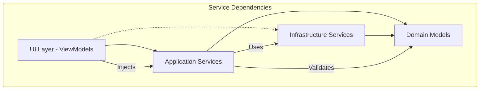

# WPF Bulk Editor - Service Interfaces & Dependency Injection Strategy

## 🎯 **Service Interface Design Principles**

### **Interface Segregation Strategy**

- **Single Responsibility**: Each interface handles one specific business concern
- **Minimal Surface Area**: Interfaces expose only necessary methods
- **Async-First Design**: All I/O operations return `Task<T>` or `ValueTask<T>`
- **Cancellation Support**: All long-running operations accept `CancellationToken`
- **Progress Reporting**: Operations that take time support `IProgress<T>`

### **Dependency Flow Architecture**



## 🔧 **Core Service Interfaces**

### **IDocumentProcessingService** (Application Layer)

_Primary orchestration service for document processing workflows_

```csharp
public interface IDocumentProcessingService
{
    /// <summary>
    /// Processes a single document through the complete workflow
    /// </summary>
    /// <param name="filePath">Path to the document file</param>
    /// <param name="progress">Progress reporting callback</param>
    /// <param name="cancellationToken">Cancellation support</param>
    /// <returns>Processing result with success/failure status and details</returns>
    Task<ProcessingResult> ProcessDocumentAsync(
        string filePath,
        IProgress<ProgressUpdate>? progress = null,
        CancellationToken cancellationToken = default);

    /// <summary>
    /// Processes multiple documents in batch with configurable concurrency
    /// </summary>
    /// <param name="filePaths">Collection of document file paths</param>
    /// <param name="maxConcurrency">Maximum number of concurrent operations</param>
    /// <param name="progress">Progress reporting for overall batch operation</param>
    /// <param name="cancellationToken">Cancellation support</param>
    /// <returns>Aggregate processing results</returns>
    Task<BatchProcessingResult> ProcessDocumentsBatchAsync(
        IEnumerable<string> filePaths,
        int maxConcurrency = 5,
        IProgress<BatchProgressUpdate>? progress = null,
        CancellationToken cancellationToken = default);

    /// <summary>
    /// Validates document before processing
    /// </summary>
    /// <param name="filePath">Path to document</param>
    /// <returns>Validation result with any issues found</returns>
    Task<ValidationResult> ValidateDocumentAsync(string filePath);

    /// <summary>
    /// Gets processing statistics for monitoring
    /// </summary>
    /// <returns>Current processing metrics</returns>
    ProcessingStatistics GetProcessingStatistics();
}
```

### **IApiService** (Application Layer)

_External API communication for document metadata retrieval_

```csharp
public interface IApiService
{
    /// <summary>
    /// Retrieves document metadata for the specified lookup IDs
    /// </summary>
    /// <param name="lookupIds">Collection of document lookup IDs</param>
    /// <param name="cancellationToken">Cancellation support</param>
    /// <returns>API response with document metadata</returns>
    Task<ApiResponseDto> GetDocumentMetadataAsync(
        IEnumerable<string> lookupIds,
        CancellationToken cancellationToken = default);

    /// <summary>
    /// Validates API connectivity and authentication
    /// </summary>
    /// <param name="cancellationToken">Cancellation support</param>
    /// <returns>Connection validation result</returns>
    Task<ApiConnectionResult> ValidateConnectionAsync(
        CancellationToken cancellationToken = default);

    /// <summary>
    /// Gets current API version and update information
    /// </summary>
    /// <param name="currentVersion">Current application version</param>
    /// <param name="cancellationToken">Cancellation support</param>
    /// <returns>Version information and update notes</returns>
    Task<VersionInfo> GetVersionInfoAsync(
        string currentVersion,
        CancellationToken cancellationToken = default);

    /// <summary>
    /// Gets API health status and performance metrics
    /// </summary>
    /// <returns>API health information</returns>
    Task<ApiHealthStatus> GetHealthStatusAsync();
}
```

### **IHyperlinkService** (Application Layer)

_Hyperlink extraction, validation, and modification logic_

```csharp
public interface IHyperlinkService
{
    /// <summary>
    /// Extracts all unique lookup IDs from document hyperlinks
    /// </summary>
    /// <param name="document">OpenXML document object</param>
    /// <returns>Collection of unique lookup IDs</returns>
    IEnumerable<string> ExtractLookupIds(WordprocessingDocument document);

    /// <summary>
    /// Updates hyperlinks based on API response data
    /// </summary>
    /// <param name="document">OpenXML document object</param>
    /// <param name="apiResponse">API response with document metadata</param>
    /// <param name="progress">Progress reporting for hyperlink updates</param>
    /// <returns>Update results with detailed change information</returns>
    Task<HyperlinkUpdateResult> UpdateHyperlinksAsync(
        WordprocessingDocument document,
        ApiResponseDto apiResponse,
        IProgress<HyperlinkProgressUpdate>? progress = null);

    /// <summary>
    /// Identifies and removes invisible/empty hyperlinks
    /// </summary>
    /// <param name="document">OpenXML document object</param>
    /// <returns>Information about removed hyperlinks</returns>
    RemovalResult RemoveInvisibleHyperlinks(WordprocessingDocument document);

    /// <summary>
    /// Validates hyperlink integrity and format
    /// </summary>
    /// <param name="document">OpenXML document object</param>
    /// <returns>Validation results with any issues found</returns>
    HyperlinkValidationResult ValidateHyperlinks(WordprocessingDocument document);

    /// <summary>
    /// Appends or updates Content ID formatting in hyperlink text
    /// </summary>
    /// <param name="currentText">Current hyperlink display text</param>
    /// <param name="contentId">Content ID to append</param>
    /// <returns>Updated display text with proper Content ID format</returns>
    string UpdateContentIdInText(string currentText, string contentId);
}
```

### **IChangelogService** (Application Layer)

_Changelog generation and formatting logic_

```csharp
public interface IChangelogService
{
    /// <summary>
    /// Generates a comprehensive changelog from processing results
    /// </summary>
    /// <param name="processingResults">Results from document processing</param>
    /// <param name="versionInfo">Version and update information</param>
    /// <returns>Formatted changelog content</returns>
    Task<ChangelogContent> GenerateChangelogAsync(
        IEnumerable<ProcessingResult> processingResults,
        VersionInfo? versionInfo = null);

    /// <summary>
    /// Saves changelog to specified location
    /// </summary>
    /// <param name="changelog">Changelog content to save</param>
    /// <param name="outputPath">Target file path (optional, defaults to Downloads)</param>
    /// <returns>Information about saved changelog file</returns>
    Task<ChangelogFileInfo> SaveChangelogAsync(
        ChangelogContent changelog,
        string? outputPath = null);

    /// <summary>
    /// Formats changelog entries for different output formats
    /// </summary>
    /// <param name="entries">Changelog entries to format</param>
    /// <param name="format">Output format (Text, HTML, Markdown)</param>
    /// <returns>Formatted changelog content</returns>
    string FormatChangelog(
        IEnumerable<ChangelogEntry> entries,
        ChangelogFormat format = ChangelogFormat.Text);

    /// <summary>
    /// Opens changelog file in default application
    /// </summary>
    /// <param name="filePath">Path to changelog file</param>
    /// <returns>Success status of file opening</returns>
    Task<bool> OpenChangelogAsync(string filePath);
}
```

### **IFileSystemService** (Infrastructure Layer)

_File system operations with backup and safety features_

```csharp
public interface IFileSystemService
{
    /// <summary>
    /// Creates a backup of the specified file
    /// </summary>
    /// <param name="filePath">Path to file to backup</param>
    /// <param name="backupLocation">Optional backup location</param>
    /// <returns>Backup information including path and metadata</returns>
    Task<BackupInfo> CreateBackupAsync(
        string filePath,
        string? backupLocation = null);

    /// <summary>
    /// Restores a file from backup
    /// </summary>
    /// <param name="backupInfo">Backup information</param>
    /// <param name="targetPath">Optional target restoration path</param>
    /// <returns>Restoration result</returns>
    Task<RestoreResult> RestoreFromBackupAsync(
        BackupInfo backupInfo,
        string? targetPath = null);

    /// <summary>
    /// Safely writes document content using atomic operations
    /// </summary>
    /// <param name="document">Document to save</param>
    /// <param name="filePath">Target file path</param>
    /// <returns>Write operation result</returns>
    Task<WriteResult> WriteDocumentSafelyAsync(
        WordprocessingDocument document,
        string filePath);

    /// <summary>
    /// Validates file path security and accessibility
    /// </summary>
    /// <param name="filePath">Path to validate</param>
    /// <returns>Validation result with any security issues</returns>
    PathValidationResult ValidateFilePath(string filePath);

    /// <summary>
    /// Cleans up old backup files based on retention policy
    /// </summary>
    /// <param name="retentionDays">Number of days to retain backups</param>
    /// <returns>Cleanup results</returns>
    Task<CleanupResult> CleanupOldBackupsAsync(int retentionDays = 30);

    /// <summary>
    /// Gets file system usage statistics
    /// </summary>
    /// <returns>Usage metrics including backup storage</returns>
    FileSystemUsageStats GetUsageStatistics();
}
```

### **IConfigurationService** (Infrastructure Layer)

_Configuration management with persistence and validation_

```csharp
public interface IConfigurationService
{
    /// <summary>
    /// Gets strongly-typed configuration section
    /// </summary>
    /// <typeparam name="T">Configuration type</typeparam>
    /// <param name="sectionName">Configuration section name</param>
    /// <returns>Configuration object</returns>
    T GetConfiguration<T>(string sectionName) where T : class, new();

    /// <summary>
    /// Updates and persists configuration section
    /// </summary>
    /// <typeparam name="T">Configuration type</typeparam>
    /// <param name="sectionName">Configuration section name</param>
    /// <param name="configuration">Updated configuration object</param>
    /// <returns>Update result</returns>
    Task<ConfigurationUpdateResult> UpdateConfigurationAsync<T>(
        string sectionName,
        T configuration) where T : class;

    /// <summary>
    /// Validates configuration integrity
    /// </summary>
    /// <returns>Validation results with any issues found</returns>
    Task<ConfigurationValidationResult> ValidateConfigurationAsync();

    /// <summary>
    /// Resets configuration to defaults
    /// </summary>
    /// <param name="sectionName">Optional section to reset (all if null)</param>
    /// <returns>Reset operation result</returns>
    Task<ConfigurationResetResult> ResetToDefaultsAsync(string? sectionName = null);

    /// <summary>
    /// Gets configuration change notifications
    /// </summary>
    /// <returns>Observable sequence of configuration changes</returns>
    IObservable<ConfigurationChangeNotification> GetChangeNotifications();
}
```

### **IProgressReportingService** (Application Layer)

_Progress tracking and aggregation for long-running operations_

```csharp
public interface IProgressReportingService
{
    /// <summary>
    /// Creates a progress reporter for single operations
    /// </summary>
    /// <typeparam name="T">Progress data type</typeparam>
    /// <param name="callback">Progress callback function</param>
    /// <returns>Progress reporter instance</returns>
    IProgress<T> CreateProgress<T>(Action<T> callback);

    /// <summary>
    /// Creates an aggregated progress reporter for batch operations
    /// </summary>
    /// <param name="totalOperations">Total number of operations</param>
    /// <param name="callback">Progress callback function</param>
    /// <returns>Batch progress reporter</returns>
    IBatchProgressReporter CreateBatchProgress(
        int totalOperations,
        Action<BatchProgressUpdate> callback);

    /// <summary>
    /// Tracks operation performance metrics
    /// </summary>
    /// <param name="operationName">Name of operation being tracked</param>
    /// <returns>Performance tracker instance</returns>
    IOperationTracker StartOperation(string operationName);

    /// <summary>
    /// Gets current progress statistics
    /// </summary>
    /// <returns>Progress and performance metrics</returns>
    ProgressStatistics GetProgressStatistics();
}
```

### **IThemeService** (Infrastructure Layer)

_Theme management and system integration_

```csharp
public interface IThemeService
{
    /// <summary>
    /// Applies the specified theme to the application
    /// </summary>
    /// <param name="themeType">Theme to apply</param>
    /// <returns>Theme application result</returns>
    Task<ThemeApplicationResult> ApplyThemeAsync(ThemeType themeType);

    /// <summary>
    /// Detects current system theme preference
    /// </summary>
    /// <returns>Detected system theme</returns>
    ThemeType DetectSystemTheme();

    /// <summary>
    /// Gets available themes
    /// </summary>
    /// <returns>Collection of available theme information</returns>
    IEnumerable<ThemeInfo> GetAvailableThemes();

    /// <summary>
    /// Monitors system theme changes
    /// </summary>
    /// <returns>Observable sequence of theme change notifications</returns>
    IObservable<ThemeChangeNotification> MonitorSystemThemeChanges();

    /// <summary>
    /// Gets current theme information
    /// </summary>
    /// <returns>Current theme details</returns>
    ThemeInfo GetCurrentTheme();
}
```

## 🏗️ **Dependency Injection Container Configuration**

### **Service Registration Strategy**

```csharp
public static class ServiceCollectionExtensions
{
    /// <summary>
    /// Registers all application services with appropriate lifetimes
    /// </summary>
    public static IServiceCollection AddBulkEditorServices(
        this IServiceCollection services,
        IConfiguration configuration)
    {
        // Configuration Services (Singleton)
        services.AddSingleton<IConfigurationService, ConfigurationService>();
        services.Configure<AppSettings>(configuration.GetSection("AppSettings"));
        services.Configure<ApiSettings>(configuration.GetSection("ApiSettings"));
        services.Configure<LoggingSettings>(configuration.GetSection("LoggingSettings"));

        // Infrastructure Services (Singleton)
        services.AddSingleton<IThemeService, ThemeService>();
        services.AddSingleton<IFileSystemService, FileSystemService>();

        // Application Services (Scoped)
        services.AddScoped<IDocumentProcessingService, DocumentProcessingService>();
        services.AddScoped<IHyperlinkService, HyperlinkService>();
        services.AddScoped<IChangelogService, ChangelogService>();
        services.AddScoped<IProgressReportingService, ProgressReportingService>();

        // HTTP Services (Transient with HTTP Client Factory)
        services.AddHttpClient<IApiService, ApiService>(client =>
        {
            var apiSettings = configuration.GetSection("ApiSettings").Get<ApiSettings>();
            client.BaseAddress = new Uri(apiSettings.BaseUrl);
            client.Timeout = TimeSpan.FromSeconds(apiSettings.TimeoutSeconds);
        })
        .AddPolicyHandler(GetRetryPolicy())
        .AddPolicyHandler(GetCircuitBreakerPolicy());

        // Logging Services
        services.AddLogging(builder =>
        {
            var loggingSettings = configuration.GetSection("LoggingSettings").Get<LoggingSettings>();
            builder.AddSerilog(LoggingConfiguration.CreateLogger(loggingSettings));
        });

        return services;
    }

    /// <summary>
    /// Registers UI-specific services
    /// </summary>
    public static IServiceCollection AddUIServices(this IServiceCollection services)
    {
        // ViewModels (Transient - new instance per injection)
        services.AddTransient<MainWindowViewModel>();
        services.AddTransient<SettingsWindowViewModel>();
        services.AddTransient<ProgressWindowViewModel>();
        services.AddTransient<LogViewWindowViewModel>();

        // UI Services (Singleton)
        services.AddSingleton<IDialogService, DialogService>();
        services.AddSingleton<IWindowManager, WindowManager>();
        services.AddSingleton<IUIThreadDispatcher, UIThreadDispatcher>();

        return services;
    }

    private static IAsyncPolicy<HttpResponseMessage> GetRetryPolicy()
    {
        return Policy
            .HandleResult<HttpResponseMessage>(r => !r.IsSuccessStatusCode)
            .Or<HttpRequestException>()
            .WaitAndRetryAsync(
                retryCount: 3,
                sleepDurationProvider: retryAttempt =>
                    TimeSpan.FromSeconds(Math.Pow(2, retryAttempt)),
                onRetry: (outcome, timespan, retryCount, context) =>
                {
                    var logger = context.GetLogger();
                    logger?.LogWarning(
                        "API retry attempt {RetryCount} after {Delay}ms",
                        retryCount,
                        timespan.TotalMilliseconds);
                });
    }

    private static IAsyncPolicy<HttpResponseMessage> GetCircuitBreakerPolicy()
    {
        return Policy
            .HandleResult<HttpResponseMessage>(r => !r.IsSuccessStatusCode)
            .CircuitBreakerAsync(
                handledEventsAllowedBeforeBreaking: 5,
                durationOfBreak: TimeSpan.FromSeconds(30),
                onBreak: (exception, duration) =>
                {
                    // Log circuit breaker opened
                },
                onReset: () =>
                {
                    // Log circuit breaker closed
                });
    }
}
```

### **Host Builder Configuration**

```csharp
public partial class App : Application
{
    private IHost? _host;

    protected override async void OnStartup(StartupEventArgs e)
    {
        // Build configuration
        var configuration = new ConfigurationBuilder()
            .SetBasePath(Directory.GetCurrentDirectory())
            .AddJsonFile("appsettings.json", optional: false)
            .AddJsonFile($"appsettings.{Environment.GetEnvironmentVariable("ENVIRONMENT") ?? "Production"}.json", optional: true)
            .AddJsonFile(Path.Combine(Environment.GetFolderPath(Environment.SpecialFolder.ApplicationData), "BulkEditor", "UserSettings.json"), optional: true)
            .Build();

        // Build host
        _host = Host.CreateDefaultBuilder()
            .ConfigureServices((context, services) =>
            {
                services.AddBulkEditorServices(configuration);
                services.AddUIServices();
            })
            .ConfigureLogging((context, logging) =>
            {
                logging.ClearProviders();
                var loggingSettings = configuration.GetSection("LoggingSettings").Get<LoggingSettings>();
                logging.AddSerilog(LoggingConfiguration.CreateLogger(loggingSettings));
            })
            .Build();

        await _host.StartAsync();

        // Initialize main window
        var mainWindow = _host.Services.GetRequiredService<MainWindow>();
        mainWindow.Show();

        base.OnStartup(e);
    }

    protected override async void OnExit(ExitEventArgs e)
    {
        if (_host != null)
        {
            await _host.StopAsync();
            _host.Dispose();
        }

        base.OnExit(e);
    }
}
```

## 📋 **Service Lifetime Management**

### **Lifetime Strategies**

| Service Type                   | Lifetime  | Rationale                                         |
| ------------------------------ | --------- | ------------------------------------------------- |
| **IConfigurationService**      | Singleton | Configuration is shared across entire application |
| **IThemeService**              | Singleton | Theme state is global application concern         |
| **IFileSystemService**         | Singleton | Stateless service with shared file operations     |
| **IDocumentProcessingService** | Scoped    | May maintain state during processing workflow     |
| **IApiService**                | Transient | HTTP client factory manages lifetime              |
| **IHyperlinkService**          | Scoped    | May cache data during document processing         |
| **IProgressReportingService**  | Scoped    | Tracks progress for specific operations           |
| **ViewModels**                 | Transient | New instance per window/dialog                    |

### **Scoped Service Context**

- **MainWindow Scope**: Each main window instance gets its own scoped services
- **Processing Scope**: Document processing operations use dedicated scope
- **Dialog Scope**: Settings and other dialogs use separate scopes

## 🔧 **Configuration Binding Strategy**

### **Strongly-Typed Configuration Models**

```csharp
// AppSettings.cs
public class AppSettings
{
    public ApiSettings Api { get; set; } = new();
    public ProcessingSettings Processing { get; set; } = new();
    public LoggingSettings Logging { get; set; } = new();
    public UISettings UI { get; set; } = new();
}

// Configuration validation attributes
public class ApiSettings
{
    [Required, Url]
    public string BaseUrl { get; set; } = string.Empty;

    [Range(5, 300)]
    public int TimeoutSeconds { get; set; } = 30;

    [Range(1, 10)]
    public int RetryCount { get; set; } = 3;

    [Range(100, 10000)]
    public int RetryDelayMs { get; set; } = 1000;
}
```

### **Configuration Validation Pipeline**

```csharp
public class ConfigurationValidationService
{
    public async Task<ValidationResult> ValidateAsync<T>(T configuration) where T : class
    {
        var context = new ValidationContext(configuration);
        var results = new List<ValidationResult>();

        var isValid = Validator.TryValidateObject(
            configuration,
            context,
            results,
            validateAllProperties: true);

        return new ValidationResult
        {
            IsValid = isValid,
            Errors = results.Select(r => r.ErrorMessage ?? "Unknown error").ToList()
        };
    }
}
```

## 🎯 **Service Integration Patterns**

### **Service Orchestration Example**

```csharp
public class DocumentProcessingService : IDocumentProcessingService
{
    private readonly IHyperlinkService _hyperlinkService;
    private readonly IApiService _apiService;
    private readonly IFileSystemService _fileSystemService;
    private readonly IChangelogService _changelogService;
    private readonly IProgressReportingService _progressService;
    private readonly ILogger<DocumentProcessingService> _logger;

    public DocumentProcessingService(
        IHyperlinkService hyperlinkService,
        IApiService apiService,
        IFileSystemService fileSystemService,
        IChangelogService changelogService,
        IProgressReportingService progressService,
        ILogger<DocumentProcessingService> logger)
    {
        _hyperlinkService = hyperlinkService;
        _apiService = apiService;
        _fileSystemService = fileSystemService;
        _changelogService = changelogService;
        _progressService = progressService;
        _logger = logger;
    }

    public async Task<ProcessingResult> ProcessDocumentAsync(
        string filePath,
        IProgress<ProgressUpdate>? progress = null,
        CancellationToken cancellationToken = default)
    {
        using var tracker = _progressService.StartOperation("ProcessDocument");

        try
        {
            // Service orchestration with proper error handling
            // and progress reporting throughout the workflow
        }
        catch (Exception ex)
        {
            _logger.LogError(ex, "Document processing failed for {FilePath}", filePath);
            throw;
        }
    }
}
```

This service interface and dependency injection strategy ensures clean separation of concerns, testability, and maintainability while providing robust error handling and progress reporting throughout the application.
